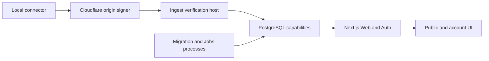

# Vibe Racing

> **Status:** local pre-alpha. The synthetic web prototype is runnable, but no production service or
> released connector exists.

External participation remains closed. The repository is public in source-only mode with a recorded
maintainer and matching CODEOWNERS, private vulnerability reporting enabled, Issues and Discussions
disabled, collaborator-only pull requests, and an active `main` ruleset. This is public-source
evidence only, not a release, deployment, beta, or invitation to contribute. See
[GitHub source-only publication](docs/getting-started/GITHUB_FIRST_PUBLICATION.md).

Vibe Racing is an open-source, pixel-art weekly leaderboard for exact provider-reported coding-agent
tokens. The accepted clean-slate target uses one immutable GitHub identity, multiple logical
`AgentAccount` records, account-scoped device keys, direct exact weekly sums, shared ranks, and
snapshot-only public reads. Community remains self-reported, tokenizers differ, and rank represents
neither normalized cost/compute nor a reward or privilege.

The unreleased Codex-only baseline has been replaced locally under
[ADR 0076](docs/decisions/0076-clean-agent-account-provider-reported-token-ranking.md). The result
is still pre-release synthetic evidence: no provider, connector version, target platform, hosted
service, or deployment is declared supported without the separate evidence listed in
[implementation status](docs/IMPLEMENTATION_STATUS.md).


The screenshot is one repository-owned synthetic baseline. It contains no account state or real
usage.

## Quick start

Prerequisites:

- Node.js `24.18.0`;
- pnpm `11.7.0`;
- Rust `1.94.0` with `rustfmt` and `clippy` for repository verification;
- Docker with Compose v2 only for opt-in PostgreSQL integrations.

```text
pnpm install --frozen-lockfile --ignore-scripts
pnpm run dev:web
```

Open the reported `localhost` URL. No account, database, connector, environment file, or real data
is required for the synthetic preview.

For the normal deterministic development gate:

```text
pnpm run verify
```

The exhaustive release gate and Docker-backed integrations are intentionally separate. See
[local development](docs/getting-started/LOCAL_DEVELOPMENT.md) for focused commands and evidence
boundaries.

## What works locally

- A responsive EN/RU semantic server-rendered leaderboard, lazy pixel race, public profile, garage,
  three themes, forced-colors support, and reduced-motion behavior over synthetic snapshot data.
- Three bounded default-off public snapshot routes: current leaderboard, historical leaderboard, and
  current public profile. The four legacy score/race/status/token routes return 404.
- Default-off invite, GitHub OAuth, passkey, recovery, private account, batch pairing,
  AgentAccount/installation/device lifecycle, deletion, and CarRecipe boundaries with injected or
  disposable-database evidence.
- One unreleased `UsageSyncV1` protocol at `POST /v1/usage`, composed through a dependency-free
  Cloudflare Worker boundary, Ingest verification/application layers, and one atomic
  least-privileged PostgreSQL capability.
- A provider-neutral unreleased connector with OS credential storage, bounded batch discovery and
  pairing, account-scoped keys, sync/status/doctor commands, and one exact Codex `0.144.5` candidate
  reader. Codex remains recognized rather than supported pending clean-machine real-account and
  release evidence.
- A seven-revision clean database bootstrap plus default-off migration, thirteen-capability Jobs,
  and in-memory Jobs-scheduler processes with disposable PostgreSQL evidence.

Current contract inventory: **18 schemas, 4 protocol policies, 7 OpenAPI operations, and 7 OpenAPI
paths**. Current database inventory: **7 immutable SQL migration revisions**.

These are local and synthetic implementation claims. They do not prove a deployed service, live
OAuth/authenticator/database credentials, external TLS or edge routing, representative capacity,
operational cleanup cadence, released connector, or real-user ingestion. The canonical evidence
ledger is [Implementation status](docs/IMPLEMENTATION_STATUS.md).

## Trust and privacy

Community results are self-reported by local devices. They are not provider-verified and must never
be used for prizes, money, access control, or other valuable benefits. Verified ingestion remains
disabled until an independently reviewable server-verifiable source exists.

The network protocol has no fields for prompts, conversations, code, repository contents, local
paths, email, access tokens, API keys, or arbitrary user-uploaded files. Public projections omit raw
usage, private identifiers, and exact receipt timestamps. See the
[privacy data map](docs/security/PRIVACY_DATA_MAP.md),
[security invariants](docs/architecture/SECURITY_INVARIANTS.md), and
[threat model](docs/security/THREAT_MODEL.md).

## Architecture



Every arrow is a bounded capability rather than shared ambient authority. Default-off module-load
gates, exact public contracts, isolated database roles, and no-queue admission keep local slices
closed until their deployment prerequisites exist. The complete diagrams are in
[System context](docs/architecture/SYSTEM_CONTEXT.md) and
[Data flows](docs/architecture/DATA_FLOW.md).

## Verification

```text
pnpm run verify
pnpm run verify:release
pnpm run check:public:staged
pnpm run check:history
pnpm run check:publication
```

- `verify` is the bounded development gate.
- `verify:release` adds coverage, production builds, documentation, history, visual/policy,
  checker-regression, license, formatting, and Windows connector evidence when available.
- `check:public:staged` scans the exact Git index before a commit.
- `check:history` scans reachable refs, identities, DCO trailers, paths, and blobs.
- `check:publication` currently passes the tracked source-only boundary and fails closed on
  maintainer, CODEOWNERS, remote, reporting, or interaction-policy drift.

Docker-backed Web, Ingest, Migration, Database, Admin, and Jobs integrations remain opt-in local
synthetic evidence. A green local command is not production or hosted-CI evidence.

## Publication status

The repository is already public in **source-only mode**. The published baseline has a successful
hosted CI run; `main` has an active no-bypass ruleset with pull-request, conversation-resolution,
strict required-check, deletion, and non-fast-forward protections.

- the public maintainer registry and CODEOWNERS agree;
- private vulnerability reporting is enabled and visible, though external-account submission and
  notification delivery remain unproven;
- Issues and Discussions are disabled and pull requests are limited to collaborators;
- required checks are `Node and repository gates`, `Rust workspace gate`, and
  `PostgreSQL capability and invariant gate`; and
- every new revision still needs its own reviewed PR, hosted checks, and source-only policy
  readback. A local green branch is not hosted evidence.

No conduct endpoint is invented while participation is closed. Opening public interactions later
requires a real tested private conduct channel. The exact sequence is documented in
[First GitHub publication](docs/getting-started/GITHUB_FIRST_PUBLICATION.md); release and deployment
remain separate workflows.

## Documentation

- [Documentation index](docs/README.md)
- [Project plan](docs/PROJECT_PLAN.md)
- [Implementation status](docs/IMPLEMENTATION_STATUS.md)
- [Local development](docs/getting-started/LOCAL_DEVELOPMENT.md)
- [Public contracts](contracts/README.md)
- [Database foundation](database/README.md)
- [Architecture decisions](docs/decisions/README.md)
- [Security policy](SECURITY.md)
- [Contributing](CONTRIBUTING.md)
- [Governance and maintainers](MAINTAINERS.md)
- [Roadmap](ROADMAP.md)
- [Russian overview](README.ru.md)

## Contributing and security

External contributions are currently closed. Maintainer changes follow [CONTRIBUTING.md] and use
synthetic data plus DCO sign-off.

Do not disclose vulnerabilities through a public issue, pull request, discussion, commit message, or
social post. Use the repository's private vulnerability-reporting action described in [SECURITY.md];
external-account submission and notification delivery have not yet been end-to-end-tested.

## License

Source code is licensed under [Apache-2.0](LICENSE). Third-party dependency and asset records are in
[THIRD_PARTY_NOTICES.md](THIRD_PARTY_NOTICES.md) and
[Asset provenance](docs/reference/ASSET_PROVENANCE.md).

## Important warning

Treat every tracked file and reachable commit as public. Never add production credentials, personal
account data, private logs, internal anti-abuse thresholds, local machine paths, or real usage
exports. Automated scans do not replace review of the complete staged diff and Git history.
