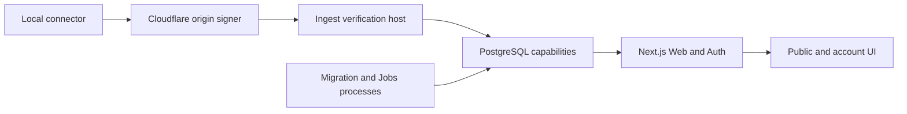

# Vibe Racing

> **Status:** local pre-alpha. The synthetic web prototype is runnable, but no production service or
> released connector exists.

External participation remains closed. The source can be published immediately in source-only mode
after a real maintainer and CODEOWNERS are recorded, GitHub private vulnerability reporting is
verified, and Issues/Discussions are disabled with Pull Requests limited to collaborators. See
[First GitHub publication](docs/getting-started/GITHUB_FIRST_PUBLICATION.md).

Vibe Racing is an open-source, pixel-art weekly leaderboard for exact provider-reported coding-agent
tokens. The accepted clean-slate target uses one immutable GitHub identity, multiple logical
`AgentAccount` records, account-scoped device keys, direct exact weekly sums, shared ranks, and
snapshot-only public reads. Community remains self-reported, tokenizers differ, and rank represents
neither normalized cost/compute nor a reward or privilege.

The working branch is replacing the unreleased Codex-only local baseline under
[ADR 0076](docs/decisions/0076-clean-agent-account-provider-reported-token-ranking.md). Until
[implementation status](docs/IMPLEMENTATION_STATUS.md) records each replacement slice, do not treat
the accepted target as implemented provider support, connector release, or deployment.


The screenshot is one repository-owned synthetic baseline. It contains no account state or real
usage.

## Quick start

Prerequisites:

- Node.js `24.18.0`;
- pnpm `11.7.0`;
- Rust `1.94.0` with `rustfmt` and `clippy` for repository verification;
- Docker with Compose v2 only for opt-in PostgreSQL integrations.

```text
pnpm install --frozen-lockfile --ignore-scripts
pnpm run dev:web
```

Open the reported `localhost` URL. No account, database, connector, environment file, or real data
is required for the synthetic preview.

For the normal deterministic development gate:

```text
pnpm run verify
```

The exhaustive release gate and Docker-backed integrations are intentionally separate. See
[local development](docs/getting-started/LOCAL_DEVELOPMENT.md) for focused commands and evidence
boundaries.

## What works locally

- A responsive EN/RU synthetic race, leaderboard, profile summary, garage, themes, reduced-motion
  mode, and a browser-only score simulator.
- Four bounded default-off public read routes for score, race, race status, and direct token
  ranking.
- Default-off invite, GitHub OAuth, passkey, recovery, account, pairing, device/source, deletion,
  and CarRecipe application boundaries with injected or disposable-database evidence.
- A single unreleased `UsageSyncV1` protocol through a dependency-free Cloudflare Worker boundary,
  Ingest verification/application layers, and a least-privileged PostgreSQL capability.
- A candidate-only Windows x86_64 connector foundation with native credential storage, pairing,
  exact-version Codex admission, one-shot sync, and proposal-only commands.
- Default-off migration and Jobs processes with checked local lifecycle and disposable PostgreSQL
  integrations.

Current contract inventory: **14 schemas, 4 protocol policies, 8 OpenAPI operations, and 8 OpenAPI
paths**. Current database inventory: **43 immutable SQL migration revisions**.

These are local and synthetic implementation claims. They do not prove a deployed service, live
OAuth/authenticator/database credentials, external TLS or edge routing, representative capacity,
operational cleanup cadence, released connector, or real-user ingestion. The canonical evidence
ledger is [Implementation status](docs/IMPLEMENTATION_STATUS.md).

## Trust and privacy

Community results are self-reported by local devices. They are not provider-verified and must never
be used for prizes, money, access control, or other valuable benefits. Verified ingestion remains
disabled until an independently reviewable server-verifiable source exists.

The project does not collect prompts, conversations, repository contents, Codex access tokens, API
keys, or arbitrary user-uploaded files. Public projections omit raw usage, private identifiers, and
exact receipt timestamps. See the [privacy data map](docs/security/PRIVACY_DATA_MAP.md),
[security invariants](docs/architecture/SECURITY_INVARIANTS.md), and
[threat model](docs/security/THREAT_MODEL.md).

## Architecture



Every arrow is a bounded capability rather than shared ambient authority. Default-off module-load
gates, exact public contracts, isolated database roles, and no-queue admission keep local slices
closed until their deployment prerequisites exist. The complete diagrams are in
[System context](docs/architecture/SYSTEM_CONTEXT.md) and
[Data flows](docs/architecture/DATA_FLOW.md).

## Verification

```text
pnpm run verify
pnpm run verify:release
pnpm run check:public:staged
pnpm run check:history
pnpm run check:publication
```

- `verify` is the bounded development gate.
- `verify:release` adds coverage, production builds, documentation, history, visual/policy,
  checker-regression, license, formatting, and Windows connector evidence when available.
- `check:public:staged` scans the exact Git index before a commit.
- `check:history` scans reachable refs, identities, DCO trailers, paths, and blobs.
- `check:publication` is intentionally fail-closed until real hosted GitHub identities and controls
  are configured.

Docker-backed Web, Ingest, Migration, Database, Admin, and Jobs integrations remain opt-in local
synthetic evidence. A green local command is not production or hosted-CI evidence.

## Publication status

The source tree is designed for an immediate **public, source-only GitHub repository**. Create the
empty public repository first, configure its security and interaction settings, and push source only
after the local publication gate passes.

- confirm public maintainer identities and matching CODEOWNERS;
- enable and test GitHub private vulnerability reporting before the source push;
- disable Issues and Discussions and limit Pull Requests to collaborators;
- push the reviewed `main`, protect it, and require the reviewed CI checks;
- review the first hosted Actions run and its public logs;
- rerun `verify:release` and `check:publication`.

No conduct endpoint is invented while participation is closed. Opening public interactions later
requires a real tested private conduct channel. The exact sequence is documented in
[First GitHub publication](docs/getting-started/GITHUB_FIRST_PUBLICATION.md); release and deployment
remain separate workflows.

## Documentation

- [Documentation index](docs/README.md)
- [Project plan](docs/PROJECT_PLAN.md)
- [Implementation status](docs/IMPLEMENTATION_STATUS.md)
- [Local development](docs/getting-started/LOCAL_DEVELOPMENT.md)
- [Public contracts](contracts/README.md)
- [Database foundation](database/README.md)
- [Architecture decisions](docs/decisions/README.md)
- [Security policy](SECURITY.md)
- [Contributing](CONTRIBUTING.md)
- [Governance and maintainers](MAINTAINERS.md)
- [Roadmap](ROADMAP.md)
- [Russian overview](README.ru.md)

## Contributing and security

External contributions are currently closed. Maintainer changes follow [CONTRIBUTING.md] and use
synthetic data plus DCO sign-off.

Do not disclose vulnerabilities through a public issue, pull request, discussion, commit message, or
social post. The repository must enable GitHub private vulnerability reporting before public
announcement; until then, it is not open for external security reports. See [SECURITY.md].

## License

Source code is licensed under [Apache-2.0](LICENSE). Third-party dependency and asset records are in
[THIRD_PARTY_NOTICES.md](THIRD_PARTY_NOTICES.md) and
[Asset provenance](docs/reference/ASSET_PROVENANCE.md).

## Important warning

Treat every tracked file and reachable commit as public. Never add production credentials, personal
account data, private logs, internal anti-abuse thresholds, local machine paths, or real usage
exports. Automated scans do not replace review of the complete staged diff and Git history.
