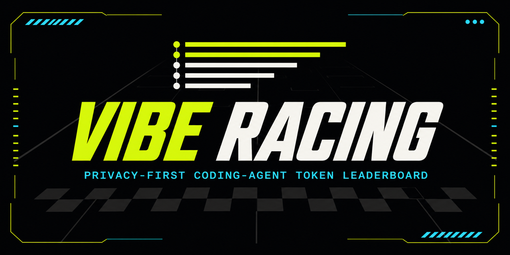

# Vibe Racing

**A privacy-first leaderboard for coding-agent token usage.**

[](https://github.com/Tah10n/viberacing/actions/workflows/ci.yml)
[](LICENSE)

[Open the leaderboard](https://viberacing.up.railway.app) · [Get started](#get-started) ·
[Agent support](docs/AGENT_SUPPORT.md) · [Run locally](#run-locally) ·
[Documentation](#documentation)



Connect your coding agents, compare token totals, and follow your usage over time. One GitHub
account can bring together multiple computers and agent accounts. The connector reads exact local
token counters and sends aggregate totals; your conversations and code stay on your computer.

Rankings are self-reported and just for fun. They do not measure productivity, quality, or cost.

## Get started

You need **Node.js 24 LTS**, a GitHub account, and usage from a supported agent.

1. Run this command on the computer whose usage you want to include:

   ```bash
   npx --yes @viberacing/connector@latest connect --origin https://viberacing.up.railway.app
   ```

2. Sign in with GitHub in the browser that opens, then review and approve the detected agents.
3. The first sync runs automatically. Open your dashboard to inspect totals and connected computers.

No global npm installation is required. The connector keeps its working copy in local Vibe Racing
state. Repeat the setup on another computer to include its agents. For a self-hosted instance, use
the exact command shown by its dashboard.

**After connecting:** Codex users must review and trust the Vibe Racing `Stop` hook through `/hooks`
before automatic sync can run. OpenCode users should restart OpenCode once when the connector
reports a plugin create or update. Manual sync remains available in both cases.

## What you can track

- **Your place in the leaderboard**, with an agent breakdown and public racer profile.
- **Week, Month, This year, or Custom**, using the same UTC period throughout the app.
- **Daily usage**, with a zoomable chart and an exact-value table. Future days are not drawn as
  zero.
- **Multiple computers and accounts**, with account-wide totals deduplicated and machine-local
  histories added according to each agent's collection method.

`This year` means January 1 through today in the current UTC calendar year. Custom ranges stay
within that year through today. Full token values are visible in racer profiles and their dialogs;
small positive agent shares display as `<1%`.

### Supported agents

| Agent       | Supported surface     | Setup or limitation                                                                                      |
| ----------- | --------------------- | -------------------------------------------------------------------------------------------------------- |
| Codex       | CLI + Desktop account | Review the `Stop` hook; account switching requires file-backed authentication.                           |
| Claude Code | CLI                   | Collects exact local usage; automatic sync uses the `Stop` hook.                                         |
| OpenCode    | CLI                   | Restart once after the owned plugin is created or updated.                                               |
| Kimi Code   | CLI                   | Detects the current token store; legacy roots can be added explicitly.                                   |
| Qwen Code   | CLI                   | Headless usage needs manual sync or a later supported lifecycle trigger.                                 |
| Antigravity | Wrapped CLI sessions  | Use `viberacing run antigravity`; Desktop and earlier direct sessions are not included.                  |
| Gemini CLI  | CLI                   | Collects exact local usage; automatic sync uses the `SessionEnd` hook.                                   |
| Cursor      | Desktop + CLI         | Automatic interactive hooks; headless runs use `viberacing run cursor`. History starts at capture setup. |

The [support matrix](docs/AGENT_SUPPORT.md) documents versions, discovery, account limits, and exact
collection boundaries. The [connector guide](packages/connector/README.md) covers wrapper commands
and source configuration. See [Cursor evidence](docs/CURSOR_EVIDENCE.md) for its verified capture
contract and rollout gates.

## Sync and maintenance

Supported agent hooks schedule automatic sync, coalescing events into about one batch every two
minutes. Manual sync collects all active sources immediately and continues through available
current-year history. Coverage varies by agent; unavailable history is marked partial.

If you connected with **`VIBERACING_STATE_DIR`**, set it to the same value before every command
below. Omitting it selects the default installation in `~/.viberacing` instead.

| Action                                                     | Command for the official service                         |
| ---------------------------------------------------------- | -------------------------------------------------------- |
| Sync now                                                   | `npx --yes @viberacing/connector@latest sync`            |
| Retry a full current-year import                           | `npx --yes @viberacing/connector@latest sync --full`     |
| Update the installed runtime and repair owned integrations | `npx --yes @viberacing/connector@latest doctor --repair` |
| Remove an installation and its owned local integrations    | `npx --yes @viberacing/connector@latest uninstall`       |

Dashboard Sync buttons stay visible when unavailable and explain why they are disabled. Browser Sync
requires that browser to be linked to the computer and a compatible installed handler. Open **Sync
options** for the appropriate terminal or recovery command.

Browser Sync is unavailable for custom state directories. Use CLI sync with the original
`VIBERACING_STATE_DIR`; repair or reconnect cannot enable Browser Sync there. For the default
installation, repair the handler and reconnect in the browser you want to use when needed.

Self-hosted dashboards can provide equivalent same-origin archive commands. See
[deployment and distribution](docs/DEPLOYMENT.md#connector-distribution-and-publication).

## Privacy and ranking

Usage uploads contain UTC dates and aggregate token counters. A separate, strictly allowlisted
diagnostics channel can send fixed machine codes and state transitions.

**Never uploaded:** prompts, responses, code, transcripts, repository names, local paths, hostnames,
provider identities or credentials, model names, costs, exception messages, or stack traces.

Vibe Racing uses one Next.js service, one PostgreSQL database, and one local connector. The
connector does not install a resident daemon or polling service. Rankings grant no rewards,
permissions, or access. Read the [privacy boundary](docs/PRIVACY.md),
[ranking rules](docs/RANKING_SEMANTICS.md), and [architecture](docs/ARCHITECTURE.md) for the
details.

## Run locally

Development also requires **pnpm 11.7 through Corepack**, **Docker Compose**, and a GitHub OAuth
app. Run the following from the repository root:

```bash
corepack pnpm install --frozen-lockfile
cp .env.example apps/web/.env.local
```

Fill in the OAuth client ID and secret in `apps/web/.env.local`. Configure the OAuth app with:

| Setting  | Local value                                      |
| -------- | ------------------------------------------------ |
| Homepage | `http://localhost:3000`                          |
| Callback | `http://localhost:3000/api/auth/github/callback` |

Start only PostgreSQL, then run the app with live reloading:

```bash
docker compose up -d db
corepack pnpm db:migrate
corepack pnpm dev
```

The app runs at `http://localhost:3000`; PostgreSQL is exposed only at `127.0.0.1:55432`. GitHub
Device Flow is not needed. To pair a connector from this checkout:

```bash
node packages/connector/bin/viberacing.mjs connect --origin http://localhost:3000
```

For a production-container preview, stop the dev server and run `corepack pnpm local:up` instead; it
starts both services and waits for `/ready` (requires `curl`). Before switching back to live
reloading, run `corepack pnpm local:down` to release port 3000.

| Development task                                         | Command                     |
| -------------------------------------------------------- | --------------------------- |
| Full repository checks and production build              | `corepack pnpm verify`      |
| Synthetic HTTP/SQL scenarios against the local stack     | `corepack pnpm local:test`  |
| Stop the local stack and retain its database             | `corepack pnpm local:down`  |
| Delete the local Vibe Racing database volume and restart | `corepack pnpm local:reset` |

## Documentation

| You want to…                                      | Read                                                                                                                             |
| ------------------------------------------------- | -------------------------------------------------------------------------------------------------------------------------------- |
| Configure agents, accounts, and CLI commands      | [Connector guide](packages/connector/README.md) · [Agent support](docs/AGENT_SUPPORT.md)                                         |
| Understand totals, corrections, and deduplication | [Ranking semantics](docs/RANKING_SEMANTICS.md)                                                                                   |
| Understand storage, protocols, and privacy        | [Architecture](docs/ARCHITECTURE.md) · [Privacy](docs/PRIVACY.md)                                                                |
| Deploy, verify, or troubleshoot the service       | [Deployment](docs/DEPLOYMENT.md) · [Production checklist](docs/PRODUCTION_CHECKLIST.md) · [Observability](docs/OBSERVABILITY.md) |
| Contribute or publish a release                   | [Contributing](CONTRIBUTING.md) · [Releasing](docs/RELEASING.md) · [Changelog](CHANGELOG.md)                                     |
| Get help or report a vulnerability                | [Support](SUPPORT.md) · [Security policy](SECURITY.md)                                                                           |

Licensed under [Apache-2.0](LICENSE). See [Governance](GOVERNANCE.md) and the
[Code of Conduct](CODE_OF_CONDUCT.md) for project participation.
