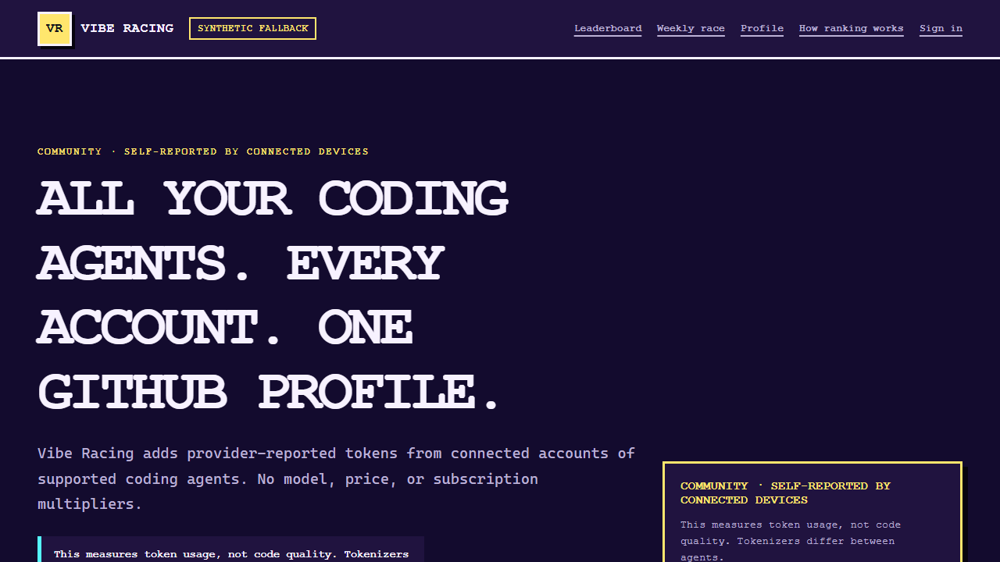

# Vibe Racing

> Status: Phase 2/3/4 local vertical slices are in progress. No production service or released
> connector exists.

External participation is closed until real public maintainers, CODEOWNERS, and private reporting
channels are configured. Local identities are never copied into the repository to fill that gap.

Vibe Racing is an open-source, pixel-art weekly leaderboard for people using Codex. Participants
connect a local, least-privileged connector, submit their own token-activity buckets, and appear as
racing cars on a public track.

The current runnable site starts with a clearly labeled synthetic preview so contributors can use it
without an account, connector, or database. It now also requests the current Community week from the
same-origin public race-status route, which remains unavailable unless its module resolves exact
`VIBERACING_PUBLIC_RANKING_ENABLED=true` when loaded, and replaces the visible race and leaderboard
only after a bounded response passes browser-side validation. The tracked default is false. The
response includes complete-UTC-day freshness and may include the current approved enum-only car plus
a preference-gated streak; exact receipt time and underlying daily scores remain private. When no
active recipe exists, the browser keeps a repository-owned presentation fallback. A Community handle
selects a same-page public summary from that same validated field set; daily detail, device counts,
exact usage, and identifiers remain absent. Each selection has a canonical public-handle URL, and a
signed-in public profile links to its current summary without adding browser storage. An unavailable
route leaves the synthetic fallback visible; the demo garage remains synthetic. The same public page
now includes an EN/RU score simulator that applies the production Community formula to one
hypothetical daily token total and one to seven active days entirely in component memory. Its value
is never sent, stored, prefilled from an account, or used to change a standing. A separate
invite-only join flow now composes GitHub OAuth with state and PKCE, one encrypted short-lived
continuation, atomic profile enrollment, required WebAuthn registration, returning
discoverable-credential login, a session-scoped passkey inventory, an active account page, immediate
public-profile hide/show, source and active-device inventory, immediate source pause, fresh-passkey
paused-source reactivation, device revoke, backup-passkey addition and fresh-passkey terminal source
unlink, non-current-passkey revocation, fresh-passkey recovery-code rotation with one-time display,
an exact-handle fresh-passkey profile-deletion request, one-time recovery-code replacement-passkey
sign-in, and logout. It is locally tested only: the repository supplies no invite issuer UI, OAuth
registration, real secret, live OAuth/authenticator/database credentials, deployed deletion purge,
cache/backup/tombstone handling, restore replay, distributed edge abuse controls, recovery cleanup
or notifications, or live-user evidence.

The authenticated account page now also renders the current Community week's seven derived daily
scores and bounded summary from one combined server-side visibility/score checkout. Hidden profiles
show no score; raw usage, private identifiers, a browser fetch, and browser storage remain absent.



This page-only image is one member of the synthetic
[Phase 1 browser matrix](docs/testing/PHASE1_BROWSER_MATRIX.md); it contains no browser chrome,
account state, or real usage.

## Trust model

Community results are self-reported by local devices. They are not verified by OpenAI and must never
be used for prizes, money, access control, or other valuable benefits. A separate Verified league
remains disabled until a server-verifiable OpenAI data source exists.

The project does not collect prompts, conversations, repository contents, Codex access tokens, API
keys, or arbitrary user-uploaded files.

## Current documents

- [Public implementation plan](docs/PROJECT_PLAN.md)
- [Implementation status](docs/IMPLEMENTATION_STATUS.md)
- [Security invariants](docs/architecture/SECURITY_INVARIANTS.md)
- [Threat model](docs/security/THREAT_MODEL.md)
- [Abuse cases](docs/security/ABUSE_CASES.md)
- [Privacy data map](docs/security/PRIVACY_DATA_MAP.md)
- [System context](docs/architecture/SYSTEM_CONTEXT.md) and
  [data flows](docs/architecture/DATA_FLOW.md)
- [Compatibility policy](docs/architecture/COMPATIBILITY_POLICY.md)
- [Versioned public contracts](contracts/README.md)
- [Database foundation](database/README.md)
- [Default-off migration runner](apps/migrate/README.md)
- [Architecture decisions](docs/decisions/README.md)
- [Local development](docs/getting-started/LOCAL_DEVELOPMENT.md)
- [Web prototype](apps/web/README.md)
- [Phase 1 browser matrix](docs/testing/PHASE1_BROWSER_MATRIX.md)
- [Ingest verification kernel](apps/ingest/README.md)
- [Connector protocol foundation](crates/connector/README.md)
- [Local bounded car-proposal Agent Skill](.agents/skills/viberacing-propose-car/SKILL.md)
- [Local bounded repository-verification Agent Skill](.agents/skills/viberacing-verify/SKILL.md)
- [Dependency policy](docs/security/DEPENDENCY_POLICY.md)
- [Dependency inventory](docs/reference/dependency-inventory.json)
- [Asset provenance](docs/reference/ASSET_PROVENANCE.md)
- [Pull-request CI trust model](docs/architecture/CI_TRUST_MODEL.md)
- [Public repository data policy](docs/security/PUBLIC_REPOSITORY_POLICY.md)
- [Documentation index](docs/README.md)
- [Repository guidance for coding agents](AGENTS.md)
- [Security policy](SECURITY.md)
- [Contributing](CONTRIBUTING.md)
- [Governance](GOVERNANCE.md)
- [Maintainers and publication gate](MAINTAINERS.md)
- [Code of conduct](CODE_OF_CONDUCT.md)
- [Support](SUPPORT.md)
- [Roadmap](ROADMAP.md)
- [Release policy](RELEASE.md)
- [Changelog](CHANGELOG.md)
- [Third-party notices](THIRD_PARTY_NOTICES.md)
- [Russian overview](README.ru.md)

The repository-verification Agent Skill is read-only: it inspects the real Git scope and checked-in
gates but cannot edit, stage, commit, install, access live services, publish, push, or deploy.

## Open-source baseline

The code is licensed under [Apache-2.0](LICENSE). The current product visuals are local HTML, CSS,
canvas primitives, fixed pixel recipes, and one documented project-generated social preview; no
remote fonts or third-party source visual assets are loaded. The current tree has pinned toolchains,
locked dependencies, reproducible repository gates, read-only secretless pull-request CI, and a
disposable loopback-only PostgreSQL service. Protected reviews, remote security settings, documented
governance, and signed and attested connector releases remain gates before public beta.

The governance documents and structured contribution forms are now present and policy-tested. The
repository still has no GitHub remote, public maintainer registry, CODEOWNERS file, or verified
private reporting channels; those hosted controls cannot be safely invented from local data.

Phase 2/3/4 contract and persistence foundations are also present: thirteen closed, bounded JSON
Schemas plus generated TypeScript validators and locally implemented OpenAPI GET and POST
operations. They cover connector sync/result, problem details, a one-season Community score query, a
response-only top-32 Community score page, a separate compatible race page with an optional exact
`CarRecipeV1`, and a third race-status page with rounded freshness plus optional streak. The two
older components and routes remain unchanged. Server-only fail-closed mappers convert only the exact
ten-, eleven-, or thirteen-column SQL projections and reject malformed, inconsistent, oversized, or
contract-invalid results. A bounded server-only PostgreSQL adapter now uses a separate
least-privileged Web login contract, certificate-verified production transport, a four-connection
pool, per-checkout role/read-only verification, fixed deadlines, and fixed parameterized top-32
procedure calls. A server-only HTTP problem factory now generates opaque 128-bit request IDs and
closed, contract-validated, no-store error responses. A shared server-only boundary now enforces the
exact score/race/status paths, query, GET-only method and `Accept` policy, four-request no-queue
admission, adapter deadline policy, store-error translation, final response validation, and
no-store/no-CORS headers. A separate opt-in synthetic integration builds the standalone artifact,
bundles the reviewed `pg` driver, and starts two emitted Next production processes against one
TLS-enabled disposable PostgreSQL database. It proves a deliberately widened login returns only
generic problems without mutating any private table, validates exact successful contracts through a
narrow `viberacing_web` login, observes TLS 1.2 or 1.3 in `pg_stat_ssl`, and confirms the successful
reads are also non-mutating. The same narrow path enables parameter-redacted `auto_explain` only in
that disposable database and requires six bounded plan classes: the three fixed adapter calls plus
their three nested score/race/status projections. It rejects missing reviewed indexes, sequential
scans over the bounded-index relations, parameter payloads, mutation/locking nodes, dirty/written
blocks, temporary I/O, excess rows, or plan/log budget overflow. It also holds four real score reads
behind a controlled database lock, proves a fifth request receives the generic unavailable response
without adding a fifth public-score query, and validates the four original responses after release.
It is local no-queue, synthetic query-plan, and synthetic certificate evidence, not deployment:
there is still no cache, deployment certificate/login, external TLS/edge route, edge rate policy,
representative plan/load/capacity evidence, or live API, and this is not evidence that real Codex
data can be submitted. A separate pure local Ingest kernel now copies and bounds the exact Community
sync body and raw headers, verifies a replay-consumed body-bound origin HMAC before JSON or device
work, rejects duplicate headers/decoded keys and excessive parser structure, validates the generated
sync contract, and strictly verifies the source-bound Ed25519 request. It returns only a frozen
database-ready allowlist. A separate bounded Ingest PostgreSQL adapter now revalidates that
allowlist, copies all binary/array parameters, verifies the exact least-privileged Ingest login/role
boundary on every checkout, and exposes only fixed origin-replay, device-lookup, and submission
calls through a four-client deadline-bound pool. Its transport config is loopback-only without TLS
and otherwise certificate-verified; focused tests use mock pools. A protected local factory now
requires one exact primary origin HMAC pair and permits one complete distinct rotation pair through
namespaced configuration; it returns only the verifier and the repository contains no real key or
secret-manager binding. A forced-RLS PostgreSQL replay table now stores only the origin key ID,
domain-separated nonce digest, and millisecond expiry; one Ingest procedure atomically consumes it,
and an observed race proves one winner for an expired tuple. A transport-free application boundary
now generates one server request ID, composes that replay/device/submission adapter with the exact
verifier, waits for database settlement, and returns only a validated acknowledgement or generic
problem decision. A separate local Fastify server factory now preserves the exact raw body/header
evidence for `POST /v1/community/sync`, rejects proxy and inbound request ID trust, admits four
application calls without a queue, applies bounded parser/header/connection and 5/33/34-second
request/handler/connection deadlines, and serializes only revalidated `no-store` success/problem
contracts. A separate local host now binds that exact factory under loopback-only development/test
or explicit Railway-edge production configuration only after exact `VIBERACING_INGEST_ENABLED=true`.
Missing or alternate state fails before any protected application configuration, pool, server, or
listener; the tracked example is explicitly disabled. The host closes partial startup and handles
SIGINT/SIGTERM under a fixed deadline. Its 130 tests and built entrypoint check are synthetic/local
evidence, not proof of a deployed restart/route denial, Railway, external TLS, edge routing, live
credentials, or deployment. A separate opt-in integration builds the emitted host, creates a
synthetic dedicated Ingest login in disposable PostgreSQL, sends independently signed loopback HTTP
requests, and proves accepted, duplicate, persistent origin-replay, revoked-device, response-header,
and exact persistence behavior. It also holds four valid requests at the first replay-store call,
requires a fifth to return generic 503 without a fifth replay call, then releases and proves the
four accepted responses. After closing the imported host, the gate starts the built entry point as a
separate silent process, observes its loopback listener without application work, proves one more
exact accepted request, and forcibly ends only that test child before cleanup. This is controlled
local process and no-queue evidence. A separate opt-in gate builds a link-free exact production
runtime, mounts it read-only under the pinned Linux Node image, blocks one independently signed
request at the first origin-replay call, delivers a real `SIGTERM`, releases the lock, and proves
the exact acknowledgement and stored state, silent code-0 host exit, database-session release, and
unchanged runtime contents. Neither gate proves Railway or orchestrator drain, a representative load
result, or a deployment credential, certificate, protected secret delivery, distributed control,
external edge route, real-user data, or capacity result. A library-only Rust foundation now emits
the fixed stable App Server handshake and, only after it succeeds, a candidate `0.144.5`
account/usage sequence. It confirms ChatGPT mode while discarding email/plan/summary values and
returns at most 31 sorted strict date/token entries. Exact release metadata, schema digests, minimal
extracts, fixtures, and a drift/matrix checker are committed. The Windows x86_64 development command
admits only the exact official artifact size and SHA-256; repository tests still do not execute a
user's Codex account and the compatibility matrix remains empty. A one-shot supervisor proves the
exact sequence against a target-built synthetic child with a fixed `app-server` argument, local
pipes, cleared ambient environment, bounded stdout/stderr/time, late-output rejection, and
reap-before-success cleanup. Its reviewed-launch capability remains private to exact admission. A
second inaccessible reviewed context now lets a candidate composer consume the minimized entries
into the exact `ConnectorSyncV1` JSON, SHA-256 digest, unpadded base64url nonce, and LF-separated
device-signature message. An isolated one-use signer consumes that closed material with an equally
inaccessible device-bound Ed25519 key capability and returns only the same body plus five exact
header values. A shared synthetic vector proves the exact public key/signature across Rust and the
production Ingest verifier. A separate inaccessible pending-key/challenge signer and server-only Web
verifier now agree on the exact domain-separated pairing-possession message and a second shared
vector. A transport-free Web/Auth start boundary generates fresh server identifiers, poll token,
challenge, 60-bit human code, separate keyed verifiers, and a nine-minute pending transaction from
closed device metadata. A second activation boundary uses the same separately probed read-write pool
wrapper for protected poll lookup, verifies the exact approved proof, and alone invokes atomic
activation with server-owned identifiers behind four-call admission and a settlement floor. A local
signed-in `/connect` page now accepts one pending human code, shows the exact bounded device
metadata and full public-key fingerprint, and requires a separate fresh passkey assertion before
atomically approving a new or active existing opaque source. Its PostgreSQL lookup counts attempts
on the possessed session across Web instances under deployment-private limits. Two closed local POST
routes now expose the versioned pairing start/poll contracts through shared four-call admission, a
fixed-storage global-and-64-bucket PostgreSQL rate policy, bounded bodies, generic failures, and
no-store/no-CORS responses. Connector start/poll and signed-in approval options/verification each
remain unavailable unless their route module resolves exact `VIBERACING_PAIRING_ENABLED=true`; the
tracked default is false. New-source selection and completion separately require exact
`VIBERACING_SOURCE_CREATION_ENABLED=true` in the `/connect` and browser approval modules; its
tracked default is also false, while existing-source pairing remains available when pairing itself
is enabled. A local Rust `connect` command generates an Ed25519 key and anonymous rate ID with the
OS CSPRNG, persists a versioned prepared/pending/active record only in the native credential store,
proves possession, and resumes an interrupted pending poll without printing key, token, challenge,
source, or device IDs. A separate exact `forget-local` command can delete only that canonical
origin/label native entry without reading it or contacting Vibe Racing; its fixed output warns that
it does not revoke server device authority, which remains a separate authenticated account action. A
separate explicit `check-codex` command performs only the same exact Windows candidate artifact
admission without an origin, credential-store access, Codex process, account read, persistence, or
network. Its fixed result is point-in-time candidate evidence and explicitly says no Codex version
is supported. An optional `--diagnostic-preview` prints only a closed local v1 summary of
allowlisted version/admission/support state, retains failed-admission status, omits
workstation/account data, and is neither saved nor sent by the connector. A separate Windows x86_64
`sync` command now requires an active record, then either discovers the exact `0.144.5` executable
through a fixed-name, resource-bounded `PATH` policy or accepts an explicit path under the same
canonical size/SHA-256 admission. It launches the held file in a fresh empty working directory,
creates fresh request time/ID/nonce, sends the exact signed body once to the fixed sync path, and
accepts only a closed acknowledgement. It does not retry an ambiguous POST or send edge origin
proof. There is still no macOS/Linux admission or result, live protected key injection, edge
signer/direct-origin denial, deployed host/TLS/database login, capacity evidence, credential
rotation, automatic server-revoke composition, packaging, release, monitoring, supported connector,
or deployment.

The isolated PostgreSQL gate now first holds revision 0039's advisory lock until two exact migration
processes are observed waiting. After release, one applies the migration, one rolls back with the
expected duplicate-object `42P07`, and the gate requires one exact ledger row plus the canonical
table. It then twice restores its current synthetic state from bounded container-only archive
generations and requires matching canonical data digests/lengths, a byte-stable restored schema, all
28 forced-RLS tables, selected role grants, and all 45 post-restore lock-wait races plus the final
runtime deny matrix. This is not a successful concurrent deployment controller, staging migration
orchestration/rollback, old-backup deletion replay, external backup, cluster-role recovery,
production restore, scale, or RPO/RTO result.

A separate default-off one-shot migration runner now verifies the exact repository manifest,
canonical paths, bounded UTF-8 source, and every SHA-256 digest before constructing one migration
pool. It rejects a widened login through a closed owner-member/TLS/search-path probe, serializes the
whole catalog with the fixed session advisory key, rereads the ledger after locking, applies only an
exact missing suffix, and requires the complete ledger before success. In addition to 97 injected
unit/policy tests plus strict build and built disabled-startup checks, an opt-in synthetic gate runs
one widened and two narrow emitted processes against a disposable certificate-verified PostgreSQL
database. The widened process fails before schema creation; both narrow controllers are observed
behind one external lock holder and then converge successfully on the exact 40-row ledger, all 28
forced-RLS private tables, and the identity invariant oracle. This proves local driver/TLS/lock
behavior only, not production credentials, staging migration/rollback, deployed replicas,
monitoring, deployment, or recovery.

Forty SQL migrations now add 28 private identity, passkey, restricted-recovery, source, device,
pairing, audit, deletion, replay, usage, Community scoring, and CarRecipe tables with
deny-by-default runtime roles, forced RLS, state-machine constraints, checksum drift detection, and
an isolated PostgreSQL capability test. A narrow procedure boundary implements invite issuance,
atomic enrollment, session-bound initial-passkey challenges, credential-derived login, bounded
multi-passkey management, session rotation/revocation, the immediate lock-down portion of profile
deletion, one-time new/existing-source device pairing, private source/device inventory, source
pause/reactivation/unlink, immediate device revoke, passkey-protected recovery-code rotation, and
short-lived recovery-only replacement-passkey authority. Pairing creates only opaque user-declared
sources: it never reads or stores Codex account email or claims account uniqueness. Source pause is
immediate. Paused-source reactivation now requires a fresh user-verified passkey assertion and one
atomic challenge-consume/reactivate call. Terminal source unlink now uses its own fresh passkey
context and one atomic consume/unlink call that revokes every active source device. The local
identity flow verifies both initial passkey registration and returning discoverable-credential
login. Invite/OAuth/initial-passkey enrollment is independently unavailable unless its two pages and
four route modules resolve exact `VIBERACING_ENROLLMENT_ENABLED=true`; the tracked default is false.
Disabled EN/RU UI omits both enrollment forms, all four service methods repeat literal-true
enforcement before private or persistent work, and returning login/recovery stay available. Login
options keep the profile-free challenge only in an encrypted cookie; a valid assertion causes one
atomic database create-consume-session call. Anonymous login still requires edge rate/capacity
controls before exposure. The account page uses that same possessed session to read only passkey
labels, active/revoked state, rounded creation dates, the current-authenticator marker, the closed
`public`/`hidden` profile state, at most 32 opaque sources, and at most 64 active device
labels/platforms/versions with rounded activation dates. Credential IDs, raw source IDs, internal
keys, and profile IDs are not rendered; source actions receive only a 15-minute encrypted token
bound to the current session. A same-origin server form can hide the profile from the public score
read or publish it again without stopping source sync. Another can immediately revoke one exact
owned active device even while the profile is hidden. The same page can immediately pause a source
and can reactivate only a paused source after a fresh required-UV passkey assertion; neither action
changes hidden/public visibility or lifts quarantine. A separate destructive control permanently
unlinks any non-terminal source after the same kind of fresh assertion, including while the profile
is hidden; it does not publish the profile. An authenticated passkey revoke control sends only the
selected opaque passkey ID, requires a fresh user-verified assertion bound to that session and
target, and reaches one atomic consume-and-revoke call; the current or last active passkey cannot be
removed. A separate add control validates and seals the label before prompting, requires an
existing-key assertion plus an independent registration ceremony, and atomically consumes that
step-up while inserting the new credential under the 32-retained-record cap. A local CarRecipe slice
now validates one exact versioned enum-only recipe, stores at most one private 24-hour proposal per
session-derived profile, previews it in all three themes, and requires an explicit encrypted
session-bound approve or reject control. Approval atomically replaces the active recipe. A separate
device-authenticated Web route and fixed `propose-car` command can only create or replace the same
pending exact recipe for an active source-bound device; they cannot read, approve, reject, or
activate it. A checked local Agent Skill reduces a styling request to the exact recipe flags,
requires explicit shell-safe origin/label values, invokes only that command once, and receives no
read or decision authority. Cross-profile and non-Web database capabilities remain denied. Browser
creation/approval and device ingress now remain unavailable unless their exact modules resolve
`VIBERACING_CAR_PROPOSALS_ENABLED=true`; the tracked default is false. Disabled EN/RU account UI
keeps active/private previews and exact session-bound rejection while omitting editor/approve, and
both browser service mutations repeat literal-true enforcement. A separate Jobs-only command now
deletes bounded oldest-first batches of expired private proposals while preserving live and active
recipes. A separate compatible public race contract now projects only the current approved recipe
for an active profile; proposal identity, state, and timestamps stay private and the stable score
response remains unchanged. The cleanup object is exercised by the default-off local scheduler and
combined synthetic PostgreSQL integration; deployed cadence, live credentials, released connector
packaging, edge controls, and deployment remain pending. A database-only Community ingest capability
now exposes minimal active-device verification material and accepts bounded source-bound snapshots
with exact retry, nonce replay, monotonic source/date, quarantine, and lifecycle-race enforcement. A
Jobs-only procedure deletes independently bounded batches of expired origin nonces, device nonces,
and raw snapshots while preserving current source/day values. A separate Jobs-only procedure deletes
bounded expired non-activated pairing transactions plus their still-pending keys, while preserving
live and activated bindings. A third cleanup procedure independently deletes expired authentication
challenges and restricted recovery authorities plus an exact still-present used code whose verifier
was already scrubbed. It preserves live ceremonies, unused recovery codes, passkeys, and audit
evidence, and serializes on profile locks against recovery transitions. A fourth bounded procedure
physically deletes expired active or revoked invite verifiers while preserving live invites and
redeemed enrollment provenance. A fifth bounded procedure physically deletes expired sessions only
after rotation and pairing references permit it, cascading their unusable challenges while
preserving live sessions and activated-pairing provenance. A sixth bounded procedure removes only a
canonical abandoned `enrolling` profile after every associated enrollment session and registration
challenge expires, one redeemed invite remains, and no other profile-bound recovery, authority,
source, deletion, scoring, or recipe state exists. The profile cascade permanently removes that
invite and expired enrollment authority while retaining its audit event with redacted profile
linkage; it does not restore invite use or create a deletion job/tombstone. The database does not
verify a wire signature; the local kernel and adapter are composed locally and exercised together
with a signed synthetic request. The opt-in loopback integration now carries an independently signed
request through the emitted host and a disposable least-privileged PostgreSQL login, including
duplicate, replay, revoke, response, and stored-state checks. Another Jobs-only procedure serializes
an atomic refresh of one open ISO-week Community season: it sums distinct eligible sources before
one profile daily cap, stores an immutable formula and season binding, shares rank on equal score
and active days, and persists no raw token or source identifier in the score tables. Revision 0024
adds a separate Jobs-only maximum-10 primary deletion procedure. It accepts only due queued/retry
work linked to committed `deletion_pending` profiles, locks its fixed five-capability maintenance
set in stable order, removes restrictive pairings and authority-free pending keys first, terminally
settles the opaque job, and cascades identity, credentials, sources, devices, usage, and personal
score rows atomically. It deliberately creates no unkeyed tombstone. A separate Jobs-only cleanup
retains that opaque terminal job for at least 30 days after server-recorded completion, then permits
bounded oldest-first batches while preserving recent and non-terminal deletion work. Revision 0033
adds a separate Jobs-only audit cleanup that retains each database audit reference for at least 180
days after server-recorded occurrence, then permits bounded oldest-first batches while preserving
recent evidence. It does not supply an external append-only audit sink. Revision 0010 adds a public
48-hour server-time grace rule, late-snapshot quarantine, and a Jobs-only idempotent finalization
procedure whose terminal metadata and score projection reject silent rewrites while profile purge
can still remove personal rows. Revision 0039 separately retains one private UTC-day/count freshness
projection at terminal finalization and, only after 30 days, permits bounded Jobs-only deletion of
exact per-source daily values while preserving the compatible public race-status response. Open,
recent, missing-projection, or integrity-drifted state fails closed. The command is in the
default-off local scheduler catalog and combined synthetic PostgreSQL integration; backup purge,
correction process, and deployed retention evidence remain absent. Revision 0034 separately retains
the exact session/passkey approval references on an activated pairing for at least 180 days, then
permits bounded oldest-first redaction of only those two references while preserving the
profile/source/device binding, pairing row, active device, and passkey. A later session-cleanup call
can remove the now-unreferenced expired session. One local Revision 0035 separately removes at most
1000 passkey rows only after they have been revoked for 180 days and have no retained session,
verifying/authorized challenge, or pairing reference. Active and referenced credentials remain,
while eligible deletion can free the unchanged 32-row recovery ceiling. Revision 0036 separately
removes at most 1000 minimized activated pairings and their exact revoked device-key rows only after
both activation and revocation are at least 180 days old, approval provenance has been redacted, and
no authorization challenge, nonce, or raw snapshot remains. It preserves active, recent, and
referenced device history and never cascades raw evidence. Revision 0037 adds a separate no-argument
Jobs-only reset for positive anonymous pairing transport rate windows only after the maximum
permitted one-hour duration. It preserves the fixed 130-row matrix and scrubs only aggregate
timestamp/count state. Revision 0040 adds a no-argument Jobs-only step that finalizes at most one
oldest grace-eligible open or data-backed historical season without returning or accepting a date.
It adds no queue, run ledger, or retained field. One local one-shot Jobs runner now wraps exactly
one of eighteen fixed functions: abandoned-enrollment cleanup, authentication cleanup, audit-event
cleanup, invite cleanup, CarRecipe-proposal cleanup, ingest cleanup, finalized source/day cleanup,
pairing cleanup, aged revoked-passkey cleanup, aged revoked-device cleanup, pairing
approval-provenance redaction, pairing-rate-window reset, session cleanup, terminal deletion-job
cleanup, primary profile purge, refresh, latest-season finalization, or historical-backlog
finalization. It uses a distinct least-privileged configuration namespace, one-client pool,
per-checkout role/login/search-path probe, fixed deadlines and prepared parameters, closed result
validation, destructive release after failure, and stable non-reflective CLI output. An opt-in
synthetic integration now builds that runner, applies the reviewed migration manifest to one
disposable PostgreSQL container, proves all eighteen commands through a narrow login, rejects a
deliberately widened login before mutation, and verifies exact stored state before cleanup. It has
no external audit sink, production login/certificate, monitoring backend, capacity result, or
deployment. A separate default-off local scheduler now invokes only that closed catalog: it derives
the current and latest grace-eligible Monday in UTC, advances one oldest known historical season per
hour, marks fixed five-minute/hour/day slots in memory, runs sequentially without overlap or
same-slot retry, and stops under a bounded signal lifecycle. Its 94 tests and built-entrypoint check
use fake time and a fake runner. A second opt-in integration composes the production scheduler core
under a fixed injected UTC clock/timer with the real Jobs runner and disposable PostgreSQL, proving
exact catalog order, full-state widened-login denial, and exact narrow-login state. A third advances
that fixed clock by one hour, invokes the production interval handler twice while the real-runner
cycle is active, proves exact recurring catalog execution plus overlap and same-slot suppression,
and verifies the rearmed terminal reset. A fourth composes the process lifecycle under the fixed
clock, injects its first handler during the penultimate database job, proves active-call settlement,
no later scheduler job, exact graceful cleanup, and exit code 0, then invokes the omitted reset
separately for the shared state oracle. A fifth starts the built scheduler entry point with the real
host clock, reaches the terminal startup-catalog marker without process output, forcibly ends only
its persistent test child, and then verifies exact stored state. A sixth runs the same unchanged
entry point from a link-free read-only production graph under pinned Linux Node, waits for startup,
holds the scoring mutex, and observes a native minute-timer callback reach refresh in a later real
five-minute slot. It then delivers a real `SIGTERM`, releases the mutex, and requires that refresh
to commit before silent code-0 exit, database-session release, and runtime-fingerprint revalidation.
A seventh uses the same bounded Linux runtime shape, holds the emitted first finalization call,
delivers a real `SIGTERM`, and proves active-call settlement, no later job, silent code-0 exit,
database-session release, and an unchanged runtime fingerprint. The injected timer result still does
not prove host-timer delivery, and the forcibly ended startup result still does not prove its own
controller settlement. The sixth gate proves one local wall-clock recurring refresh plus graceful
OS-signal settlement, not a deployed signal route or orchestrator grace, durable or hosted cadence,
cross-replica coordination, production TLS/login, monitoring, capacity, or real-user retention.
Revision 0011 gives only the Web database role a bounded active-profile score projection containing
no raw values, private identifiers, or exact timestamps. The score response component and Web
PostgreSQL adapter preserve only that public allowlist through the local score route. All three
public score/race/status routes require one exact default-off module-load gate before query/header
parsing, admission acquisition, or storage work. The visible race, leaderboard, and selectable
participant summary consume the validated current-week response only when enabled, using a
credential-free same-origin request and an explicit synthetic fallback on disabled or failed state.
Canonical `/?profile=handle#profile` links select only an exact public handle in that page, and a
missing current top-32 row is not replaced with another participant. There is now a local
invite/OAuth/initial-passkey enrollment, returning-passkey login, fresh-passkey recovery-code
rotation, one-time recovery-code replacement-passkey sign-in, and a fresh-passkey profile-deletion
request flow. Recovery lookup returns only the selected unused PHC; admitted attempts use bounded
Argon2id work, a protected pepper, generic responses, a configured minimum response floor, and a
four-call local no-queue limit. A valid code creates only the sealed five-minute replacement-passkey
continuation; the normal session is returned only after exact WebAuthn verification and atomic
database completion. The local `/connect` flow now reviews one pending device, explicitly selects a
new or active owned opaque source without exposing its raw ID, and fresh-passkey approves that exact
choice under a database-backed session attempt window; the local start/poll routes and native-store
Rust client complete that synthetic connection path only when all four pairing modules were
explicitly enabled before load. New-source review and completion additionally require the separate
exact default-off source-creation decision; disabled UI retains active existing-source choices and
the server rejects an in-flight new-source challenge before passkey or database completion. These
local controls are not dynamic/deployed switches. The separate candidate-only Windows sync command
now joins the reviewed local collector, signer, and one bounded upload. A separate credential-free
`check-codex` command verifies only point-in-time exact candidate admission and never launches it,
reads an account, or uses the network. Its explicit redacted preview gives a user one complete
stdout result to inspect before sharing and still declares that no Codex version is supported. A
separate Windows release-profile smoke copies the `0.0.0` connector to an isolated temporary
directory, checks the exact command surface and generic missing-candidate failure, then proves
removal; secretless CI declares the same bounded job without uploading its binary. No repository
test runs a real Codex account or deployed service, and no hosted Windows result is claimed from the
local workflow definition. There is still no deployed Ingest/score/pairing API, supported sync
connector, trusted edge limit or direct-origin policy, anonymous recovery edge policy, recovery
notification, deployed cleanup/scoring/deletion cadence, audited correction flow,
cache/backup/tombstone purge, restore replay, live OAuth/authenticator/Web/Jobs database
integration, deployment Ingest credential/TLS integration, cross-platform connector evidence,
installer, upgrade/revoke composition, credential rotation, released binary, or deployed database.

## Run and verify the synthetic prototype

```text
pnpm install --frozen-lockfile --ignore-scripts
pnpm run dev:web
pnpm run verify
pnpm run test:connector:windows-portable
pnpm run test:migrate:postgres-integration
pnpm run test:web-query-plan-evidence
pnpm run test:web:postgres-integration
pnpm run test:ingest:postgres-integration
pnpm run test:ingest:signal-postgres-integration
pnpm run test:jobs:postgres-integration
pnpm run test:jobs-scheduler:postgres-integration
pnpm run test:jobs-scheduler:timer-postgres-integration
pnpm run test:jobs-scheduler:lifecycle-postgres-integration
pnpm run test:jobs-scheduler:process-postgres-integration
pnpm run test:jobs-scheduler:wall-clock-postgres-integration
pnpm run test:jobs-scheduler:signal-postgres-integration
```

The connector lifecycle command is Windows x86_64-only. It builds from the locked Cargo graph and
tests only a temporary portable copy; it does not install, package, sign, publish, run a connector
network command, or contact a Vibe Racing/Codex service. The eleven `*:postgres-integration`
commands are opt-in Docker-backed synthetic integrations; secretless CI declares all eleven, and
they are intentionally outside the deterministic offline `verify` command. The current tree has
local results only; no hosted pass is claimed for any Docker-backed integration.

`pnpm run check:publication` is a separate fail-closed gate. It is expected to fail in the current
pre-public state and must pass only after real hosted identities and controls are configured.

The development site binds to loopback and remains fully usable with committed synthetic fixtures.
If a separately provisioned Web login is configured, the browser can display the current public
Community projection through the same-origin route; the repository supplies only disposable,
obviously synthetic integration credentials and no reusable deployment credential or real user data.
See [local development](docs/getting-started/LOCAL_DEVELOPMENT.md) before running it or starting
PostgreSQL. The local enrollment application fails closed without an externally issued invite,
dedicated GitHub OAuth app, fresh cookie key, exact RP/origin settings, and separately provisioned
read-write Web login. No live OAuth, authenticator, or database-login result is claimed; real-user
ingestion does not exist, and database evidence uses only rolled-back or disposable synthetic
fixtures.

## Important warning

Do not place production credentials, personal account data, private logs, internal anti-abuse
thresholds, or local machine paths in this repository. Treat every tracked file as public. Run
`pnpm run verify`, then scan and review the exact staged snapshot before committing.
