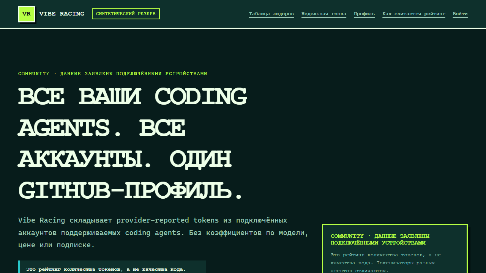
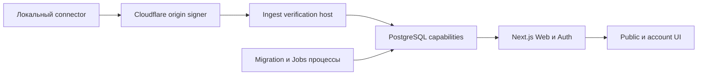

# Vibe Racing

> **Статус:** локальная pre-alpha. Синтетический веб-прототип запускается, но production-сервиса и
> выпущенного connector пока нет.

Внешнее участие закрыто. Репозиторий уже публичен в source-only режиме: записан maintainer и
matching CODEOWNERS, включён Private Vulnerability Reporting, Issues/Discussions отключены, Pull
Requests ограничены collaborators, а `main` защищён активным ruleset. Это только public-source
evidence, не release, deployment, beta или приглашение к участию. Процесс описан в
[GitHub source-only publication (EN)](docs/getting-started/GITHUB_FIRST_PUBLICATION.md).

Vibe Racing — открытый пиксельный недельный рейтинг точных provider-reported tokens coding agents.
Принятая clean-slate модель использует один immutable GitHub identity, несколько логических
`AgentAccount`, account-scoped device keys, прямую точную недельную сумму, shared rank и публичное
чтение только готовых snapshots. Community остаётся self-reported, токенизаторы различаются, а rank
не означает нормализованные стоимость/compute, награду или привилегию.

Невыпущенный локальный Codex-only baseline заменён по
[ADR 0076](docs/decisions/0076-clean-agent-account-provider-reported-token-ranking.md). Результат
остаётся pre-release синтетическим evidence: ни один provider, connector version, target platform,
hosted service или deployment не считается supported без отдельных доказательств из
[implementation status](docs/IMPLEMENTATION_STATUS.md).



Изображение входит в repository-owned синтетическую матрицу и не содержит account state или реальную
статистику.

## Быстрый запуск

Нужны Node.js `24.18.0` и pnpm `11.7.0`. Rust `1.94.0` требуется для полной проверки репозитория, а
Docker Compose v2 — только для opt-in PostgreSQL integrations.

```text
pnpm install --frozen-lockfile --ignore-scripts
pnpm run dev:web
```

Откройте показанный `localhost` URL. Для синтетического превью не нужны аккаунт, база, connector,
environment-файл или реальные данные.

Обычная детерминированная проверка:

```text
pnpm run verify
```

Полный release-gate и Docker-backed integrations запускаются отдельно. Команды и границы
доказательств описаны в [локальной разработке (EN)](docs/getting-started/LOCAL_DEVELOPMENT.md).

## Что реализовано локально

- Адаптивный EN/RU semantic server-rendered leaderboard, lazy pixel race, public profile, garage,
  три темы, forced-colors и reduced-motion поверх синтетических snapshots.
- Три bounded default-off public snapshot route: current leaderboard, historical leaderboard и
  current public profile. Четыре legacy score/race/status/token route возвращают 404.
- Default-off invite, GitHub OAuth, passkey, recovery, private account, batch pairing,
  AgentAccount/installation/device lifecycle, deletion и CarRecipe boundaries с injected или
  disposable-database evidence.
- Единственный unreleased `UsageSyncV1` на `POST /v1/usage`: Cloudflare Worker boundary, Ingest
  verification/application и одна атомарная least-privileged PostgreSQL capability.
- Provider-neutral unreleased connector с OS credential storage, bounded batch discovery/pairing,
  account-scoped keys и sync/status/doctor. Единственный exact Codex `0.144.5` reader остаётся
  recognized, а не supported, до clean-machine real-account и release evidence.
- Clean database bootstrap из семи revisions и default-off migration, Jobs из 13 capabilities и
  in-memory Jobs scheduler с disposable PostgreSQL evidence.

Текущий inventory контрактов: **18 схем, 4 protocol policies, 7 OpenAPI operations и 7 OpenAPI
paths**. Текущий database inventory: **7 immutable SQL migration revisions**.

Это локальные и синтетические доказательства. Они не подтверждают deployed service, live
OAuth/authenticator/database credentials, внешний TLS/edge route, representative capacity,
операционный cleanup cadence, released connector или ingestion реальных пользователей. Канонический
реестр доказательств находится в [Implementation status (EN)](docs/IMPLEMENTATION_STATUS.md).

## Модель доверия и приватность

Community results предоставляются локальными устройствами и не подтверждаются провайдером. Их нельзя
использовать для денежных призов, доступа, авторизации или других ценных преимуществ. Verified
ingestion остаётся выключенным до появления независимо проверяемого server-verifiable источника.

В network protocol нет полей для промптов, переписки, кода, содержимого репозиториев, локальных
путей, email, access tokens, API-ключей или произвольных пользовательских файлов. Публичные
projections не содержат raw usage, private identifiers и точное время получения. Подробнее:
[Privacy data map (EN)](docs/security/PRIVACY_DATA_MAP.md),
[Security invariants (EN)](docs/architecture/SECURITY_INVARIANTS.md) и
[Threat model (EN)](docs/security/THREAT_MODEL.md).

## Архитектура



Каждая стрелка — bounded capability, а не общие ambient-права. Default-off module-load gates, точные
public contracts, изолированные database roles и no-queue admission удерживают локальные slices
закрытыми до выполнения deployment prerequisites. Полные схемы:
[System context (EN)](docs/architecture/SYSTEM_CONTEXT.md) и
[Data flows (EN)](docs/architecture/DATA_FLOW.md).

## Проверка

```text
pnpm run verify
pnpm run verify:release
pnpm run check:public:staged
pnpm run check:history
pnpm run check:publication
```

- `verify` — обычный development gate.
- `verify:release` добавляет coverage, production builds, docs/history/visual/policy checks, checker
  regressions, licenses, formatting и доступные Windows connector tests.
- `check:public:staged` проверяет точный Git index перед коммитом.
- `check:history` проверяет reachable refs, identities, DCO, paths и blobs.
- `check:publication` сейчас проходит tracked source-only boundary и fail-closed при drift
  maintainer, CODEOWNERS, remote, reporting или interaction policy.

Зелёная локальная команда не является production или hosted-CI evidence.

## Готовность к GitHub

Репозиторий уже публичен в **source-only режиме**. Для опубликованного baseline есть успешный hosted
CI run; `main` защищён активным ruleset без bypass с pull-request, conversation-resolution, strict
required-check, deletion и non-fast-forward controls.

- public maintainer registry совпадает с CODEOWNERS;
- Private Vulnerability Reporting включён и видим, но external-account submission и notification
  delivery не проверены end-to-end;
- Issues и Discussions отключены, Pull Requests ограничены collaborators;
- обязательные checks: `Node and repository gates`, `Rust workspace gate` и
  `PostgreSQL capability and invariant gate`;
- каждая новая revision всё равно требует reviewed PR, собственные hosted checks и повторный
  source-only policy readback. Зелёная локальная branch не является hosted evidence.

Пока participation закрыт, фиктивный conduct endpoint не создаётся. Для открытия public interactions
позже потребуется реальный протестированный private conduct channel. Точный процесс:
[First GitHub publication (EN)](docs/getting-started/GITHUB_FIRST_PUBLICATION.md).

## Основные документы

- [Индекс документации (EN)](docs/README.md)
- [План проекта (EN)](docs/PROJECT_PLAN.md)
- [Статус реализации (EN)](docs/IMPLEMENTATION_STATUS.md)
- [Локальная разработка (EN)](docs/getting-started/LOCAL_DEVELOPMENT.md)
- [Публичные контракты (EN)](contracts/README.md)
- [Database foundation (EN)](database/README.md)
- [Architecture decisions (EN)](docs/decisions/README.md)
- [Security policy (EN)](SECURITY.md)
- [Contributing (EN)](CONTRIBUTING.md)
- [Maintainers и publication gate (EN)](MAINTAINERS.md)
- [English README](README.md)

## Участие и безопасность

Внешние contributions сейчас закрыты. Maintainer changes следуют [CONTRIBUTING.md](CONTRIBUTING.md),
используют только синтетические данные и DCO sign-off.

Не публикуйте vulnerability details в issue, pull request, discussion, commit message или social
post. Используйте private vulnerability-reporting action, описанный в [SECURITY.md](SECURITY.md);
external-account submission и notification delivery ещё не протестированы end-to-end.

## Лицензия

Исходный код доступен по [Apache-2.0](LICENSE). Dependency и asset records находятся в
[THIRD_PARTY_NOTICES.md](THIRD_PARTY_NOTICES.md) и
[Asset provenance (EN)](docs/reference/ASSET_PROVENANCE.md).

## Важно

Считайте каждый tracked file и reachable commit публичным. Не добавляйте production credentials,
personal account data, private logs, внутренние anti-abuse thresholds, локальные пути или реальные
usage exports. Автоматические сканеры не заменяют ручной просмотр полного staged diff и Git history.
