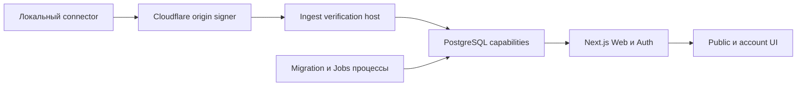

# Vibe Racing

> **Статус:** локальная pre-alpha. Синтетический веб-прототип запускается, но production-сервиса и
> выпущенного connector пока нет.

Внешнее участие закрыто до настройки реальных публичных maintainers, CODEOWNERS и проверенных
приватных каналов для security/conduct reports. Безопасная последовательность описана в
[инструкции первой GitHub-публикации (EN)](docs/getting-started/GITHUB_FIRST_PUBLICATION.md).

Vibe Racing — открытый пиксельный недельный рейтинг вайбкодеров. Privacy-first **vibecode rating**
представлен как одна публичная гонка. Текущий локальный slice поддерживает только Codex и напрямую
суммирует provider-reported tokens: без логарифма, бонуса за активные дни и коэффициентов
провайдера, модели или стоимости.


Изображение входит в repository-owned синтетическую матрицу и не содержит account state или реальную
статистику.

## Быстрый запуск

Нужны Node.js `24.18.0` и pnpm `11.7.0`. Rust `1.94.0` требуется для полной проверки репозитория, а
Docker Compose v2 — только для opt-in PostgreSQL integrations.

```text
pnpm install --frozen-lockfile --ignore-scripts
pnpm run dev:web
```

Откройте показанный `localhost` URL. Для синтетического превью не нужны аккаунт, база, connector,
environment-файл или реальные данные.

Обычная детерминированная проверка:

```text
pnpm run verify
```

Полный release-gate и Docker-backed integrations запускаются отдельно. Команды и границы
доказательств описаны в [локальной разработке (EN)](docs/getting-started/LOCAL_DEVELOPMENT.md).

## Что реализовано локально

- Адаптивная EN/RU синтетическая гонка, leaderboard, public profile, garage, три темы,
  reduced-motion режим и браузерный score simulator.
- Четыре bounded default-off public read route для score, race, race status и direct token ranking.
- Default-off invite, GitHub OAuth, passkey, recovery, account, pairing, device/source, deletion и
  CarRecipe boundaries с injected или disposable-database evidence.
- Единственный unreleased протокол `UsageSyncV1`: Cloudflare origin signer, Ingest verification и
  least-privileged PostgreSQL capability.
- Candidate-only Windows x86_64 connector foundation с native credential storage, pairing,
  exact-version Codex admission, one-shot sync и proposal-only командами.
- Default-off migration и Jobs процессы с локальными lifecycle и disposable PostgreSQL tests.

Текущий inventory контрактов: **14 схем, 4 protocol policies, 8 OpenAPI operations и 8 OpenAPI
paths**. Текущий database inventory: **43 immutable SQL migration revisions**.

Это локальные и синтетические доказательства. Они не подтверждают deployed service, live
OAuth/authenticator/database credentials, внешний TLS/edge route, representative capacity,
операционный cleanup cadence, released connector или ingestion реальных пользователей. Канонический
реестр доказательств находится в [Implementation status (EN)](docs/IMPLEMENTATION_STATUS.md).

## Модель доверия и приватность

Community results предоставляются локальными устройствами и не подтверждаются провайдером. Их нельзя
использовать для денежных призов, доступа, авторизации или других ценных преимуществ. Verified
ingestion остаётся выключенным до появления независимо проверяемого server-verifiable источника.

Проект не собирает промпты, переписку, содержимое репозиториев, Codex access tokens, API-ключи или
произвольные пользовательские файлы. Публичные projections не содержат raw usage, private
identifiers и точное время получения. Подробнее:
[Privacy data map (EN)](docs/security/PRIVACY_DATA_MAP.md),
[Security invariants (EN)](docs/architecture/SECURITY_INVARIANTS.md) и
[Threat model (EN)](docs/security/THREAT_MODEL.md).

## Архитектура



Каждая стрелка — bounded capability, а не общие ambient-права. Default-off module-load gates, точные
public contracts, изолированные database roles и no-queue admission удерживают локальные slices
закрытыми до выполнения deployment prerequisites. Полные схемы:
[System context (EN)](docs/architecture/SYSTEM_CONTEXT.md) и
[Data flows (EN)](docs/architecture/DATA_FLOW.md).

## Проверка

```text
pnpm run verify
pnpm run verify:release
pnpm run check:public:staged
pnpm run check:history
pnpm run check:publication
```

- `verify` — обычный development gate.
- `verify:release` добавляет coverage, production builds, docs/history/visual/policy checks, checker
  regressions, licenses, formatting и доступные Windows connector tests.
- `check:public:staged` проверяет точный Git index перед коммитом.
- `check:history` проверяет reachable refs, identities, DCO, paths и blobs.
- `check:publication` fail-closed до настройки реальных GitHub identities и hosted controls.

Зелёная локальная команда не является production или hosted-CI evidence.

## Готовность к GitHub

Сначала исходники загружаются в **приватный GitHub repository**. Пока репозиторий приватный,
настройте и проверьте все доступные в этом режиме controls. GitHub Private Vulnerability Reporting
включается во время контролируемого visibility cutover, потому что эта repository setting доступна
для public repositories. Не объявляйте проект и не приглашайте внешних участников до зелёного
финального publication gate.

- подтверждены публичные maintainer identities и matching CODEOWNERS;
- настроен и проверен приватный conduct-reporting channel;
- защищён `main` и выбраны обязательные CI checks;
- просмотрен первый hosted Actions run и его публичные logs;
- выполнен проверенный visibility cutover, сразу включён и протестирован GitHub Private
  Vulnerability Reporting, а при его недоступности процесс остановлен или repository возвращён в
  private visibility;
- повторно пройдены `verify:release` и `check:publication`.

Точный private-first процесс:
[First GitHub publication (EN)](docs/getting-started/GITHUB_FIRST_PUBLICATION.md).

## Основные документы

- [Индекс документации (EN)](docs/README.md)
- [План проекта (EN)](docs/PROJECT_PLAN.md)
- [Статус реализации (EN)](docs/IMPLEMENTATION_STATUS.md)
- [Локальная разработка (EN)](docs/getting-started/LOCAL_DEVELOPMENT.md)
- [Публичные контракты (EN)](contracts/README.md)
- [Database foundation (EN)](database/README.md)
- [Architecture decisions (EN)](docs/decisions/README.md)
- [Security policy (EN)](SECURITY.md)
- [Contributing (EN)](CONTRIBUTING.md)
- [Maintainers и publication gate (EN)](MAINTAINERS.md)
- [English README](README.md)

## Участие и безопасность

Внешние contributions сейчас закрыты. Maintainer changes следуют [CONTRIBUTING.md](CONTRIBUTING.md),
используют только синтетические данные и DCO sign-off.

Не публикуйте vulnerability details в issue, pull request, discussion, commit message или social
post. До публичного объявления GitHub Private Vulnerability Reporting должен быть фактически включён
и проверен. См. [SECURITY.md](SECURITY.md).

## Лицензия

Исходный код доступен по [Apache-2.0](LICENSE). Dependency и asset records находятся в
[THIRD_PARTY_NOTICES.md](THIRD_PARTY_NOTICES.md) и
[Asset provenance (EN)](docs/reference/ASSET_PROVENANCE.md).

## Важно

Считайте каждый tracked file и reachable commit публичным. Не добавляйте production credentials,
personal account data, private logs, внутренние anti-abuse thresholds, локальные пути или реальные
usage exports. Автоматические сканеры не заменяют ручной просмотр полного staged diff и Git history.
