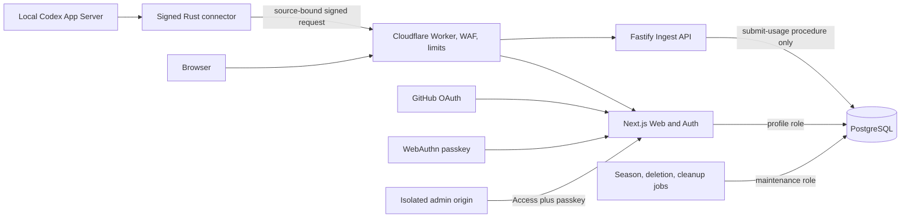

# Vibe Racing public implementation plan

## Document status

This is the canonical, public-safe plan for the project. It intentionally contains no credentials,
personal account data, production hostnames, local machine paths, incident details, or live
anti-abuse thresholds.

The repository contained no implementation when this plan was written. The separate
[implementation status](IMPLEMENTATION_STATUS.md) records evidence as delivery progresses. Behavior
described here remains proposed until that page points to corresponding code, tests, and deployment
evidence.

## Reading map

- Product and data truth: Outcome, Product behavior, Trust model.
- System design: Architecture, Codex compatibility contract, Multi-account and multi-device model.
- Security-critical flows: Identity, passkeys, pairing, protocol, deletion, administration, and
  operations.
- Public project quality: Repository design, documentation, tests, supply chain, versioning, and
  release.
- Execution: Delivery phases and public-beta release gates.

Readers implementing one subsystem should still review the linked
[security invariants](architecture/SECURITY_INVARIANTS.md), because those constraints cross service
boundaries.

## Outcome

Vibe Racing will be an English/Russian, pixel-art weekly leaderboard for Codex users. A signed local
connector reads a narrow token-activity response from the local Codex App Server and submits bounded
daily values to the service. Public profiles appear as cars in a live weekly race.

The product launches as an invite-only Community beta. Community data is self-reported and
unverified. It cannot award money, prizes, authorization, or valuable product privileges.

A separate Verified league is present only as a disabled server-owned state. It remains impossible
to populate until a future OpenAI source supplies server-verifiable usage and account identity.

## Findings incorporated into this revision

The earlier design had several claims that were too strong for a high-quality public project:

1. Current Codex account information exposes an account type and, for some ChatGPT accounts, an
   email, but no documented immutable account identifier. Email can also be absent. Therefore the
   service cannot prove global account uniqueness.
2. The daily bucket date is currently a string in the generated schema. The project must not claim
   undocumented UTC semantics.
3. A VOPRF over account email would add a substantial cryptographic and privacy surface without
   making a modified client honest.
4. Blindly retaining the maximum usage value makes an accidental or malicious spike difficult to
   correct.
5. A public repository needs governance, contribution, provenance, compatibility, documentation,
   licensing, privacy, and operational gates in addition to application code.
6. Agent readability requires concise durable instructions, stable contracts, explicit invariants,
   an architecture index, and commands that are actually exercised by CI.

This plan corrects those issues rather than hiding them behind anti-cheat language.

## Product behavior

### Public experience

- The home page opens on the current weekly race rather than a marketing-only landing page.
- The leaderboard shows shared rank, car, display handle, weekly score, active days, optional
  streak, freshness rounded to a day, and the number of sources contributing that week.
- Users can inspect their score by day, connected sources, device keys, car proposal, privacy
  controls, and deletion flow.
- Three switchable visual themes use the same semantic race state: Neon Night Arcade, Classic Grand
  Prix, and Cyber Rally.
- Keyboard navigation, screen-reader labels, contrast, reduced motion, and a non-animated table view
  are first-class acceptance criteria.
- The interface and user documentation ship in English and Russian.

### Privacy defaults

- Public identity is a user-selected handle. Linking the public profile to GitHub is opt-in.
- Exact token totals are private by default.
- Last-sync data is rounded to a day so the UI does not expose an exact working schedule.
- A user can pause collection, hide the profile immediately, or delete it.
- The MVP uses no advertising, behavioral analytics, third-party tracking pixels, or remote web
  fonts.

### Explicit non-goals

- Ranking all Codex users worldwide.
- Claiming OpenAI endorsement or verification.
- Supporting prizes, wagering, paid ranking, or usage-based authorization.
- Reading prompts, conversations, repositories, model selections, API keys, or Codex authentication
  tokens.
- Arbitrary image, SVG, HTML, CSS, script, archive, or URL uploads.
- Supporting API-key and Amazon Bedrock Codex modes in the first release.
- Implementing the Verified league before a verifiable upstream contract exists.

## Trust model

### Actors

- Visitor: reads public race and profile data.
- GitHub user: owns one Vibe Racing profile.
- Passkey holder: approves security-sensitive profile changes.
- Local connector: owns a source-bound device key and submits Community data.
- Maintainer: develops and releases the project but has no routine need to read user usage values.
- Operator: runs Cloudflare, Railway, and PostgreSQL with separated production roles.
- Attacker: may control browsers, modified connectors, many GitHub accounts, network clients,
  malicious pull requests, or leaked device credentials.

### Residual risk

A computer owner can modify the connector, fabricate token values, create several declared sources,
or share a device. Request signatures prove which registered device sent a payload; they do not
prove that the payload came from an honest Codex installation.

We contain this risk by:

- keeping the league explicitly Community and reward-free;
- applying the score cap once per profile after aggregating all sources;
- publishing the number of sources used in a season;
- removing raw-token tie breakers;
- rate-limiting source creation and ingestion with deployment-configured policies;
- quarantining anomalous records without calling the heuristic verification;
- keeping Verified ingestion unreachable.

## Architecture



### Runtime components

- Web/Auth: Next.js App Router and strict TypeScript. Local invite/OAuth/initial-passkey enrollment
  and returning discoverable-credential login use purpose-separated encrypted cookies, exact
  same-origin bounded routes, application WebAuthn verification, and fixed calls through the probed
  read-write pool. Login options retain no database state; valid proof alone reaches atomic
  challenge creation/consumption and passkey-provenance session minting. A dormant transport-free
  pairing start boundary now owns fresh server IDs/token/challenge/code, separate protected
  poll/code verifiers, closed device metadata, nine-minute expiry, and one fixed call through a
  separate probed read-write pool wrapper. A second dormant boundary owns protected poll lookup,
  strict possession proof, server-owned activation IDs, and fixed admission/timing. Pairing browser
  approval, recovery/step-up, edge attempt policy, live provider/database credentials, and
  deployment remain separate gates.
- Ingest: a small Fastify service with no OAuth, admin, signing, or deployment credentials. Its
  first local slices are a pure raw-request verification kernel and a bounded least-privileged
  PostgreSQL adapter, a protected exact two-key origin configuration reader, and an atomic
  PostgreSQL origin-replay capability. A transport-free application boundary now composes those
  exact capabilities, generates one server request ID, waits for database settlement, and validates
  a closed acknowledgement or generic problem decision. A separate bounded Fastify factory now
  preserves exact raw HTTP evidence, enforces local parser/header/connection/deadline and four-call
  no-queue policies, rejects proxy/request-ID trust, and serializes only revalidated contracts. The
  host/port/TLS entry point, secret-manager/edge key injection, direct-origin denial, distributed
  rate/backpressure controls, live login/certificate, capacity evidence, end-to-end integration, and
  deployment remain separate gates.
- Jobs: idempotent Node.js one-shot jobs for season finalization, deletion, retention, and cleanup.
  The first local runner now wraps only the reviewed ingest cleanup, pairing cleanup, Community
  refresh, and finalization procedures; scheduling, deletion purge, monitoring, live credentials,
  and deployment remain separate gates.
- Database: PostgreSQL with SQL-first migrations and separate non-owner runtime roles.
- Edge: Cloudflare Worker for origin proof, WAF integration, request shaping, and public caching.
- Connector: Rust CLI for Windows, macOS, and Linux.
- Contracts: language-neutral JSON Schemas; generated OpenAPI and language types are derived
  artifacts checked for drift.

### Deployment boundaries

- Cloudflare is the only intended public entry point.
- The edge adds a short-lived proof bound to method, path, body hash, and time.
- Railway rejects missing, expired, replayed, or body-mismatched proofs before application work.
- Health endpoints expose no build secrets or dependency details and have a separate narrow policy.
- Staging and production use different projects, databases, OAuth registrations, passkey origins,
  edge keys, and deployment credentials.
- Pull-request previews never use production data or production secrets.

## Codex compatibility contract

### Supported surface

The connector launches Codex App Server over local stdio, performs the required initialize
handshake, and allowlists only:

- account/read, used to confirm that the active mode is ChatGPT while ignoring and never
  transmitting the returned email or plan;
- account/usage/read, used for the summary and daily buckets.

The connector does not enable experimental API capability. It rejects WebSocket, thread, turn, item,
approval, MCP, file, shell, and login methods.

### Version policy

App Server schemas are version-specific. Compatibility is therefore explicit, not guessed from a
broad semantic-version range.

- docs/reference/codex-compatibility.md lists every supported Codex version.
- compat/codex contains a manifest and synthetic fixtures for each candidate or supported exact
  contract; candidate evidence is forbidden from the supported matrix.
- Required CI installs pinned supported Codex releases, generates their stable JSON schemas, and
  compares the extracted account contracts.
- A non-blocking scheduled job probes the latest release and opens an issue when the contract
  changes.
- An unknown or malformed contract fails closed with a clear local error. It never uploads a partial
  interpretation.
- Compatibility additions require fixtures, an ADR when semantics change, and connector release
  notes.

ADR 0022 now adds candidate-only `0.144.4` evidence: immutable release metadata, full stable-schema
digests, minimal account extracts, synthetic fixtures, a drift checker, and a closed library parser
for the two planned reads. It confirms ChatGPT mode while discarding email/plan/summary values and
returns only bounded sorted daily date/token entries. ADR 0023 adds a one-shot supervisor with a
fixed `app-server` argument, local pipes, no ambient environment, bounded stdout/stderr/time, and
reap-before-success composition. Its launch capability deliberately has no public constructor until
a later boundary resolves links, rejects untrusted writable paths, and verifies the exact executable
and version. The candidate does not execute the official artifact, run on all platforms, upload, or
create a matrix row. ADR 0024 adds an inaccessible reviewed source/device/time/nonce context whose
minimized daily usage produces one exact bounded `ConnectorSyncV1` body, SHA-256 digest, and
LF-separated device message. ADR 0025 removes public access to that unsigned material and adds an
isolated one-use signer behind an equally inaccessible device-bound key capability. A shared
Rust/Ingest vector proves exact body, public-key, and signature agreement. ADR 0026 adds a second
domain-separated pairing-possession policy, inaccessible pending-key/challenge signer, and pure
strict Web verifier with a shared synthetic vector. Context construction, key generation/storage,
browser approval, transport, retry, scheduling, and support remain absent. ADR 0027 adds the dormant
server-side half of the final activation step: exact 32-byte poll tokens become primary/secondary
HMAC-SHA-256 verifier candidates, one probed read-write Web pool selects at most one approved
transaction, the strict proof is mandatory, and only server-owned IDs reach the atomic procedure.
Its four-call admission and 250-millisecond floor are local process safeguards, not an anonymous
route or distributed client-rate policy. ADR 0028 adds the dormant server-side start half: closed
public-key/device metadata enters, fresh server IDs, a 32-byte poll token and challenge, separate
primary poll/code HMAC verifiers, a 60-bit human code, and a nine-minute expiry reach only the fixed
`start_pairing` procedure. Malformed admitted input performs fixed-shape local work but no database
write. This still provides no public request/response contract, connector client, browser approval,
anonymous route, or distributed abuse control. Revision 0013 and ADR 0029 add only the separate
Jobs-side physical cleanup: at most 1000 expired non-activated transactions and exact pending keys
per call, with activated and live state preserved. No scheduler or retention cadence exists.

### Date semantics

The current contract does not document a timezone for startDate. Version 1 therefore:

- accepts only the strict YYYY-MM-DD shape;
- stores it as codexReportedDate rather than calling it UTC;
- groups the value into an ISO Monday-based season without claiming what timezone created the
  upstream label;
- uses server receivedAt, never client time, for grace periods and finalization;
- documents any future timezone clarification through an ADR and data migration.

## Multi-account and multi-device model

### CodexSource

A CodexSource is an opaque Community source created by the user. It is not marketed as a verified
OpenAI account identity.

One profile can hold at most 32 lifetime source records and 64 active plus unexpired approved device
authorities. These are public fail-safe ceilings, not product targets. Creation and synchronization
also remain subject to lower private fair-use, rate, and infrastructure budgets.

When pairing a device, the user chooses:

- create a new source for another Codex account; or
- attach this device to an existing source representing the same account.

That choice requires a current GitHub session and passkey. All devices attached to one source are
deduplicated at the source/date level. Separate sources are summed.

This design intentionally does not read, hash, transmit, or store account email. It also does not
pretend to prevent a malicious user from declaring the same account as several sources. The public
source count and Community label make the remaining limitation visible.

### State model

Source states are:

- active: eligible to submit;
- paused: retained but unable to submit until passkey reactivation;
- unlinked: future submissions are rejected while season attribution remains;
- quarantined: submissions are retained for review but excluded from ranking;
- deleted: removed through the profile deletion workflow.

Every transition is an explicit server-side state machine with database constraints and an audit
event.

### Usage update rule

- Device snapshots for one source/date never sum.
- A value greater than or equal to the prior accepted value can advance the current snapshot while
  the season is open.
- A decrease, malformed date, impossible range, or suspicious jump quarantines the update instead of
  silently taking max or overwriting history.
- Signed raw snapshots are retained for a short documented dispute window, proposed as 30 days, then
  removed.
- Finalized seasons are immutable except through a separately authorized, reasoned, audited
  correction process.

## Identity, passkeys, and pairing

### Profile enrollment

- Invite-only beta.
- GitHub OAuth with minimal identity permission, state, PKCE, exact redirect matching, one-time code
  handling, and session-fixation prevention.
- The GitHub access token is discarded after the immutable GitHub user ID is resolved.
- One profile per GitHub user ID.
- Turnstile is validated server-side for invite redemption and suspicious anonymous flows.
- Invite values and recovery codes are stored only as slow or keyed hashes, as appropriate to their
  entropy.

### WebAuthn

- At least one passkey is required after GitHub enrollment.
- Multiple passkeys are supported before recovery codes can be regenerated.
- User verification is required for registration and critical actions.
- RP ID and allowed origins are exact per environment.
- Challenges are high-entropy, one-time, short-lived, and transaction-bound.
- Login challenges carry no profile authority; a session is bound only after an active exact
  credential derives the profile and the application verifies the assertion.
- Sessions retain their authenticating-passkey provenance across rotation, and critical step-up
  challenges retain the exact verifying passkey separately.
- Attestation is not required in the MVP; the service does not build a device fingerprint database.
- Sign counters are treated as a risk signal, not a universal clone detector.
- Adding a device, unlinking a source, changing recovery, and deleting a profile require fresh
  step-up.
- Passkey removal is terminal, cannot remove the last active credential, and closes the removed
  key's sessions, unused ceremonies, and approved-but-not-activated pairing authority. Activated
  devices remain explicit separately revocable credentials.
- Public database safety ceilings allow at most 32 retained passkey records and 32 active unexpired
  browser sessions per profile; edge limits and expiry cleanup remain independently required.
- Recovery uses a short-lived restricted authority and cannot become a normal browser session until
  a replacement passkey is safely established.
- Recovery-code regeneration requires an exact active-session passkey step-up and atomically
  replaces a batch of 8 to 16 opaque-selector/secret codes. Plaintext is shown once; only Argon2id
  PHCs are persisted, and used verifier material is immediately scrubbed.
- After bounded application Argon2id verification, one code creates at most one ten-minute
  registration authority bound to the exact replacement WebAuthn challenge and context. It cannot
  call session, profile, source, device, invite, ingest, job, deletion, or admin capabilities.
- Successful registration atomically installs the replacement passkey, revokes old passkeys and
  browser sessions, cancels pending device approval, removes remaining codes/challenges, and only
  then creates a passkey-bound session. Activated source-bound devices remain visible and explicitly
  revocable because they have no profile-admin scope.
- Recovery lookup and verification require generic responses and timing, body/attempt bounds,
  edge/service rate controls, protected deployment pepper, cleanup, and monitoring. Recovery
  completion fails closed at the 32-lifetime-passkey provenance ceiling until bounded cleanup is
  implemented.

### Device authorization

1. The agent-facing connect page contains static, versioned instructions and no personalized secret.
2. The user or agent downloads a GitHub Release and verifies checksum, platform signature, and
   provenance.
3. The connector creates an Ed25519 key for the selected source.
4. The connector starts a transaction with its immutable public key and safe metadata. The server
   returns a high-entropy poll token, a transaction challenge, and a short user code; only keyed
   verifiers are persisted.
5. The browser displays the code, public-key fingerprint, source choice, connector version,
   platform, and device label.
6. A GitHub session plus fresh passkey approves the exact pending transaction and source choice.
7. The connector presents the poll token and proves private-key possession by signing the bound
   challenge.
8. The server atomically activates the binding and issues a public device ID tied to that public key
   and exactly one source.

The poll token is short-lived, one-time, and insufficient to approve or activate a device without
the browser step-up and key-possession proof. Its plaintext is returned once and is never persisted
or logged. There is no long-lived bearer credential. Each later sync request signs a canonical
method, path, body hash, device ID, nonce, timestamp, and idempotency key.

Nonce records expire after the replay window. Idempotency records have bounded retention. Neither
table can grow without cleanup.

### Local connector safety

- User-scoped installation with no administrator or root requirement.
- Keys live in Windows Credential Manager, macOS Keychain, or Linux Secret Service. No plaintext
  persistent fallback.
- The connector resolves symlinks, rejects an untrusted writable Codex path, displays the selected
  binary and version, and does not accept a silent environment-variable override.
- The App Server child process has a bounded lifetime, bounded output, separate stderr, sanitized
  environment, and guaranteed cleanup.
- Scheduled execution uses an argument array, fixed executable path, fixed working directory,
  jittered retry, and no shell evaluation.
- The connector never executes commands or scripts received from the website.
- MVP updates are manual and verified. Auto-update is deferred until its own signed update threat
  model exists.
- Telemetry is off by default. Local diagnostic export is explicit, redacted, and previewed before
  sharing.

## Public protocol and data

### Canonical contracts

Contracts live under contracts/v1 as human-readable JSON Schema. They are the source of truth for:

- strict request and response validation;
- generated OpenAPI documentation;
- generated TypeScript types;
- Rust serialization fixtures;
- size, enum, integer, timestamp, and unknown-field rules.

Generated artifacts state their generator and source. CI regenerates them and fails on drift.

All public endpoints:

- are under /v1;
- accept only declared content types and bounded bodies;
- reject unknown fields;
- return a documented problem-details error shape and request ID;
- have explicit cache and CORS policy;
- never expose stack traces, SQL errors, secrets, or internal hostnames.

The first reserved read contract is `GET /v1/community/scores?seasonStart=YYYY-MM-DD`. It accepts
exactly one supported Monday season, returns a bounded Community score page or the documented
problem shape, and starts with `Cache-Control: no-store`, `Vary: Accept`, and same-origin/no-CORS
semantics. ADR 0013, the generated OpenAPI operation, and a local Next.js route now implement the
closed query, GET-only method/`Accept` policy, exact problem translation, final response validation,
and four-request no-queue admission. The lease remains held through the adapter's enforced
connect/query/statement deadlines. This local evidence is not a deployment, live database login,
edge rate policy, shared cache, capacity result, or public-beta claim.

The visible home race now uses that exact same-origin operation for its current server-selected
Monday. It accepts only the bounded Public response, uses no credentials or browser persistence, and
keeps a clearly labeled synthetic fallback on any invalid or unavailable result. CarRecipe, streak,
freshness, authenticated profile detail, cache, live database integration, and deployment remain
separate gates.

### ConnectorSyncV1

The minimum payload contains:

- schemaVersion;
- sourceId;
- syncId;
- observedAt for replay protection only;
- connectorVersion and Codex version;
- bounded daily entries with codexReportedDate and tokens.

Trust tier, score, rank, streak, profile ID, season, receivedAt, and moderation state are
server-derived and absent from client-writable schemas.

ADR 0015 and `connector-sync-authentication.json` now make the local pre-database verification
boundary executable. They fix the exact method/target/media type, copied raw envelope and JSON
budgets, canonical base64url/timestamps, and LF-separated origin/device messages. A pure verifier
checks a replay-consumed exact-body origin HMAC before parsing or device lookup, validates the
generated payload contract, and verifies the source-bound exact-body request under strict Ed25519
semantics. ADR 0016 adds a separate bounded PostgreSQL config/pool/mapper for only the minimal
device lookup and verified submission procedures, with per-checkout least-privilege probes and
mock-pool evidence. ADR 0017 adds exact protected primary/secondary origin-key configuration and a
factory that constructs the verifier without returning raw configuration. ADR 0018 adds the
forced-RLS origin replay tuple, atomic Ingest-only consume, Jobs cleanup extension, and strict local
adapter mapping. ADR 0019 composes one configured database boundary with that verifier, generates a
server-owned request ID, waits for submission, and validates only the closed result/problem
contracts. ADR 0020 adds the local exact Fastify POST boundary with copied raw bytes/headers,
no-queue admission, fixed connection and deadline budgets, no proxy/request-ID trust, and closed
contract serialization. It is not a host/port/TLS deployment entry point, live secret-manager/edge
integration, working database login/TLS connection, connector, edge path, capacity result, or
deployment.

### Storage

Primary tables include:

- profiles, sessions, passkeys, recovery codes, and invites;
- codex sources and device keys;
- short-lived origin and device replay digests;
- signed usage snapshots and current source/day values;
- seasons, score-version records, entries, and source-count snapshots;
- CarRecipe and proposals;
- audit events, deletion jobs, and short-lived security tombstones.

Important constraints include unique GitHub identity, unique device public key, unique origin
key/digest and device nonce within their replay windows, unique source/date current state, and valid
state-transition checks.

The ingest database role receives EXECUTE only on narrowly owned submission procedures and cannot
directly modify profiles, passkeys, invites, admin state, schema, or finalized seasons. Migration
ownership is never assigned to a runtime service.

## Scoring and seasons

For each Codex-reported date:

```text
profileDailyTokens =
  sum(current accepted tokens for each distinct active source)

dailyScore =
  min(1000, round(250 * ln(1 + profileDailyTokens / 10000)))

weeklyScore =
  sum(dailyScore), capped at 7000
```

Rules:

- The profile cap is applied after all sources are summed.
- Raw tokens are not a tie breaker.
- Equal weekly score and active-day count share the same rank.
- Display ordering inside a shared rank is deterministic per season and has no competitive meaning.
- Streak is informational and does not increase score.
- The scoring version is stored with each season and cannot change mid-season.
- A public simulator and synthetic-distribution tests show the effect of the formula before beta.
- A season begins on Monday according to codexReportedDate grouping.
- [ADR 0008](decisions/0008-community-season-grace-and-finalization.md) fixes the Community grace
  deadline at Wednesday 00:00 UTC after that ISO week, 48 hours after the next Monday begins.
- Server receive time closes the Ingest window; a Jobs decision time at or after the same boundary
  finalizes the season. Client time cannot extend either decision.

The ranking page always states that it ranks participating Vibe Racing Community profiles rather
than all Codex users.

## CarRecipe and pixel assets

CarRecipe is a strict versioned object containing only project-owned enums, such as chassis, nose,
cockpit, wing, wheels, palette, trail, and a bounded seed.

- No free text, arbitrary color, URL, path, file, markup, shader, or executable value is accepted.
- The server validates the recipe before persistence.
- The renderer is deterministic across all three themes.
- An agent can propose a recipe without uploading conversation text.
- A proposal is previewed and explicitly approved in the browser.
- A device cannot directly replace the active car.

Pixel source is stored in reviewable indexed data rather than opaque editable binaries where
practical. Generated sprite sheets are derived artifacts. Fonts and unavoidable binaries require
source, license, checksum, and attribution records. Real automotive brands and protected trade dress
are not used without permission.

## Web and application security

- Strict CSP with nonces and no user-controlled markup.
- HSTS, Referrer-Policy, Permissions-Policy, frame protection, MIME sniffing protection, and an
  explicit cross-origin policy.
- Authenticated responses are private and no-store; public cache keys cannot mix user state.
- Credentialed CORS never uses a wildcard.
- State-changing browser requests require CSRF protection.
- Handles and display names use bounded normalization and plain-text rendering.
- Redirect destinations are allowlisted.
- IP-based controls trust only edge-authenticated forwarding headers.
- Error handling is constant in membership-sensitive flows where practical.
- Expensive endpoints have concurrency limits, deadlines, and backpressure.

## Deletion and retention

Confirmed deletion requires GitHub session, fresh passkey, and typed handle.

The transaction:

1. hides the public profile immediately;
2. revokes sessions and all device keys immediately;
3. makes ingestion reject the profile;
4. schedules idempotent primary-data deletion;
5. reports progress without leaking record identifiers.

Primary data is purged within the published service window. Backup expiry and any short-lived
abuse-prevention tombstone are described honestly in the Privacy Policy. Restore procedures must not
silently resurrect a deleted profile; deletion markers are replayed after recovery.

Expired pairing transactions and their authority-free pending keys now have a separate bounded
Jobs-only deletion capability and local one-shot command. This is isolated SQL/application evidence,
not a production retention schedule; all other expiry classes still require their own reviewed
cleanup and public policy.

## Administration and operations

- Admin uses a separate hostname behind Cloudflare Access plus application passkey step-up.
- Ordinary GitHub membership never implies admin.
- Admin roles are least-privileged and individual; no shared accounts.
- Sensitive actions require a reason and produce an external, append-only audit event.
- Operators cannot retrieve Codex prompts or account email because those values are never collected.
- Kill switches independently disable enrollment, pairing, source creation, ingestion, proposals,
  and public ranking.
- Operational logs are structured, redacted, retention-bounded, and avoid raw token values.
- Alerts cover auth anomalies, pairing storms, source growth, signature and replay failures, ingest
  rejection, season jobs, deletion failures, database saturation, release events, and origin-proof
  failures.
- Backup restore, key rotation, compromised release, mass device revoke, source quarantine, and
  deletion failure have tested runbooks.

## Repository design

The planned public tree is:

```text
.
|-- .agents/
|   `-- skills/
|       `-- viberacing-verify/
|-- .github/
|   |-- ISSUE_TEMPLATE/
|   |-- workflows/
|   |-- CODEOWNERS
|   |-- dependabot.yml
|   `-- pull_request_template.md
|-- apps/
|   |-- web/
|   |-- ingest/
|   `-- jobs/
|-- contracts/
|   `-- v1/
|-- crates/
|   `-- connector/
|-- packages/
|   |-- db/
|   |-- pixel-assets/
|   |-- scoring/
|   `-- ui/
|-- compat/
|   `-- codex/
|-- docs/
|   |-- architecture/
|   |-- decisions/
|   |-- getting-started/
|   |-- operations/
|   |-- reference/
|   |-- releasing/
|   `-- security/
|-- AGENTS.md
|-- CODE_OF_CONDUCT.md
|-- CONTRIBUTING.md
|-- GOVERNANCE.md
|-- LICENSE
|-- MAINTAINERS.md
|-- README.md
|-- README.ru.md
|-- ROADMAP.md
|-- SECURITY.md
|-- SUPPORT.md
`-- THIRD_PARTY_NOTICES.md
```

### Toolchain

- pnpm workspace with package manager and current LTS Node pinned in tracked configuration.
- Cargo workspace with stable Rust pinned in rust-toolchain.toml.
- Committed pnpm and Cargo lockfiles.
- Cross-platform root scripts; no Unix-only command is the sole documented development path.
- Docker Compose supplies disposable local PostgreSQL only; no production data is used for
  development.
- One root verification entry point, `pnpm run verify`, invokes the currently implemented
  language-specific, policy, and documentation checks.

### Community and governance

Before the repository is announced publicly it includes:

- Apache-2.0 LICENSE and clear asset licensing;
- CONTRIBUTING with setup, architecture map, review expectations, DCO sign-off, and safe test-data
  rules;
- CODE_OF_CONDUCT with a tested project-controlled private enforcement channel;
- SECURITY with supported versions and GitHub private vulnerability reporting;
- GOVERNANCE, MAINTAINERS, SUPPORT, ROADMAP, changelog, release policy, issue forms, and
  pull-request template;
- Developer Certificate of Origin rather than a custom CLA for the initial contributor model;
- a documented trademark and branding policy before the name or logo is promoted broadly.

Pre-public policy files and forms may exist before public identities are known, but they must state
that participation is closed. Publication remains blocked until a real maintainer, matching
CODEOWNERS rules, and tested private reporting channels replace that status. Local workstation
identity is never used as a substitute.

Repository badges are added only after the corresponding check exists. The project does not display
aspirational security, coverage, or compliance badges.

## Documentation for people and agents

### Human documentation

README stays short: purpose, screenshot, status, trust disclaimer, quick start, architecture
thumbnail, documentation map, contribution and security links.

Long-form documents follow a predictable structure:

- getting started and tutorials;
- task-oriented how-to guides;
- architecture and design explanations;
- protocol, CLI, configuration, scoring, and compatibility reference;
- operations and incident runbooks;
- numbered ADRs.

English engineering documentation is canonical. Russian documentation covers the product and user
workflows. Translation files record their canonical source, and CI reports drift.

### Agent documentation

The root AGENTS.md contains only:

- the repository map and canonical documents;
- actual build and verification commands;
- public-data boundaries;
- non-negotiable security rules;
- completion criteria.

Nested AGENTS.md files are introduced only for genuinely different areas:

- apps/ingest for signature, schema, and database-capability boundaries;
- crates/connector for local privacy, process, key, and compatibility rules;
- docs when documentation tooling requires different commands.

Repeatable verification becomes a repository skill under .agents/skills/viberacing-verify only after
the real commands are stable. The end-user connect workflow is packaged separately as a
distributable plugin or skill and invokes fixed connector commands only.

No duplicated agent-instruction files are maintained manually for different vendors. If adapter
files become necessary, they are generated from the canonical guidance and checked for drift.

### Documentation quality gates

- Markdown formatting and style.
- Internal and external link checking.
- Spelling with separate EN/RU dictionaries.
- Mermaid syntax and rendering.
- OpenAPI and JSON Schema linting.
- Translation drift.
- Executable or explicitly illustrative command examples.
- Generated-reference drift.
- File-size and broken-anchor checks for AGENTS.md and documentation indexes.

## Code quality and test strategy

### TypeScript

- Strict compiler settings and no unchecked implicit any.
- ESLint import boundaries between Web, Ingest, Jobs, contracts, and database capabilities.
- Formatter check, unit tests, property tests, and runtime schema tests.
- Security-sensitive packages receive higher branch and mutation-test expectations than presentation
  code.

### Rust connector

- unsafe code forbidden by default.
- cargo fmt, clippy with warnings denied, cargo audit, cargo deny, license checks, unit and
  integration tests.
- Fuzzing for JSON-RPC framing, schema decoding, canonical request signing, and hostile process
  output.
- Platform tests on Windows, macOS, and Linux.
- No panic or secret-bearing diagnostic on malformed upstream input.

### Required behavior coverage

- GitHub OAuth state, PKCE, callback, account uniqueness, and token disposal.
- WebAuthn RP ID, origin, challenge, replay, user verification, multiple passkeys, recovery, and
  step-up.
- Pairing expiry, code guessing, cross-source device binding, revoke, key rotation, and
  stolen-device scenarios.
- App Server handshake, supported-version adapters, nullable fields, missing buckets, malformed
  dates, oversized output, overload, timeout, and child cleanup.
- Multi-device same-source dedup and multi-source aggregation.
- Decreasing and anomalous snapshots, integer bounds, idempotency, replay cleanup, finalization, and
  shared ranks.
- Every database role attempting every forbidden capability.
- XSS, CSRF, IDOR, open redirect, cache leakage, CORS, CSP, SQL injection, origin bypass, and
  request smuggling defenses.
- CarRecipe rejection of files, URLs, markup, unknown enums, and oversized input; deterministic
  visual snapshots in every theme.
- Deletion under retries, job crashes, backup restore, and partial outage.
- Fork pull requests unable to access secrets or publish.
- Connector artifact verification from a clean machine.

### Performance and reliability

Measure rather than promise:

- public leaderboard p50/p95 latency and cache hit rate;
- ingest p95 latency, database connections, lock time, and rejection rate;
- season-finalization duration and idempotent rerun behavior;
- connector startup time, memory, child-process lifetime, and upload size;
- frontend Core Web Vitals with and without animation;
- load shedding during pairing and sync storms.

Initial SLOs are beta targets, not contractual guarantees. They are published only after staging
measurements exist.

## GitHub and supply-chain policy

- Protected default branch, required status checks, no force push, and no direct production release
  from an unreviewed commit.
- CODEOWNERS for auth, connector, contracts, database privileges, edge, workflows, and release code.
- Security-critical stable releases require independent review. If the project has only one
  maintainer, an external review substitutes for self-approval.
- All reusable GitHub Actions are pinned to full commit SHAs and updated by reviewed automation.
- Workflow permissions are read-only by default and expanded per job.
- Fork pull requests run with pull_request, no production secrets, and no privileged self-hosted
  runner.
- pull_request_target never checks out or executes untrusted fork code.
- CodeQL, secret scanning with push protection, dependency review, OSV or ecosystem audits, license
  checks, and Dependabot run continuously.
- OpenSSF Scorecard runs as a signal. Release gates focus on specific critical and high-risk checks
  rather than gaming one aggregate score.
- Release jobs operate only from protected tags or environments and receive signing/deployment
  credentials after approval.
- Binaries are built in CI, checksummed, signed where platforms support it, accompanied by SBOM, and
  GitHub provenance-attested.
- Users receive an independent verification command and expected signer identity. An attestation is
  useful only when consumers verify it.
- Release binaries live in GitHub Releases, not in source control.

## Versioning, migration, and release

- Connector, public API, CarRecipe, scoring, and database schema have explicit, independently
  documented versions.
- Connector releases follow semantic versioning.
- Public API breaking changes use a new path version and a documented deprecation window; an
  emergency security block may shorten support with a published advisory.
- Scoring changes apply only to a new season and never rewrite a finalized season silently.
- Database changes use expand-and-contract migrations compatible with the currently running
  application version.
- Every production release has migration, verification, rollback, and incident-owner steps.
- Changelog entries describe user impact, security impact, migration, and compatibility.
- Unsigned development builds are clearly distinguished from official release artifacts.

## Delivery phases

### Phase 0 — Public foundation

- Initialize Git with the public-safe baseline.
- Add community health files, governance, DCO, issue forms, CODEOWNERS, branch rules, secret
  scanning, dependency policy, and initial CI.
- Add threat model, abuse cases, privacy data map, compatibility policy, ADR template, and
  architecture diagrams.
- Add pinned toolchains, lockfiles, environment schema, and disposable local PostgreSQL.
- Gate: documentation and supply-chain checks pass without application code.

### Phase 1 — Visual prototype with synthetic data

- Build the responsive live race, leaderboard, profile shell, three themes, reduced-motion mode, and
  deterministic pixel renderer.
- Use synthetic fixtures only; no authentication or real ingestion.
- Add visual regression, accessibility, localization, and performance tests.
- Gate: the intended product can be evaluated without exposing a trust or privacy surface.

### Phase 2 — Identity and single-source vertical slice

- Implement invite redemption, GitHub OAuth, sessions, passkeys, recovery, profile controls, and
  deletion skeleton.
- Implement connector, App Server adapters, secure key storage, device authorization, source-bound
  signing, and one Community source.
- Implement isolated ingest procedure, strict contracts, scoring, season job, and public disclaimer.
- Gate: one real user can pair and sync without any prompt, email, credential, or repository data
  leaving the machine.

### Phase 3 — Multi-source and lifecycle hardening

- Add explicit new-source versus existing-source pairing.
- Add aggregation, same-source device dedup, source count, pause/unlink, quarantine, retention, and
  finalized-season immutability.
- Add abuse controls, backpressure, alerts, audit logs, and kill switches.
- Gate: source multiplication cannot exceed the profile score cap or gain privilege, and
  infrastructure limits survive load tests.

### Phase 4 — Agent car proposal

- Add versioned CarRecipe, bounded proposal API, browser preview and approval, theme rendering,
  asset provenance, and snapshot tests.
- Package the fixed-command end-user connector workflow only after the CLI is stable.
- Gate: no arbitrary content or conversation text enters the service.

### Phase 5 — Staging and invite beta

- Deploy isolated staging and production infrastructure.
- Verify origin protection, migrations, backup restore, deletion replay, monitoring, incident
  runbooks, connector signing, SBOM, provenance, and rollback.
- Complete accessibility, privacy, legal, licensing, name/trademark, external security, and
  documentation review.
- Start with a small invite cohort and expand only after reviewing reliability, cost, abuse,
  support, and deletion evidence.

## Public-beta release gates

The project is not ready for a public beta until all of these are true:

### Product truth

- Every ranking surface says Community and self-reported.
- Verified ingestion is unreachable.
- No reward or privilege depends on score.
- Multi-source behavior and source count are visible and documented.

### Security

- Threat model and abuse cases cover browser, connector, local process, ingestion, database, edge,
  admin, CI, release, and dependencies.
- No critical or high unresolved finding remains in the launch scope.
- Auth, pairing, device authorization, ingest, deletion, origin proof, and release paths have
  independent review.
- Fork and direct-origin attack tests pass.

### Privacy

- Data inventory, purpose, retention, deletion, backup behavior, subprocessors, and user controls
  match the implementation.
- No prompts, repositories, credentials, or account email appear in code paths, logs, fixtures,
  analytics, or support exports.
- Terms and Privacy Policy receive appropriate legal review for the launch jurisdictions.

### Open source

- GitHub community profile is complete.
- License and third-party asset/dependency notices are correct.
- Contributor and governance processes are usable by someone outside the original team.
- Private vulnerability reporting and response ownership are active.
- OpenSSF and workflow audits have no unaccepted critical/high-risk result.

### Quality

- A clean clone can follow the documented setup successfully.
- One canonical command verifies format, lint, types, unit, contracts, docs, licenses, and security
  policy.
- Integration and E2E commands are documented separately with their required local services.
- Windows, macOS, and Linux connector artifacts pass tests and independent verification.
- Documentation links, examples, generated contracts, translations, and screenshots are current.

### Operations

- Staging evidence exists for latency, failure handling, load shedding, migration, rollback, backup
  restore, deletion, and key rotation.
- Alerts have owners and actionable runbooks.
- Production secrets are absent from source, pull requests, preview builds, and untrusted workflow
  contexts.
- Kill switches and minimum connector version enforcement are tested.

## Decisions that remain deployment-specific

The following do not belong as literal values in the public repository:

- live rate-limit and anomaly thresholds;
- production hostnames and account identifiers;
- secret names when their disclosure would aid an active incident;
- signing, origin-proof, OAuth, session, database, and deployment credentials;
- private security reports, exploit details under embargo, and user incident data;
- exact invite cohort and operational capacity.

The public code defines schemas, safe bounds, configuration validation, and synthetic test profiles.
Production supplies reviewed values through protected configuration.

## Design references

These sources define external contracts and repository practices; they do not prove that Vibe Racing
has implemented them.

- [OpenAI Codex App Server](https://github.com/openai/codex/blob/main/codex-rs/app-server/README.md)
  for account methods, stable versus experimental schemas, initialization, and version-specific
  schema generation.
- [OpenAI guidance for AGENTS.md](https://learn.chatgpt.com/docs/agent-configuration/agents-md) and
  [skills](https://learn.chatgpt.com/docs/build-skills) for durable, layered repository guidance and
  repeatable agent workflows.
- [GitHub community health files](https://docs.github.com/en/communities/setting-up-your-project-for-healthy-contributions/creating-a-default-community-health-file)
  for contribution, governance, support, and security-policy surfaces.
- [GitHub OAuth authorization](https://docs.github.com/en/apps/oauth-apps/building-oauth-apps/authorizing-oauth-apps)
  for state, PKCE, redirect, and device-flow requirements.
- [WebAuthn Level 3](https://www.w3.org/TR/webauthn-3/) for passkey ceremonies and user-verification
  semantics.
- [GitHub secure build guidance](https://docs.github.com/en/code-security/tutorials/implement-supply-chain-best-practices/securing-builds)
  and
  [artifact attestations](https://docs.github.com/en/actions/how-tos/secure-your-work/use-artifact-attestations/use-artifact-attestations)
  for workflow permissions, provenance, and SBOM attestations.
- [OpenSSF Scorecard](https://scorecard.dev/) for recurring open-source supply-chain checks without
  treating one aggregate score as proof.
- [Developer Certificate of Origin](https://developercertificate.org/) for the selected initial
  contribution certification model.

## Final assessment

With these corrections, the plan is suitable as an implementation baseline for a serious open-source
project. It does not make the service impossible to abuse; no public client-reported leaderboard can
make that promise. Instead it makes abuse low-value, bounded, observable, reversible, and honest to
users, while keeping the codebase understandable and verifiable by both people and coding agents.
