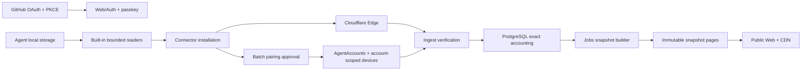

# Vibe Racing project plan

## Status and evidence boundary

This is the canonical delivery plan for the clean pre-release replacement selected by
[ADR 0076](decisions/0076-clean-agent-account-provider-reported-token-ranking.md). The repository
has no production database, released connector, deployed service, or real-user traffic. No migration
or backward-compatibility population exists.

[IMPLEMENTATION_STATUS.md](IMPLEMENTATION_STATUS.md) records what the working tree has actually
proved. A target in this plan is not an implementation, provider-support, release, deployment,
capacity, monitoring, privacy-operation, or real-user claim.

## Product contract

Vibe Racing is an English/Russian, reward-free weekly leaderboard for provider-reported coding-agent
tokens.

- one immutable GitHub numeric user ID has at most one profile;
- no anonymous profile exists;
- one profile may own several providers and several accounts for one provider;
- one `AgentAccount` is one logical account of one coding agent;
- connector installations and device keys are authority, not score sources;
- several devices for one AgentAccount do not duplicate its tokens;
- the only competitive metric is `provider_reported_tokens_v1`;
- one AgentAccount/UTC-date cumulative total contributes once;
- rank depends only on exact `weeklyTokenTotal`;
- equal totals share `rankPosition`;
- Community is device-signed self-reporting and never becomes Verified by client assertion;
- Verified requires a separately reviewed server-side provider integration and separate ranking;
- tokenizers differ; totals are not normalized cost, compute, effort, quality, or subscription
  value;
- rank grants no money, prize, authorization, access, or valuable privilege.

## Selected architecture



### Identity and private authority

GitHub OAuth resolves only the immutable numeric user ID and discards the provider token. Enrollment
creates or opens the unique profile, confirms a bounded handle, registers the primary passkey, and
continues directly to agent connection. A passkey protects the complete pairing batch and every
critical security/deletion action. Restricted recovery can mint only replacement-passkey authority.

Private Web responses and controls are same-profile, CSRF-protected, purpose-bound, and `no-store`.

### Provider registry and readers

The closed initial registry recognizes `codex`, `claude_code`, `opencode`, `qwen_code`, `cline`, and
`aider`. State is `supported`, `recognized`, or `disabled`.

A provider is supported only when the tree contains:

- a bounded built-in reader for one exact documented local surface;
- an immutable accounting revision;
- UTC-day and cumulative-total rules;
- aggregate/component and deduplication semantics;
- an account-domain and overlap rule;
- positive, boundary, corruption, drift, and mixed-content privacy fixtures;
- end-to-end discovery, pairing, signed sync, storage, and ranking evidence.

Unknown or ambiguous usage-bearing schema fails closed. The project does not invent local schemas or
infer support from a directory name. Providers without exact evidence remain recognized or disabled
with the missing evidence stated.

Reader output is a closed privacy type: provider, opaque bounded candidate metadata, UTC date,
canonical cumulative token-total decimal string, and reader/accounting version. Prompt,
conversation, code, tool output, repository name/content, path, email, login, model, key/token, raw
usage record, and provider-shaped components remain local and non-reflective.

### Installation, AgentAccount, and device

One connector installation has one native-store installation key and may service several
AgentAccounts. Each activated AgentAccount/device pair has its own native-store Ed25519 key.

Provider, accounting revision, trust tier, and accounting scope are selected by the server during
approved create/attach and remain immutable. A device can submit only for its exact AgentAccount and
cannot approve a batch, manage another credential, change account/profile state, or delete a
profile.

When a provider exposes a safe stable opaque account-domain ID, pairing uses a domain-separated
server verifier to prevent duplicate attachment. Email/login/display/path hashes are prohibited. If
no safe identifier exists, the user explicitly creates or attaches the candidate to an existing
same-provider AgentAccount.

## Multi-account and multi-device model

This heading preserves links from historical ADRs. The active model is the AgentAccount,
installation, and device contract above: multiple same-provider accounts and multiple devices per
account are allowed, while account/day totals are counted once.

### Batch connection

`viberacing connect --origin <https-origin>`:

1. validates exact origin;
2. creates or loads the installation identity from the native credential store;
3. runs built-in discovery readers;
4. shows a local privacy-safe preview;
5. creates one pending account-scoped key per selected candidate;
6. signs one bounded ordered discovery manifest;
7. obtains a browser deep link and fallback code;
8. polls with a bounded keyed token;
9. persists activated credentials before success output;
10. deletes skipped pending keys;
11. performs first sync for activated accounts.

The browser shows the complete ordered candidate list and requires create, attach, or skip for each
one. One fresh passkey assertion binds the entire decision digest. Activation is atomic: no partial
approved batch or orphan authority. Manual code remains a fallback, never a bearer profile
credential.

### Contracts and routes

The final version-one inventory is:

- `AgentProviderV1`;
- `ConnectorDiscoveryManifestV1`;
- `ConnectorPairingStartV1`;
- `ConnectorPairingApprovalV1`;
- `ConnectorPairingPollResultV1`;
- `UsageSyncV1`;
- `UsageSyncResultV1`;
- `LeaderboardSnapshotV1`;
- `PublicProfileSummaryV1`;
- `ProblemDetailsV1`.

The only public product routes are:

```text
POST /v1/usage
GET /v1/leaderboards/current
GET /v1/leaderboards/{seasonStart}
GET /v1/profiles/{handle}
```

There are no `/v1/community/*` aliases or compatibility wrappers.

`UsageSyncV1` carries one server-issued `agentAccountId`, `syncId`, canonical `observedAt`,
`clientVersion`, `readerVersion`, and bounded unique `dailyEntries`. Each entry contains an exact
UTC `usageDate` and canonical decimal-string cumulative token total. Provider, revision, trust,
scope, profile, rank, model, components, account identity, and device/installation counts are
absent.

### Edge and Ingest

Edge independently resolves exact enablement before protected configuration or body work, admits
only the final route/method/media type/encoding and bounded framing, applies rate policy, computes
the exact body digest, and adds one short-lived path/body-bound origin HMAC. It forwards only
allowlisted headers and never retries or accepts caller origin authority.

Ingest performs framing, HMAC verification, duplicate-key-aware parse, schema validation,
header/body relationships, non-mutating binding lookup, Ed25519 verification, and server-owned
attribution validation before any persistent write.

One PostgreSQL transaction then consumes origin and device replay, enforces long-lived idempotency,
revalidates active installation/device/account/provider/revision/trust/scope, applies database-clock
UTC/backfill/finalization policy, enforces monotonic cumulative totals, inserts the immutable
observation, updates one account/day total, coalesces the dirty-season outbox, appends the bounded
event, and returns the exact result. Any failure rolls back everything.

### Exact numeric and date model

All token totals are canonical non-negative decimal strings at JSON boundaries, `bigint` or
canonical strings after TypeScript validation, and `numeric(30,0)` in PostgreSQL. They never pass
through JavaScript `Number`.

Usage date is UTC. PostgreSQL clock rejects future dates and owns the bounded backfill and season
window. Client time, timezone, locale, and `observedAt` cannot widen eligibility.

### Seasons and snapshots

One UTC week is one season with metric `provider_reported_tokens_v1`. For each visible eligible
profile, Jobs exactly sums unique AgentAccount/day totals. Rank is descending total with shared
positions. Deterministic tie display is noncompetitive.

Usage and visibility changes coalesce one dirty-season outbox record. The fixed Jobs catalog
refreshes bounded immutable snapshot versions, pages, one top-32 race payload, and public profile
summaries. Publication advances atomically only after complete validation. A failed refresh
preserves the last good version. Finalization is fixed, idempotent, no-overlap, and server-clock
owned.

Public Web has no live ranking capability. It reads only complete snapshots, emits strong ETags,
supports 304, and applies reviewed shared-cache headers. Private endpoints remain `no-store`.

### Public and private UX

The home page leads with a semantic server-rendered leaderboard that works without canvas or
JavaScript animation. Community self-reporting and tokenizer differences are explicit in EN/RU. The
race is lazy, cosmetic, reduced-motion aware, and consumes the same top-32 payload.

Public fields are bounded handle, rank, exact weekly total string, tier, approved car, and rounded
snapshot freshness. No provider/account/device/day breakdown is public.

The private dashboard orders:

1. current ranking;
2. agents and AgentAccounts grouped by provider;
3. sync health and quarantine state;
4. installations and devices;
5. public profile/privacy;
6. car appearance;
7. passkeys/recovery and destructive security actions.

It never labels accounts as "Source 1" or asks for theme/motion/streak before first value.

## CarRecipe and pixel assets

CarRecipe remains a closed cosmetic enum built only from reviewed repository assets. It can be
proposed by a browser or account-scoped device and activated only by the authenticated browser.
Appearance never changes usage, trust, eligibility, rank, or authority.

### Roles and operations

The clean bootstrap owns schema through a non-login owner role and creates separate forced-RLS,
least-privileged Web read, Web/Auth, Ingest, Jobs, Admin, and migration capabilities. Runtime
adapters expose exact parameterized functions only. Jobs and migration processes accept fixed
catalogs, not arbitrary SQL, selectors, cutoffs, or retry counts.

Migration, restore, containment, deletion failure, snapshot failure, and release use explicit
runbooks with protected external authority and evidence. Repository commands operate only on
synthetic fixtures and disposable local PostgreSQL.

## Administration and operations

Admin remains a separate Access/member/fresh-passkey/reason/audit boundary with one narrow database
capability. Normal sessions cannot become Admin. Operations remain external protected authority
guided by checked public runbooks; repository-local results do not prove a deployed controller.

### Release and supply chain

Node, pnpm, Rust, actions, containers, packages, and tools stay exact-pinned and reviewed under the
dependency policy. Pull-request CI is secretless.

An official connector requires protected builds for Windows, macOS, and Linux, platform signature
where applicable, checksums, SBOM, provenance, clean-machine install/update/uninstall,
credential-store/discovery/sync tests, and an explicit supported-version matrix. Local Windows
compilation or synthetic reader fixtures do not satisfy that gate.

## Delivery sequence and commit boundaries

Each step is a reviewable vertical slice with focused tests, complete staged-diff review,
public-file scan, and a signed-off commit.

1. Finalize Accepted clean AgentAccount architecture, invariants, threat/abuse/privacy maps.
2. Replace the pre-release migration history with the clean bootstrap, roles, forced RLS, manifest,
   migration runner, restore, and database tests.
3. Add profiles, provider/revision registry, AgentAccounts, installations, devices, and batch
   pairing persistence.
4. Add atomic usage observations, account/day totals, replay, idempotency, monotonicity, outbox, and
   audit.
5. Add direct-token seasons, shared rank, snapshot versions/pages/top-32/profile summaries,
   finalization, and 10,000-profile evidence.
6. Replace generated schemas, types, policies, OpenAPI, and removed-route oracles with final V1
   contracts.
7. Replace Ingest verifier/application/adapter/host with final ordering and zero-write evidence.
8. Replace Edge with the final route, framing, HMAC, header, rate, and no-retry boundary.
9. Add connector installation, provider registry, bounded reader interface, discovery manifest, and
   privacy-sentinel framework.
10. Implement only provider readers whose exact local schema and accounting evidence exists; mark
    the rest recognized or disabled.
11. Implement batch connect, sync/status/doctor/account/disconnect/forget-local, native credentials,
    and cross-platform lifecycle.
12. Simplify GitHub OAuth/passkey onboarding and remove anonymous/cosmetic pre-value flow.
13. Implement browser batch approval with one passkey assertion and fallback code.
14. Implement dirty-season refresh/finalization/retention in Jobs and default-off scheduler.
15. Replace public live ranking with snapshot-only leaderboard/profile APIs and cache behavior.
16. Replace public race/leaderboard UX with semantic SSR and one lazy top-32 payload.
17. Replace source dashboard with provider/AgentAccount/installation/device dashboard.
18. Add clean-bootstrap, multi-agent, privacy, scale, packaging, release, and checker-regression CI.
19. Perform final security/correctness/consistency review and fix every finding.

Do not start a compatibility layer, speculative provider reader, optional MCP path, provider OAuth
Verified integration, reward system, deployment, or production operation to make a gate pass.

## Verification strategy

### Focused gates

Every slice runs its workspace lint, typecheck, unit coverage, contract/database checker, generated
drift, Rust formatting/check/test/Clippy where applicable, and the affected disposable PostgreSQL or
runtime integration.

### Cross-cutting development gate

```text
pnpm install --frozen-lockfile --ignore-scripts
pnpm run verify
cargo test --workspace --all-targets --all-features --locked
```

### Final release-preparation gate

The final branch runs:

- documentation, architecture, contracts, configuration, database, agent-skill, public-file,
  formatting, spelling, Markdown, license, history, and checker-mutation gates;
- every workspace lint, typecheck, unit coverage, and production build;
- clean database, migration, restore, Admin, Web, Ingest, Edge, Jobs, scheduler, signal, lifecycle,
  timer, scale, and snapshot PostgreSQL integrations;
- complete locked Rust workspace formatting, check, tests, Clippy, and dependency audit;
- Windows portable connector smoke and every available cross-platform package/lifecycle check;
- `pnpm run verify` and `pnpm run verify:release`;
- staged public scan, `git diff --cached --check`, full staged semantic review, and final branch
  diff review.

Network, Docker, hosted, signing, or platform gates that cannot run must be reported exactly, never
silently converted to success. No production/deployment/provider-support claim is made from a
skipped gate.

## Explicit non-goals for this replacement

- production-data migration or backward compatibility;
- legacy score history, formula, routes, schemas, procedures, or aliases;
- anonymous identity;
- subjective token normalization;
- model, price, subscription, prompt, code, repository, path, email, or raw-record collection;
- arbitrary plugin/readers, shell hooks, launchers, proxies, redirects, or plaintext keys;
- Community rewards or authorization;
- optional MCP transport before the primary product is complete;
- Verified provider integration without exact server-side evidence;
- deployment, public beta, real-user data, or official connector claims without hosted evidence.

## Completion

The plan is complete only when all 45 Definition-of-Done properties in the accepted objective are
demonstrated by current-tree code and tests, the old pre-release implementation is absent, every
provider support state is honest, the full gate matrix passes or an external limitation is reported,
and the final self-review finds no unresolved correctness, security, privacy, compatibility, or
documentation defect.
