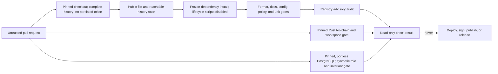

# Pull-request CI trust model

## Boundary

A pull request, including source, scripts, lockfiles, fixtures, filenames, and workflow changes, is
untrusted input. CI is an isolated evaluator, not a trusted release environment.

The `CI` workflow runs on ephemeral GitHub-hosted runners with only read access to repository
contents. It receives no production, deployment, signing, release, or application secrets. Checkout
does not persist credentials, dependency caches are disabled, and every job has a timeout.

## Execution flow

Repository scripts do execute attacker-controlled code during a pull-request check. That is expected
and safe only because the runner is disposable and carries no privileged material. A passing check
does not make the pull request trusted; review and protected-branch policy remain required.

## Workflow policy enforced in the tree

- `pull_request_target` is forbidden.
- Remote actions require a full commit SHA; container actions require an image digest.
- Top-level and job permissions may be only `read` or `none` in pull-request CI.
- Checkout must set `persist-credentials: false`.
- Checkout must fetch complete history so the reachable-history leak gate cannot pass on a shallow
  snapshot.
- Expressions cannot be interpolated directly into shell source; untrusted values must cross an
  explicit environment boundary and be treated as data.
- Secret references are rejected.
- Each job uses an allowlisted GitHub-hosted runner and a timeout of at most 60 minutes.
- Writable dependency caches, privileged environments, and mutable job/service containers are
  rejected.
- Package installation uses the frozen lockfile, the official registry, and `--ignore-scripts`.
- Phase 1 viewport evidence is checked as committed PNG bytes, dimensions, digests, and metadata
  only. Pull-request CI does not discover or launch a workstation browser, reuse a browser profile,
  or regenerate visual evidence.
- The database job uses the same digest-pinned PostgreSQL artifact as local development, no host
  port or persistent volume, a uniquely named Compose project, synthetic credentials/data, and
  cleanup in `finally`. It remains untrusted-code execution on a disposable, secretless runner.

The repository tests these rules with positive and negative fixtures. The tests are defense in
depth; a malicious pull request can edit its own tests, so protected review of workflow changes is
still mandatory.

## Release separation

This workflow cannot deploy or publish. Future release and deployment workflows will use separate
events, protected environments, least-privileged short-lived credentials, approval gates, and
artifact provenance. They must never execute an untrusted pull-request revision with privileged
credentials.

## Remote settings required before publication

The public repository is not ready for contributions until its default branch requires the CI jobs
and reviewed changes, workflow changes have appropriate ownership, secret scanning and push
protection are enabled when available, and fork behavior is tested on the actual GitHub repository.
These remote controls cannot be proven by files in the local tree.
