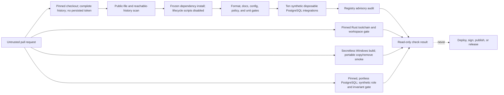

# Pull-request CI trust model

## Boundary

A pull request, including source, scripts, lockfiles, fixtures, filenames, and workflow changes, is
untrusted input. CI is an isolated evaluator, not a trusted release environment.

The `CI` workflow runs on ephemeral GitHub-hosted runners with only read access to repository
contents. It receives no production, deployment, signing, release, or application secrets. Checkout
does not persist credentials, dependency caches are disabled, every job has a timeout, and no job
publishes an artifact.

## Execution flow

Repository scripts do execute attacker-controlled code during a pull-request check. That is expected
and safe only because the runner is disposable and carries no privileged material. A passing check
does not make the pull request trusted; review and protected-branch policy remain required.

## Workflow policy enforced in the tree

- `pull_request_target` is forbidden.
- Remote actions require a full commit SHA; container actions require an image digest.
- Top-level and job permissions may be only `read` or `none` in pull-request CI.
- Checkout must set `persist-credentials: false`.
- Checkout must fetch complete history so the reachable-history leak gate cannot pass on a shallow
  snapshot.
- Expressions cannot be interpolated directly into shell source; untrusted values must cross an
  explicit environment boundary and be treated as data.
- Secret references are rejected.
- Each job uses an allowlisted GitHub-hosted runner and a timeout of at most 60 minutes.
- Writable dependency caches, privileged environments, and mutable job/service containers are
  rejected.
- Package installation uses the frozen lockfile, the official registry, and `--ignore-scripts`.
- The Windows connector job uses only full-history checkout, pinned Node setup, the public scan,
  pinned minimal Rust, one locked release-profile build, and the bounded portable copy/removal
  smoke. Its exact step order is policy-checked; it has no artifact upload, package publication,
  credential operation, networked connector command, signing step, or release environment.
- Phase 1 viewport evidence is checked as committed PNG bytes, dimensions, digests, and metadata
  only. Pull-request CI does not discover or launch a workstation browser, reuse a browser profile,
  or regenerate visual evidence. The separate explicit local re-render gate requires the manifest's
  exact reported browser product/platform and compares decoded pixels without writing, but its
  operator-supplied executable has no CI provisioning or artifact-provenance claim.
- The database job uses the same digest-pinned PostgreSQL artifact as local development, no host
  port or persistent volume, a uniquely named Compose project, synthetic credentials/data, and
  cleanup in `finally`. It remains untrusted-code execution on a disposable, secretless runner.
- After deterministic Node verification, the same secretless disposable Node runner executes ten
  separate synthetic PostgreSQL integrations: Migration controllers, Web HTTP, Ingest HTTP, Ingest
  OS-signal, Jobs CLI, and five distinct Jobs-scheduler modes. Each owns a unique Compose
  project/container, uses only synthetic credentials/data, exposes at most an ephemeral loopback
  port, retains no volume or artifact, and cleans up in `finally`. The Web harness additionally
  generates one ephemeral self-signed certificate/key pair, mounts it read-only for a TLS-enabled
  disposable database start, builds and runs two emitted standalone Next production processes with
  `pg` bundled, bounds and discards their output, bounds a separate PostgreSQL blocker child used
  for its no-queue check, and removes all key/process/container resources. That disposable database
  preloads its already bundled `auto_explain` module; only the narrow synthetic login receives
  database-scoped capture settings, parameter logging is disabled, and the harness bounds,
  private-marker scans, parses, and discards the server log before requiring six closed adapter and
  nested-projection plan classes. Plan bytes exist transiently in runner process memory, but no plan
  artifact leaves the runner. The Ingest harness independently bounds, scans, and discards its own
  PostgreSQL blocker output before removing that child. It then starts the built Ingest entry point
  with only synthetic protected configuration, treats any output byte as failure without retaining
  it, and forcibly removes only that silent test child after one accepted request. The separate
  Ingest signal gate mounts only an exact link-free production graph read-only in the pinned Linux
  Node image, passes one synthetic signed request to a capability-free client over stdin, and proves
  one OS-delivered active-call settlement before deleting both containers and the runtime. These are
  untrusted pull-request checks, not Railway/orchestrator drain, hosted-service, production
  credential, deployment, representative load/capacity, or release evidence.

The repository tests these rules with positive and negative fixtures. The tests are defense in
depth; a malicious pull request can edit its own tests, so protected review of workflow changes is
still mandatory.

## Release separation

This workflow cannot deploy or publish. Its Windows release-profile output is an ephemeral untrusted
test input and must not leave the runner; a successful portable smoke is not package, signature,
provenance, clean-machine release, or support evidence. Future release and deployment workflows will
use separate events, protected environments, least-privileged short-lived credentials, approval
gates, and artifact provenance. They must never execute an untrusted pull-request revision with
privileged credentials.

## Remote settings required before publication

The public repository is not ready for contributions until its default branch requires the CI jobs
and reviewed changes, workflow changes have appropriate ownership, secret scanning and push
protection are enabled when available, and fork behavior is tested on the actual GitHub repository.
These remote controls cannot be proven by files in the local tree.
