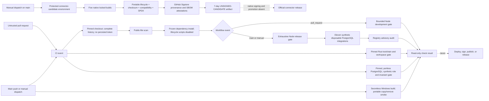

# Pull-request CI trust model

## Boundary

A pull request, including source, scripts, lockfiles, fixtures, filenames, and workflow changes, is
untrusted input. CI is an isolated evaluator, not a trusted release environment.

The `CI` workflow runs on ephemeral GitHub-hosted runners with only read access to repository
contents. Pull requests run the bounded Node development gate plus the independent Rust and
PostgreSQL invariant jobs. Pushes to `main` and manual dispatches replace the bounded Node gate with
the exhaustive release gate, add eleven synthetic service integrations and the registry audit, and
enable the Windows portable smoke. No event receives production, deployment, signing, release, or
application secrets. Checkout does not persist credentials, dependency caches are disabled, every
job has a timeout, and no job publishes an artifact.

The separate `Connector release candidates` workflow is not pull-request CI. It is manual-only,
refuses every ref except `main`, attaches the named `connector-release-candidate` Environment, and
uses only the OIDC and attestation write permissions required by GitHub's Sigstore service. Its
five-job native matrix builds Windows x86_64, macOS arm64, macOS x86_64, Linux x86_64, and Linux
arm64 candidates from the exact Cargo lock. Each job performs a bounded portable copy/removal smoke,
creates SHA-256 checksums, an exact compatibility declaration, and a path-free SPDX 2.3 SBOM, then
signs build-provenance and SBOM attestations before uploading a seven-day artifact whose name starts
with `UNSIGNED-CANDIDATE-`. That artifact is not an official release: native platform-signing
infrastructure, hosted matrix results, a package channel, and independent post-download verification
are not present in the local tree.

## Execution flow

Repository scripts do execute attacker-controlled code during a pull-request check. That is expected
and safe only because the runner is disposable and carries no privileged material. A passing check
does not make the pull request trusted; review and protected-branch policy remain required.

## Workflow policy enforced in the tree

- `pull_request_target` is forbidden.
- Remote actions require a full commit SHA; container actions require an image digest.
- Top-level and job permissions may be only `read` or `none` in pull-request CI. The one checked
  connector-candidate workflow has an exact exception for `id-token: write` and
  `attestations: write`; it has no pull-request trigger or secret reference.
- Checkout must set `persist-credentials: false`.
- Checkout must fetch complete history so the reachable-history leak gate cannot pass on a shallow
  snapshot.
- Expressions cannot be interpolated directly into shell source; untrusted values must cross an
  explicit environment boundary and be treated as data.
- Secret references are rejected from the `CI` workflow and every other unprivileged workflow.
- Each job uses an allowlisted GitHub-hosted runner and a timeout of at most 60 minutes.
- Writable dependency caches, privileged environments, and mutable job/service containers are
  rejected.
- Package installation uses the frozen lockfile, the official registry, and `--ignore-scripts`.
- The Windows connector job runs only for `main` or manual events. It uses full-history checkout,
  pinned Node setup, the public scan, pinned minimal Rust, one locked release-profile build, and the
  bounded portable copy/removal smoke. Its exact event condition and step order are policy-checked;
  it has no artifact upload, package publication, credential operation, networked connector command,
  signing step, or release environment.
- The connector-candidate workflow has one exact matrix and one fixed step order. Configuration
  mutations reject an added trigger, non-main execution, a missing target, mutable action, unlocked
  build, changed Environment, secret reference, weakened attestation, or upload that loses the
  `UNSIGNED-CANDIDATE-` label. It uses pinned first-party `actions/attest` and
  `actions/upload-artifact`; no registry, GitHub Release, package host, self-update channel, native
  signing key, or production credential is reachable.
- Phase 1 viewport evidence is checked as committed PNG bytes, dimensions, digests, and metadata
  only by the exhaustive `main` or manual release gate. Pull-request CI does not discover or launch
  a workstation browser, reuse a browser profile, or regenerate visual evidence. The separate
  explicit local re-render gate requires the manifest's exact reported browser product/platform and
  compares decoded pixels without writing, but its operator-supplied executable has no CI
  provisioning or artifact-provenance claim.
- The database job uses the same digest-pinned PostgreSQL artifact as local development, no host
  port or persistent volume, a uniquely named Compose project, synthetic credentials/data, and
  cleanup in `finally`. It remains untrusted-code execution on a disposable, secretless runner.
- After exhaustive Node verification on `main` or a manual dispatch, the same secretless disposable
  Node runner executes eleven separate synthetic PostgreSQL integrations: Migration controllers, Web
  HTTP, Ingest HTTP, Ingest OS-signal, Jobs CLI, and six distinct Jobs-scheduler modes. Each owns a
  unique Compose project/container, uses only synthetic credentials/data, exposes at most an
  ephemeral loopback port, retains no volume or artifact, and cleans up in `finally`. The Web
  harness additionally generates one ephemeral self-signed certificate/key pair, mounts it read-only
  for a TLS-enabled disposable database start, builds and runs two emitted standalone Next
  production processes with `pg` bundled, bounds and discards their output, bounds a separate
  PostgreSQL blocker child used for its no-queue check, and removes all key/process/container
  resources. That disposable database preloads its already bundled `auto_explain` module; only the
  narrow synthetic login receives database-scoped capture settings, parameter logging is disabled,
  and the harness bounds, private-marker scans, parses, and discards the server log before requiring
  six closed adapter and nested-projection plan classes. Plan bytes exist transiently in runner
  process memory, but no plan artifact leaves the runner. The Ingest harness independently bounds,
  scans, and discards its own PostgreSQL blocker output before removing that child. It then starts
  the built Ingest entry point with only synthetic protected configuration, treats any output byte
  as failure without retaining it, and forcibly removes only that silent test child after one
  accepted request. The separate Ingest signal gate mounts only an exact link-free production graph
  read-only in the pinned Linux Node image, passes one synthetic signed request to a capability-free
  client over stdin, and proves one OS-delivered active-call settlement before deleting both
  containers and the runtime. These are secretless `main` or manual checks, not Railway/orchestrator
  drain, hosted-service, production credential, deployment, representative load/capacity, or release
  evidence.

The repository tests these rules with positive and negative fixtures. The tests are defense in
depth; a malicious pull request can edit its own tests, so protected review of workflow changes is
still mandatory.

## Release separation

This workflow cannot deploy or publish. The exhaustive `main` or manual result is local-package and
synthetic-integration evidence for one revision, not a production release. Its Windows
release-profile output is an ephemeral test input and must not leave the runner; a successful
portable smoke is not package, signature, provenance, clean-machine release, or support evidence.
The separate `Deploy stable release` workflow now declares service-source deployment only. It
accepts a published non-prerelease stable tag or a manual stable tag from `main`, requires the tag
to be reachable from protected `main`, and completes a secretless verification job before a second
job can attach the `production` Environment. Only that protected job may consume the exact Railway
and Cloudflare deployment tokens.

The deployment job serializes Migration, Web, Ingest, Jobs, and Edge replacements, closes the
one-shot migration latch after an attempted enable, and applies the Usage Sync flag to Ingest before
Edge. Actions, Railway CLI, and Wrangler are immutable-version inputs covered by negative
configuration and dependency-inventory checks. A manual same-tag redeploy repeats verification and
approval; an old-version or database rollback is outside this workflow.

This checked declaration does not create its GitHub Environment, credentials, Railway project,
Cloudflare route, or a hosted result. It also does not build, upload, sign, attest, or release the
connector.

The separate connector-candidate declaration now covers five explicit native runner targets, locked
compilation, bounded install/uninstall, checksums, a versioned compatibility manifest, SPDX SBOM,
and GitHub Sigstore provenance/SBOM attestations. It can upload only short-lived,
explicitly-unsigned candidate bundles after manual `main` dispatch and Environment approval. The
tree proves the workflow shape and a local Windows bundle, not a hosted run. It has no native
Windows/macOS signing identities, notarization, Linux project-signing key, immutable public package
host, official release upload, update manifest, or hosted clean-machine result, so no connector
version or platform is declared officially supported.

## Remote settings required before publication

The public repository is not ready for contributions until its default branch requires the bounded
Node, Rust, and PostgreSQL pull-request jobs plus reviewed changes. A protected release or
deployment process must retain required reviewers on the exact `production` Environment, protected
stable tags, immutable releases, and the exhaustive secretless verification job for the exact
revision it promotes. Workflow changes need appropriate ownership, secret scanning and push
protection must be enabled when available, and fork plus release behavior must be tested on the
actual GitHub repository. The `connector-release-candidate` Environment must likewise require
reviewers before its first hosted run. These remote controls cannot be proven by files in the local
tree.
