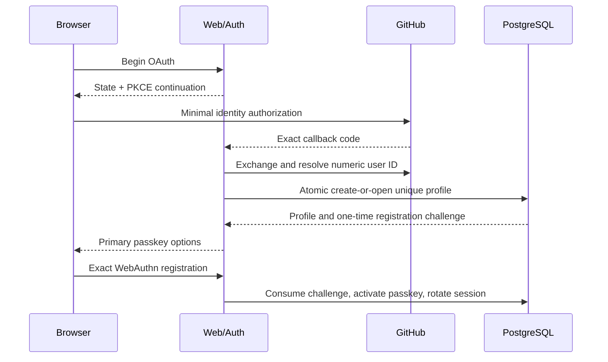
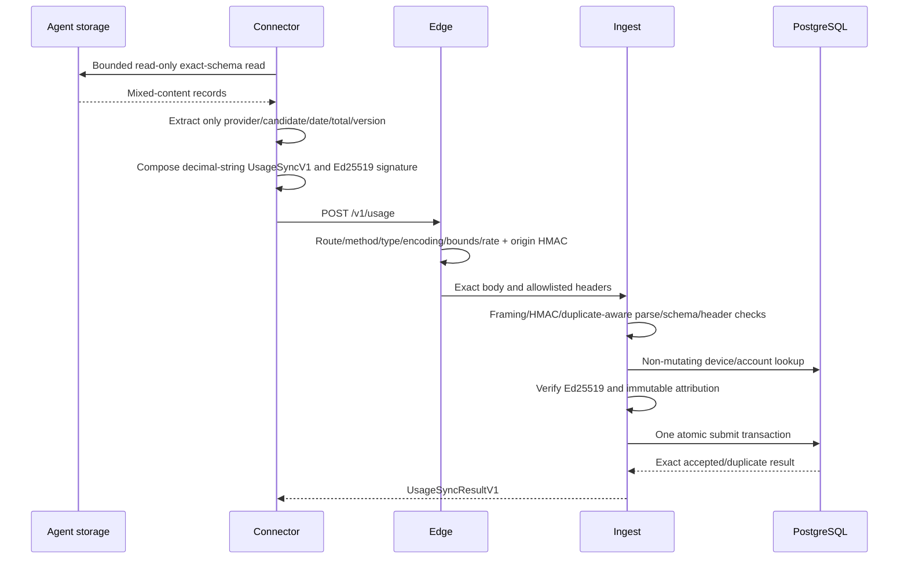
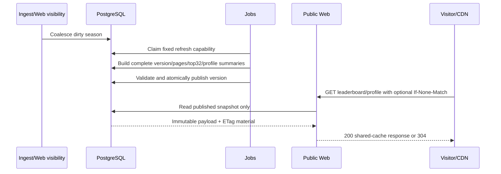
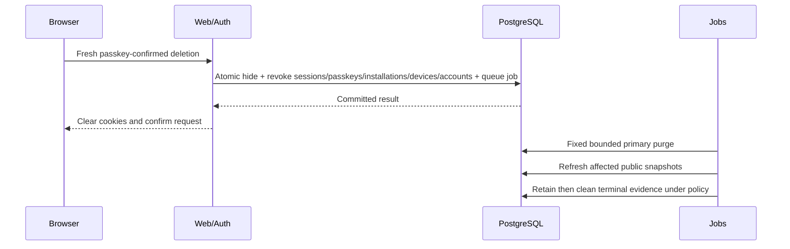
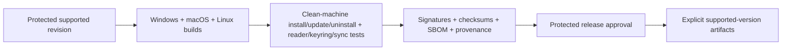

# Data flow

## GitHub enrollment and primary passkey



GitHub access material is discarded after numeric-ID resolution. Mutable GitHub fields are not
identity. No anonymous/bootstrap/ownership-lease path exists. A normal enrolled session is available
only after the primary passkey is activated.

## Batch discovery and pairing approval

```mermaid
sequenceDiagram
    participant C as Connector
    participant P as Pairing
    participant B as Browser
    participant D as PostgreSQL

    C->>C: Read safe roots and build privacy-only candidates
    C->>C: Create pending account-scoped keys
    C->>P: Signed ConnectorDiscoveryManifestV1
    P->>D: Store bounded transaction and keyed poll/code verifiers
    P-->>C: Approval deep link + fallback code
    B->>P: Signed-in transaction review
    P-->>B: Ordered candidates and same-provider account controls
    B->>P: Create/attach/skip + one fresh passkey assertion
    P->>D: Atomic complete batch and activate selected device bindings
    C->>P: Poll with raw token
    P-->>C: Closed terminal result
    C->>C: Persist activated records; delete skipped pending keys
```

The complete ordered batch, target accounts, providers, pending public keys, installation, session,
and passkey assertion are bound together. The fallback code selects a transaction but grants no
profile authority. Activation is all-or-nothing.

## Local collection and signed synchronization



No persistent Ingest state exists before device signature verification. The transaction consumes
origin/device replay and idempotency together with observation, AgentAccount/day, dirty outbox, and
audit mutation.

## Snapshot refresh and public read



A failed build does not move the publication pointer. Web has no live ranking or raw account/day
capability. Private dashboard reads remain separate and `no-store`.

## Hide and deletion



Cache purge, backup expiry, stale-restore replay, provider revocation, notification, and real-user
outcome remain separate operational evidence and are never inferred from the primary transaction.

## Trusted release



Pull-request CI is secretless and cannot publish. A local build or portable smoke is not an official
release, signature, provenance, support, or deployment result.
