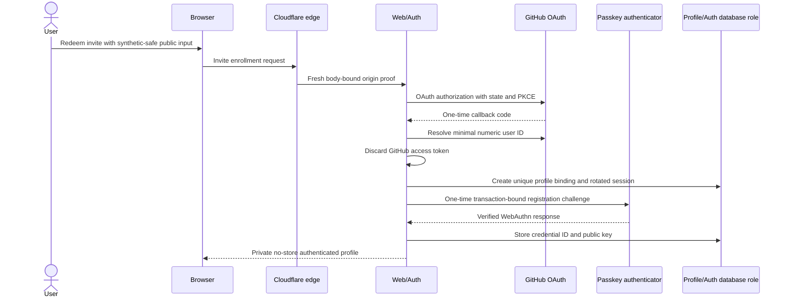
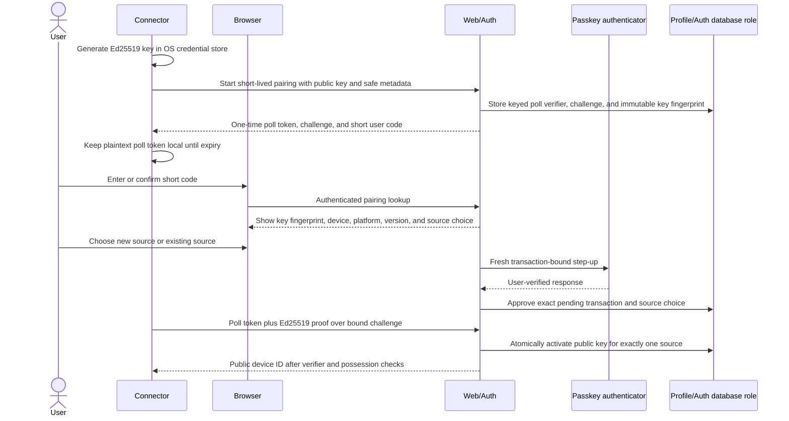
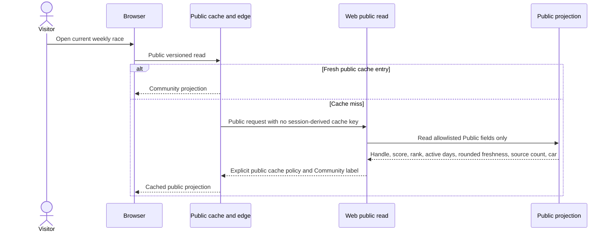
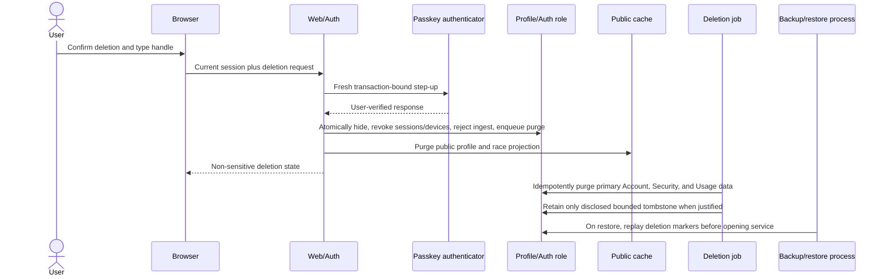
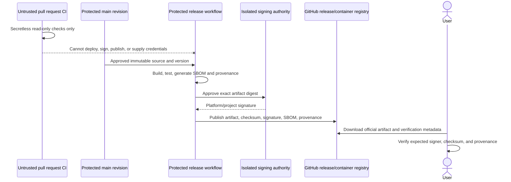

# Data flow

## Status and notation

These sequences remain planned application contracts. Revision 0001 now provides private
identity/source/device/pairing/deletion tables and deny-by-default roles, but no runtime procedure
or endpoint executes these sequences. Data labels refer to the classifications in the
[privacy data map](../security/PRIVACY_DATA_MAP.md): Public, Account, Security, Usage, Operational,
and Prohibited.

## Enrollment and passkey bootstrap



Only the numeric GitHub user ID crosses into persistent Account data. GitHub access tokens are
callback-memory data and are discarded. The public handle and optional GitHub link require a later
explicit preview/choice; neither is inferred from local or OAuth-private data.

## Device pairing and source choice



The short user code and poll token cannot approve or activate a device by themselves. The browser
needs a current GitHub session and fresh passkey, the connector must prove private-key possession,
and the pending public key is immutable. The server returns the plaintext poll token once, stores
only a keyed verifier, and never logs it. Device authority begins only after atomic source binding
and never includes profile administration.

## Local collection and signed synchronization

```mermaid
sequenceDiagram
  participant Scheduler as User-scoped scheduler
  participant Connector
  participant AppServer as Local Codex App Server
  participant KeyStore as OS credential store
  participant Edge as Cloudflare edge
  participant Ingest as Ingest API
  participant DB as Usage procedure
  participant Jobs

  Scheduler->>Connector: Fixed executable and argument array
  Connector->>AppServer: Launch pinned compatible version over stdio
  Connector->>AppServer: initialize then initialized
  Connector->>AppServer: Planned stable allowlisted account-mode and usage reads
  AppServer-->>Connector: Version-specific response
  Connector->>Connector: Reject unknown schema; select only date and token buckets
  Connector->>KeyStore: Use source-bound device private key
  Connector->>Connector: Sign method, path, body hash, device, nonce, time, idempotency
  Connector->>Edge: Bounded ConnectorSyncV1 Community payload
  Edge->>Ingest: Fresh body-bound origin proof plus original signed request
  Ingest->>Ingest: Validate proof, signature, source, schema, replay, and bounds
  Ingest->>DB: Execute narrow idempotent submission procedure
  DB-->>Ingest: Accepted, quarantined, duplicate, or rejected outcome
  Jobs->>DB: Aggregate sources then apply one profile daily cap
```

Prompts, conversations, repositories, account email, Codex credentials, API keys, and process logs
are Prohibited and have no field in the connector egress schema. `observedAt` supports replay
checks; server `receivedAt` controls deadlines and season finalization. A valid signature proves
only which registered device sent the self-reported payload.

## Public race read



Exact token values, exact sync time, GitHub binding, passkeys, devices, source details, and audit
data are absent. Authenticated responses use private `no-store` policy and never populate this
cache.

## Hide and deletion



Hide and authority revocation are synchronous security actions; bulk purge is retryable. Failure of
the asynchronous job does not make the profile public or the device valid again.

## Trusted release



Release and deployment workflows do not run a pull-request revision with privileged credentials.
Promotion reuses the verified artifact rather than rebuilding from mutable source.

## Flow-change checklist

A change to any sequence updates:

1. versioned public contracts and generated artifacts;
2. [security invariants](SECURITY_INVARIANTS.md), threat model, and abuse cases;
3. privacy classification, retention, access, and deletion behavior;
4. service/database capability matrices and negative tests;
5. compatibility, migration, rollback, logs, alerts, and user-facing EN/RU documentation.
