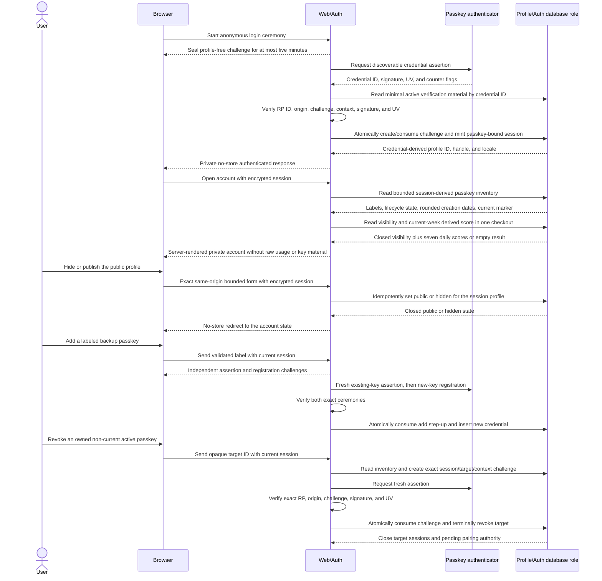
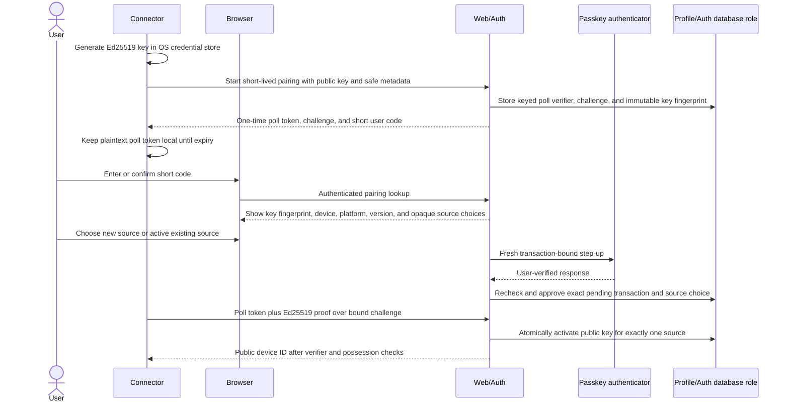
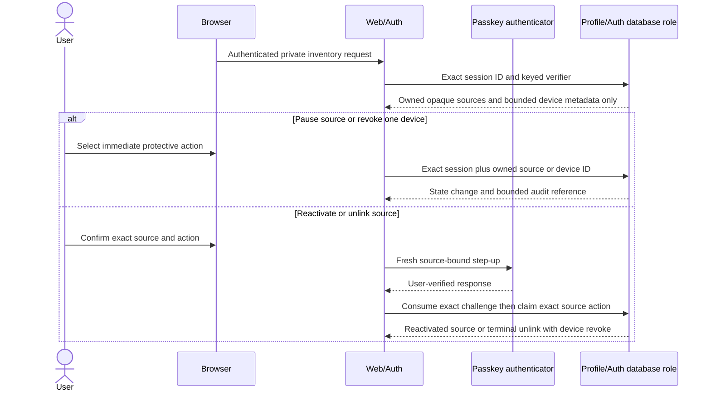
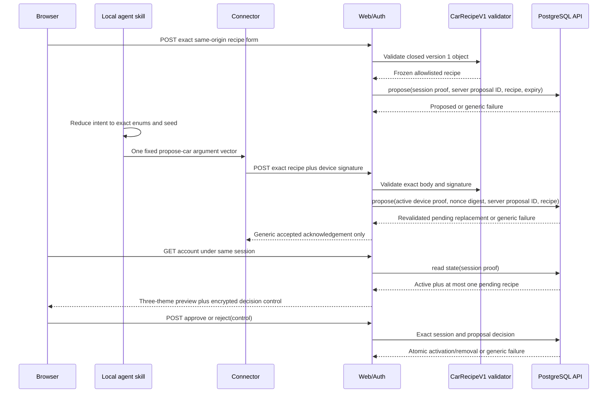
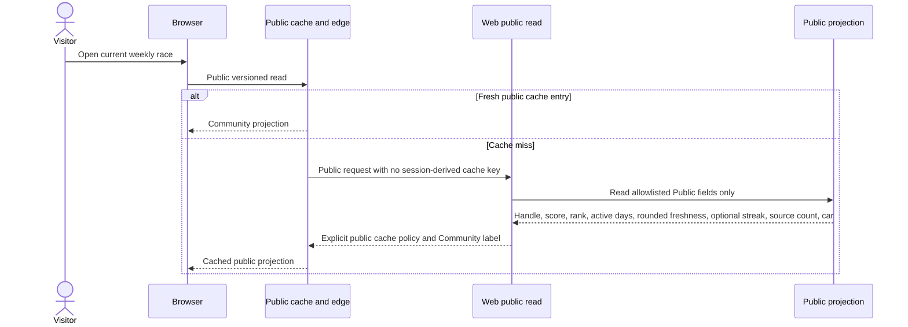
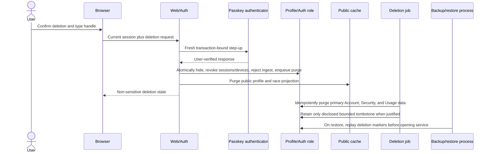
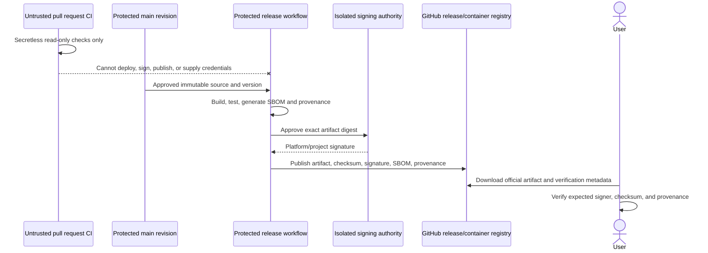

# Data flow

## Status and notation

Most sequences remain planned application contracts. The enrollment, returning-login, backup-key
addition, non-current-passkey revocation, recovery-code rotation/replacement-passkey sign-in,
immediate profile-deletion-request, source inventory/pause/reactivation/unlink, active-device
revoke, and pairing-approval sequences below plus the public race-status consumer are now locally
implemented boundaries; none has live credentials, distributed edge policy, scheduled purge, or
deployment evidence. Revisions 0001 through 0035 provide private
identity/source/device/pairing/audit/deletion/usage tables, deny-by-default roles, and a narrow
database slice for invite issuance, enrollment, exact-session challenges, initial-passkey
activation, passkey login and management, restricted recovery, session rotation/revocation,
immediate deletion lock-down, source-bound pairing, source/device lifecycle controls, and Community
ingest, bounded retention cleanup for ingest, pairing, authentication, invitation, session,
CarRecipe-proposal, terminal-deletion-job, and database audit-event state plus pairing-approval
provenance redaction, primary profile deletion, open-season scoring refresh, late-ingest closure,
terminal season finalization, a Web-only public score projection, a separate compatible
current-recipe race projection, and a third compatible rounded-freshness/optional-streak status
projection. Local score/race/status GETs construct their bounded adapters lazily after closed
request admission. The visible home race requests its current server-selected week from the exact
same-origin status route, validates the public score, rounded freshness, optional preference-gated
streak, and optional recipe, lets one canonical public-handle URL select a same-page summary from
only those fields, and retains a clearly labeled synthetic fallback on failure. A public signed-in
account links to that URL; invalid, duplicate, and unranked selections grant no authority and add no
score query field or browser persistence. One local one-shot Jobs runner can invoke exactly one of
thirteen fixed functions: any of the nine cleanup functions, pairing approval-provenance redaction,
primary profile purge, refresh, or finalization, but no broader recovery/step-up, deployed ingest
endpoint, operational connector, purge schedule/cache/backup/tombstone handling, Jobs monitor,
audited correction, or deployed service executes the complete sequences. A library-only Rust
connector foundation validates the bounded stable App Server initialization exchange and candidate
`0.144.5` account/usage responses. A synthetic one-shot supervisor composes those states with fixed
local process mechanics, while an exact-body composer and isolated one-use signer produce a
synthetic signed envelope. A separate pending-key and challenge signer plus a pure server-only Web
verifier agree on one exact pairing-possession message. The Web/Auth start application generates
fresh IDs, token, challenge, 60-bit code, separate protected poll/code verifiers, and a nine-minute
pending transaction from closed device metadata. A second application performs protected keyed poll
lookup, mandates that proof, and invokes only exact atomic activation behind local admission/timing.
The local signed-in `/connect` flow counts pending-code attempts on the exact session, renders
bounded device evidence plus the full public-key fingerprint, and consumes a fresh WebAuthn
assertion into atomic approval for an explicitly selected new or active existing opaque source.
Existing choices use only encrypted session-bound controls; raw source IDs stay server-only. ADR
0030 adds exact start/poll HTTP routes, fixed-storage aggregate admission, and one pairing-only Rust
command that creates and retains its device key only in a native OS credential store. ADR 0031 adds
a separate Windows candidate command that can construct the otherwise inaccessible
launch/context/key capabilities only after exact artifact and active-record review, then performs
one fixed signed upload. ADR 0038 adds a third fixed command that starts no Codex process and signs
one exact enum-only CarRecipe for the dedicated Web/Auth proposal route. ADR 0041 adds a fourth
command that deletes only the exact native origin/label record without loading it or crossing the
connector-to-edge boundary. There is still no supported version, cross-platform sync result,
scheduling, packaging, or released connector. A local Ingest kernel now verifies the bounded
exact-body origin/device request, while the separate adapter maps origin replay, device lookup, and
submission through fixed calls. PostgreSQL now proves atomic origin replay consumption and bounded
cleanup. A transport-free application now composes those exact local capabilities and validates only
closed acknowledgement/problem decisions. A bounded local Fastify factory preserves exact raw HTTP
evidence, enforces no-queue and deadline policy, and serializes only revalidated contracts. A
separate local host now binds that exact composition under closed loopback or declared Railway-edge
configuration and bounded process shutdown. There is no edge/live-database/deployment integration.
No trusted external TLS route, deployment login/certificate, edge signer/direct-origin policy, or
live route/Jobs evidence is supplied. Data labels refer to the classifications in the
[privacy data map](../security/PRIVACY_DATA_MAP.md): Public, Account, Security, Usage, Operational,
and Prohibited.

## Enrollment and passkey bootstrap

```mermaid
sequenceDiagram
  actor User
  participant Browser
  participant Web as Web/Auth
  participant GitHub as GitHub OAuth
  participant Authenticator as Passkey authenticator
  participant DB as Profile/Auth database role

  User->>Browser: Enter invite, public handle, and preferences
  Browser->>Web: Exact same-origin bounded form
  Web->>Web: Digest invite secret; seal state and PKCE continuation
  Web-->>Browser: Redirect to GitHub with callback-only cookie
  Browser->>GitHub: OAuth authorization with state and PKCE
  GitHub-->>Browser: One-time callback code and state
  Browser->>Web: Exact callback plus encrypted continuation
  Web->>GitHub: Exchange code and resolve numeric user ID
  Web->>Web: Discard token and every other response field
  Web->>DB: Atomically consume invite and create profile/session
  Web-->>Browser: Encrypted pending session; passkey page
  Browser->>Web: Exact same-origin options request
  Web->>DB: Create session-bound one-time challenge
  Web-->>Browser: Registration options plus short-lived cookie
  Browser->>Authenticator: Create discoverable user-verified credential
  Authenticator-->>Browser: WebAuthn registration response
  Browser->>Web: Bounded registration proof
  Web->>Web: Verify type, RP ID, origin, challenge, and UV
  Web->>DB: Consume challenge, activate passkey/profile, rotate session
  Web-->>Browser: Encrypted active session and no-store account page
```

Only the numeric GitHub user ID crosses from GitHub into persistent Account data. The OAuth app
requests no extra scope; the access token and every non-ID response field remain callback-memory
data and are discarded. The user explicitly supplies the public handle before authorization; no
GitHub name, login, email, avatar, repository, or profile link is persisted or rendered.

Revisions 0002 and 0005 enforce the database steps after Web/Auth supplies a resolved numeric GitHub
ID and a cryptographically verified WebAuthn result. The local application now supplies exact
same-origin POST checks, state plus S256 PKCE, purpose-separated AES-GCM cookies, fixed GitHub
endpoints, streaming body limits, exact RP/origin/type/user-verification checks, and fixed database
calls. The pending session lasts at most 15 minutes; successful passkey registration atomically
rotates it to a fresh 30-day passkey-bound session. The suite uses injected GitHub,
authenticator-verifier, and database capabilities; there is no live OAuth app, invite issuer UI,
real key/login, edge proof, aggregate/distributed attempt limit, expired-state cleanup scheduling,
recovery sign-in, or deployment evidence.

## Passkey login and credential management



The database exposes no profile identifier during credential lookup, stores no attestation
fingerprint, preserves a monotonic maximum sign counter, and makes revoke terminal. The local
options route creates no database state; after application proof verification revision 0014 stores
and consumes the cookie-bound challenge in the session transaction. The database still cannot check
WebAuthn cryptography or protect an Internet endpoint from request floods; bounded cleanup of
expired ceremonies now exists, while edge/service limits and scheduled execution remain mandatory
before deployment. Recovery is a separate restricted-authority flow, not a normal login shortcut.

The local account page now composes the existing session-derived inventory read. Its closed mapper
accepts at most 32 ordered rows with exactly one current active authenticator and renders only the
bounded label, active/revoked state, UTC creation date, and current marker. An opaque passkey ID
enters only the authenticated revoke control/request for a non-current active target. The service
revalidates ownership and state before creating the five-minute challenge, while the atomic database
call rechecks last-key protection under lock. Current, last, foreign, expired, malformed, and
replayed attempts fail generically. Credential IDs, public keys, sign counters, exact activity
timestamps, and profile IDs never enter the page or verify request.

Revision 0019 adds the private score read used above without a new client API. The exact-session
procedure returns only existing derived season rows, and the mapper requires the requested Monday,
seven consecutive 0–1000 daily scores, a matching weekly sum, and coherent bounded metadata. Hidden
profiles return no score; no raw usage, private identifier, browser fetch, cache, or storage is
added.

The add control appears only below the 32-retained-record cap. It validates and seals the label
before either prompt, uses distinct five-minute assertion and registration challenges, and binds
both to the active session/profile/RP/origin. The profile UUID enters only the authenticated
registration options as the pseudonymous WebAuthn user ID required by the authenticator. One
materialized statement consumes the verified existing-key step-up and adds the new credential; cap,
duplicate, mixed-cookie, malformed, expired, and replayed attempts fail generically.

## Recovery-code rotation and passkey replacement

```mermaid
sequenceDiagram
  actor User
  participant Browser
  participant Web as Web/Auth
  participant Authenticator as Passkey authenticator
  participant DB as Profile/Auth database role

  alt User still has a passkey
    User->>Browser: Regenerate recovery-code batch
    Web->>Authenticator: Fresh recovery-change step-up
    Authenticator-->>Web: Exact user-verified assertion
    Web->>DB: Record exact passkey and atomically replace ten PHCs
    DB->>DB: Revoke authority derived from every old code
    Web-->>Browser: Show plaintext batch once; never log or persist it
  else User has no available passkey
    User->>Browser: Present opaque code selector and secret
    Web->>DB: Read only selected unused PHC verification material
    Web->>Web: Apply body/rate limits and verify Argon2id plus protected pepper
    Web->>DB: Consume and scrub code; create <=10-minute restricted authority
    Web->>Authenticator: Exact replacement-passkey registration ceremony
    Authenticator-->>Web: Registration response
    Web->>Web: Verify RP ID, origin, challenge, context, signature, and UV
    Web->>DB: Atomically register replacement and revoke old browser authority
    DB-->>Web: Create normal session only after replacement passkey exists
    Web-->>Browser: Show retained activated connectors for explicit review
  end
```

Revision 0006 implements the database authority boundary, and revision 0020 adds only the minimal
post-completion profile fields needed to seal a session cookie. The local Web/Auth application now
implements both branches. For passkey-possessed rotation, an exact active session starts one
five-minute required-UV challenge bound to session/profile/RP/origin, then a valid assertion causes
ten independent selector/secret codes to be hashed sequentially with Argon2id and a separate
protected pepper. One statement consumes that challenge and atomically replaces the old batch; only
commit returns plaintext in a no-store response, and the account page keeps it only in memory for
one display.

For no-passkey recovery, lookup returns an opaque selector and PHC, never a profile identifier.
Known, wrong, unknown, and malformed admitted attempts each perform one bounded Argon2id derivation
under the protected pepper and settle behind the configured response floor and four-call local
no-queue admission. A verified attempt seals the five-minute continuation before the database
consumes the code, immediately removes its verifier, and creates no session. Completion verifies the
exact replacement WebAuthn registration, authority verifier, challenge, and context; one transaction
registers the replacement passkey, revokes previous passkeys and browser sessions, cancels
approved-but-not-activated pairings, removes remaining recovery codes and profile challenges, and
then creates the replacement-key session. Activated source-bound connector keys remain separately
visible and revocable because they have no profile-administration scope.

Code rotation and completion serialize on the profile row and take terminal timestamps after lock
acquisition. Observed cross-connection tests prove rotation dominates a concurrent start with an old
code and completion dominates a concurrent login with an old passkey. Completion fails closed at the
32-retained-passkey provenance ceiling until revision 0035 has removed an eligible aged unreferenced
revoked row; the ceiling itself remains unchanged. The repository still lacks a distributed/edge
anonymous attempt policy, cleanup scheduling for expired authentication state, notifications,
production secrets and timing values, live authenticator/database integration, monitoring, and
deployment evidence; therefore the local recovery sign-in is not launch-ready.

## Device pairing and source choice



The short user code and poll token cannot approve or activate a device by themselves. The browser
needs a current GitHub session and fresh passkey, the connector must prove private-key possession,
and the pending public key is immutable. The server returns the plaintext poll token once, stores
only a keyed verifier, and never logs it. Device authority begins only after atomic source binding
and never includes profile administration.

Revision 0003 implements the database steps in this sequence. ADR 0028 now composes the
transport-free start step: a closed request generates all identifiers, 32-byte poll/challenge
material, separate keyed poll/code verifiers, a 60-bit human code, and a nine-minute expiry before
one fixed database call. It supports an explicit new or existing opaque source, binds approval to
the exact session/pairing/source-choice challenge, exposes minimal public-key material for an
external Ed25519 verifier, and activates the exact key only after that verifier succeeds. ADRs 0026
and 0027 implement the transport-free final proof/activation composition: protected
primary/secondary HMAC candidates select at most one approved row, the strict proof is executed for
each structurally valid lookup outcome, and only server-generated device/audit/request IDs reach
activation behind four-call admission and a settlement floor. PostgreSQL scenarios cover competing
profiles, wrong poll possession, replay, immutable binding, 32 lifetime sources, and 64
active/unexpired-approved device authorities per profile. Revision 0013 and ADR 0029 now add bounded
physical cleanup for expired non-activated pairings and their pending keys. ADR 0030 closes the
local journey with generated start/poll contracts, exact no-store HTTP framing, one shared four-call
service, revision 0022's fixed global-and-bucket database admission, and a pairing-only Rust client
with native OS key custody. ADR 0041 adds only local idempotent deletion for the canonical
origin/label account. It prints that the action did not revoke server device authority, so device
revoke still follows the authenticated browser lifecycle below. Live Web/database credentials, edge
enforcement and capacity evidence, cleanup scheduling, cross-platform runtime evidence, packaging,
and deployment remain planned. ADR 0015's later device-request verifier does not consume or activate
this pairing transaction. The ceiling and first-winner assertions use separate PostgreSQL
connections held behind a real row lock before simultaneous release.

## Source and device lifecycle



Revision 0004 implements the database lifecycle boundary. Inventory derives the profile from the
possessed session and omits internal key IDs, public keys, profile IDs, exact usage, and account
email. Revision 0016 preserves private inventory and immediate owned-device revoke while public
visibility is hidden. Revision 0017 does the same for pause and source reactivation without changing
visibility; revision 0018 preserves terminal source unlink under the same hidden state. The local
account application now projects at most 32 sources and 64 active device credentials, preserves a
source with no active device, rounds activation to a day, and renders source ordinal/state rather
than its ID. One exact opaque device ID may enter its same-origin revoke form. Source actions
receive only a 15-minute encrypted token bound to the current session; raw source IDs stay
server-only. Pause and device revoke are immediate session-authenticated protective actions.
Reactivation works only from `paused` after a fresh required-UV assertion and one atomic
consume/reactivate call; a normal user cannot lift `quarantined`. A distinct fresh context lets the
same account application unlink an active, paused, or quarantined source while active or hidden.
Unlink moves the source to terminal `unlinked`, revokes every active device, cancels approved
pairings, and invalidates unused source challenges atomically.

The PostgreSQL runner releases pause against pairing approval and unlink against device activation
on separate connections. Either ordering ends without approved authority on a paused source or an
active device on an unlinked source. Inventory, pause, reactivation, and revoke now have
exact-session HTTP authorization, same-origin or exact-JSON enforcement, private no-store responses,
closed mapping, and generic failure. User notifications remain application work. Revision 0007 adds
the database-side submission enforcement described below.

## Local collection and signed synchronization

```mermaid
sequenceDiagram
  participant Scheduler as User-scoped scheduler
  participant Connector
  participant AppServer as Local Codex App Server
  participant KeyStore as OS credential store
  participant Edge as Cloudflare edge
  participant Ingest as Ingest API
  participant DB as Usage procedure
  participant Jobs

  Scheduler->>Connector: Fixed executable and argument array
  Connector->>AppServer: Launch pinned compatible version over stdio
  Connector->>AppServer: initialize then initialized
  Connector->>AppServer: Planned stable allowlisted account-mode and usage reads
  AppServer-->>Connector: Version-specific response
  Connector->>Connector: Reject unknown schema; select only date and token buckets
  Connector->>KeyStore: Use source-bound device private key
  Connector->>Connector: Sign method, path, body hash, device, nonce, time, idempotency
  Connector->>Edge: Bounded ConnectorSyncV1 Community payload
  Edge->>Ingest: Fresh body-bound origin proof plus original signed request
  Ingest->>Ingest: Validate proof, signature, source, schema, replay, and bounds
  Ingest->>DB: Execute narrow idempotent submission procedure
  DB-->>Ingest: Accepted, quarantined, duplicate, or rejected outcome
  Ingest-->>Edge: Validated acknowledgement or generic problem with server request ID
  Edge-->>Connector: Forward bounded response without a private reason
  Jobs->>DB: Delete bounded expired origin/device nonce and raw-snapshot batches
  Jobs->>DB: Delete bounded expired non-activated pairing and pending-key pairs
  Jobs->>DB: Delete bounded expired authentication and invite state
  Jobs->>DB: Delete bounded expired proposals and eligible sessions
  Jobs->>DB: Delete bounded aged unreferenced revoked passkeys
  Jobs->>DB: Aggregate sources then apply one profile daily cap
```

Prompts, conversations, repositories, account email, Codex credentials, API keys, and process logs
are Prohibited and have no field in the connector egress schema. `observedAt` supports replay
checks; server `receivedAt` controls deadlines and season finalization. A valid signature proves
only which registered device sent the self-reported payload.

Revision 0007 implements the PostgreSQL portion of this flow. Ingest can look up the minimal active
device/source/public-key tuple, then call one procedure after application verification. The
procedure independently enforces the exact activated binding, identifier/version/date/token and
31-entry bounds, millisecond timestamp precision, a server-time freshness window, per-device nonce
replay, per-device/sync idempotency, and one monotonic current value per source/date. It retains a
whole decrease or quarantined-source snapshot as `quarantined`; paused/unlinked sources, revoked
devices, and deletion-pending profiles fail closed. Observed races cover exact retry, same-source
devices, pause, and revoke.

ADR 0015 implements a pure local part of the Ingest application step. A closed raw envelope copies
the exact body and required headers, enforces transport and JSON budgets, rejects duplicate required
headers and decoded JSON keys, and verifies a fresh HMAC-SHA-256 origin proof before body parsing or
device lookup. The parser then validates `ConnectorSyncV1`; timestamp and idempotency headers must
equal their body fields; and a minimal injected device tuple verifies the exact-body request with
strict Ed25519 semantics before a frozen database-ready allowlist is returned.

ADR 0016 adds the local application-to-database mapping. A dedicated four-client pool parses only
namespaced settings, requires certificate-verified non-loopback TLS, and probes the exact Ingest
role, restricted login scope, and safe search path before any fixed parameterized procedure. Device
lookup accepts only zero or one closed row. Submission reconstructs and revalidates the verifier
allowlist, copies its values, creates a server UUID, and accepts only a coherent `accepted`,
`duplicate`, or `quarantined` row. PostgreSQL remains authoritative for receipt time, replay,
lifecycle, season closure, quarantine, and locks. Focused tests use mock pools; a separate opt-in
integration exercises this adapter through one synthetic dedicated login in disposable PostgreSQL.

ADR 0017 implements the protected local origin-key input to the verifier. One mandatory primary and
one optional complete secondary rotation pair use exact namespaced process values, closed IDs, and
canonical 32-byte keys. Construction returns only the verifier and clears the reader's temporary
decoded buffers. No real key or secret-manager binding exists in the repository.

ADR 0018 and revision 0012 implement the injected replay seam as one procedure-only PostgreSQL tuple
keyed by origin key ID and the verifier's domain-separated 32-byte nonce digest. Atomic consume
inserts or replaces only an already expired tuple, returns `false` for an unexpired replay, and
rechecks expiry after lock wait. The local adapter strictly reconstructs the three inputs and
accepts only one boolean row. An ordered observed race proves exactly one fresh consume when two
callers contend for one expired tuple.

ADR 0019 adds the transport-free orchestration around those existing boundaries. One configured
factory uses the same bounded database object for origin consume, device lookup, and submission; the
verifier must settle before submission, and submission must settle before acknowledgement. One
server-generated request ID correlates only a validated `ConnectorSyncResultV1` or generic
`ProblemDetailsV1` decision. A signed synthetic request exercises that production code order with a
mock pool. No inbound ID, private anomaly reason, callback error, or submitted field is reflected.

ADR 0020 adds the local HTTP step shown in the sequence. One confined Fastify server accepts only
the exact sync POST, copies the raw body/header evidence into ADR 0019, disables proxy and inbound
request-ID trust plus framework logging, bounds body/header/connection/socket/time work, and admits
four unsettled application calls without a queue. It revalidates every application decision and
returns only generic `no-store` acknowledgement/problem contracts. Real loopback tests exercise
malformed framing and partial sockets; injection tests exercise route, overload, and serialization.

ADR 0033 adds only the local listener/process step around that reviewed composition. It accepts
cleartext solely on exact loopback in development/test, requires exact `0.0.0.0:$PORT` plus an
explicit external-TLS declaration in production, cleans partial startup, and bounds first-signal
shutdown to 36 seconds. The declaration does not authenticate Railway, forwarded headers, or the
Cloudflare route; the exact origin proof remains mandatory and live infrastructure evidence remains
absent.

The opt-in `test:ingest:postgres-integration` gate composes ADRs 0015 through 0020 and 0033 as one
synthetic loopback path. It applies the reviewed migration ledger, creates only a disposable
least-privileged Ingest login and synthetic source/device, sends independently signed HTTP, and
checks accepted, duplicate, persistent origin-replay, revoked-device, response-contract, and exact
persistence results before teardown. It supplies no external TLS, protected secret delivery,
Cloudflare/Railway route, production credential, real-user result, or capacity evidence.

ADR 0021 implements the first local App Server protocol step: a fixed capability-free `initialize`,
one 16 KiB LF-only closed response, discarded initialization strings, and fixed `initialized`. ADR
0022 adds a candidate `0.144.5` sequence after that handshake: fixed account/usage reads, ChatGPT
mode confirmation with account fields discarded, and no more than 31 normalized daily usage entries.
ADR 0023 composes that exact one-shot sequence through one fixed `app-server` argument, a reviewed
working directory/environment with ambient variables cleared, local pipes, bounded stdout/stderr and
deadlines, terminal-event checks, and reap-before-success cleanup. The required launch capability
has no generic public constructor; ADR 0031 later gives only the exact-admission command a private
construction path. ADR 0024 then consumes the normalized output only with another inaccessible
capability containing reviewed source/device/time/nonce inputs. It emits the exact bounded
`ConnectorSyncV1` bytes, SHA-256 digest, unpadded base64url nonce, and LF-separated device message
verified by Ingest. ADR 0025 removes public unsigned access and consumes that value only with an
inaccessible, device-bound, one-use Ed25519 key capability; the returned envelope contains the same
body and five exact header values. ADR 0026 adds a separate pending-key/challenge signer and pure
Web verifier for one exact pairing-possession proof. ADR 0027 adds protected poll verification,
fixed approved-material lookup, strict proof-to-activation mapping, and local admission/timing
composition. ADR 0028 adds closed pairing-start composition with fresh material, separate keyed
poll/code verifiers, and one fixed database call. ADR 0030 opens only those pairing applications
through exact HTTP routes and a pairing-only native-store connector command; the local `/connect`
route performs the browser/passkey approval. ADR 0031 adds exact internal Windows artifact admission
plus one active-record context/key construction and fixed-path upload. Only that explicit local
command can construct the three sync capabilities; no boundary discovers a binary, schedules
execution, or alters the empty support matrix.

The released or scheduled connector layers, edge signer, direct-origin denial, trusted external
Ingest TLS/edge route, live secret-manager/edge key injection, deployment PostgreSQL login/TLS
connection, distributed rate/backpressure controls, monitoring, and load evidence are still absent.
Revisions 0008 and 0012 give Jobs a server-time, 1-to-1000 batch procedure for expired origin
nonces, device nonces, and raw snapshots. It serializes callers, caps each class independently,
cascades raw entries, preserves current source/day values, and clears only their deleted raw
reference. The expiry columns still do not delete rows by themselves. The local one-shot Jobs
command can invoke one fixed 1000-row batch, but no scheduler, monitor, production login/TLS path,
or deployment invokes it automatically.

Revision 0013 adds a separate private mutex and oldest-first 1-to-1000 batch for expired `pending`,
`approved`, or `cancelled` pairing transactions whose exact key is still pending and unbound. It
deletes transaction-bound approval challenges by cascade, then the key, while contended rows wait
for a later invocation and activated/live state remains. The local Jobs runner exposes a second
fixed 1000-row cleanup command; no scheduler, production login/TLS path, monitoring, or retention
cadence invokes it automatically.

Revision 0023 adds a third fixed 1000-row cleanup command for expired authentication challenges and
an independently bounded set of expired restricted recovery authorities. It deletes only an exact
still-present source code in used/scrubbed form, preserves live ceremonies and unused codes, and
locks candidate profiles before authorities/codes to match recovery transitions. Worker and
recovery-start races are observed locally; no scheduler, production login/TLS path, monitor, backup
purge, or retention cadence invokes it automatically.

Revision 0024 adds a separate fixed maximum-10 primary-profile purge command. The database locks its
fixed five maintenance mutexes in stable order, selects only due queued/retry work, requires
committed `deletion_pending` state, removes restrictive pairing references and authority-free
pending keys, terminally settles the opaque job, then cascades the exact profile in one transaction.
Two purge workers and purge versus authentication cleanup are observed serializing locally. No
scheduler, production login/TLS path, cache/backup purge, keyed tombstone, restore replay, monitor,
capacity result, or retention cadence invokes or completes the broader deletion sequence.

Revision 0026 adds a fourth fixed 1000-row cleanup command for expired CarRecipe proposals. It
serializes workers through a separate private mutex, captures the cutoff after that lock, deletes
oldest-first with `SKIP LOCKED`, and preserves every live proposal and active recipe. One observed
two-worker race proves exact deletion and live-state preservation; no scheduler, production
login/TLS path, monitoring, backup-purge proof, or deployed cadence invokes it automatically.

Revision 0030 adds a fifth fixed 1000-row cleanup command for expired browser sessions that have no
retained rotation predecessor or pairing approval reference. It shares the authentication mutex,
re-evaluates after each oldest-first delete so rotation chains can progress, and preserves live and
pairing-referenced state. Revision 0031 adds a sixth fixed command under the same mutex for expired
active or revoked invite verifier rows; live invites and redeemed enrollment provenance remain.
Revision 0032 adds a seventh fixed command under the profile-deletion mutex for `purged`,
profile-free jobs at least 30 days after server-recorded completion; recent and non-terminal work
remain. Revision 0033 adds an eighth fixed command under a separate private mutex for database audit
events at least 180 days after server-recorded occurrence; recent evidence remains, and no external
append-only audit sink is implied. Revision 0034 adds one fixed redaction command for the exact
approving session/passkey references on activated pairings at least 180 days after server-recorded
activation. It locks the authentication and pairing mutexes in their established order and preserves
the pairing, profile/source/device binding, active device, and passkey while allowing later cleanup
of a newly unreferenced expired session. Revision 0035 adds a ninth fixed cleanup command for
passkeys revoked at least 180 days earlier only when no session, verifying/authorized challenge, or
pairing reference remains; it can free the unchanged 32-row add/recovery ceiling. Observed worker
races prove local serialization only. No scheduler, production login/TLS path, monitoring,
backup-purge proof, or deployed cadence invokes these commands automatically.

Revision 0009 adds only the private PostgreSQL scoring part of the planned Jobs step. One serialized
transaction refreshes an open ISO-week season from current eligible source/day values, sums distinct
sources before one profile daily cap, applies the immutable Community v1 formula, and writes derived
daily/weekly scores, active days, source count, shared rank, and deterministic display order. It
excludes hidden/deleting profiles and quarantined sources and copies no raw token total or source ID
into score tables. Revision 0010 closes the grace window at Wednesday 00:00 UTC after the ISO week
using server `receivedAt`; any submission touching a closed week is retained as a quarantined whole
snapshot and cannot update accepted source/day state. Jobs may atomically finalize at or after that
deadline, and terminal triggers reject silent metadata or score rewrites while allowing profile
purge to remove personal rows. Ingest and Jobs share the canonical
`season → profile → source → device` lock order. Revision 0011 gives only Web a bounded score-only
read that filters current profile visibility before re-ranking and omits private identifiers, raw
values, daily detail, and exact timestamps. Revision 0027 calls that unchanged read and separately
left-joins only the current active recipe for the active profile behind each visible handle. It
returns no proposal identity, state, or timestamp and creates no historical recipe snapshot.
Revision 0029 calls that compatible race read and derives only saturated complete-UTC-day freshness
plus a consecutive positive-score streak from retained accepted receipt times and materialized daily
scores. The streak is omitted unless the current active profile enables it; exact timestamps, daily
rows, the preference, and private identifiers remain private. ADRs 0014, 0029, 0032, 0034, 0036,
0042, 0043, 0045, 0046, 0047, and 0048 make the local one-shot Jobs process invoke exactly one of
thirteen reviewed functions—authentication cleanup, audit-event cleanup, invite cleanup,
CarRecipe-proposal cleanup, ingest cleanup, pairing cleanup, session cleanup, terminal deletion-job
cleanup, aged revoked-passkey cleanup, pairing approval-provenance redaction, primary profile purge,
refresh, or finalization—after a per-checkout least-privilege probe. One opt-in synthetic
integration applies all reviewed migrations to a disposable loopback PostgreSQL container, runs each
emitted command through a narrow login, rejects an extra-membership login before mutation, observes
only generic process output, verifies exact stored state, and removes the container, network, and
storage. No scheduler, external audit sink, production login/certificate, audited correction,
tombstone/restore replay, deployed route, or public cache exists.

## CarRecipe proposal origins and browser approval

The local account page and the dedicated signed device route are the two current service proposal
origins. Both send the nine exact `CarRecipeV1` fields and no prompt, conversation, URL, file,
arbitrary color, profile ID, source ID, or proposal ID. The repository Agent Skill is a local
reducer, not a third service origin: it maps existing styling intent to those exact fields and
invokes the fixed connector command once. Browser authority comes from a passkey-registered session.
Device authority comes only from an exact raw-body signature, fresh nonce/time, minimal active-
device lookup, and an active source. Web generates the proposal ID and at-most-24-hour expiry.
Revisions 0025 and 0028 derive the profile again from those separate proofs and keep the same at-
most-one pending proposal.



The encrypted decision control contains the proposal ID, session ID, and the lesser of the session
or proposal expiry under the purpose-separated `car-proposal` key. The raw proposal and profile IDs
do not enter HTML. Approval atomically inserts or replaces the active recipe and deletes the pending
row; rejection deletes only the matching pending row. A device cannot read that state or invoke
either decision. Ingest, Jobs, Admin, direct-table, cross-profile, wrong-proof, stale, inactive, and
replay paths are denied. Profile deletion cascades both recipe rows.

The local Agent Skill now provides bounded conversational orchestration without forwarding or
retaining the request in Vibe Racing. It requires explicit shell-safe origin/label values, never
discovers or installs a connector, invokes only `propose-car` once, accepts only its exact generic
success line, and has no decision authority. The active recipe is projected separately and locally;
physical cleanup scheduling, live database login, distributed edge control, monitoring, capacity,
released connector packaging, and deployment remain unproved.

## Public race read



Exact token values, exact sync time, GitHub binding, passkeys, devices, source details, and audit
data are absent. Authenticated responses use private `no-store` policy and never populate this
cache. The diagram's cache branch and full public profile surface remain planned; the implemented
local reads are `no-store`. Revision 0011 implements the database score subset: season metadata,
handle, weekly score, active days, source count, shared rank, and display position. ADR 0010 wraps
at most 32 such rows in a closed score component with constant Community and self-reported metadata.
Server-only Web mapping and a dedicated four-connection `pg` pool enforce the exact SQL columns,
coherent season/order/rank semantics, strict TLS/config, every-checkout effective-role/login-
membership/search-path/read-only probes, bounded waits, and fixed score/race/status queries. ADR
0013 adds the local score GET route with closed URL/body/`Accept` grammar, four-call no-queue
admission, generic errors, final validation, and `no-store`/same-origin responses.

ADR 0037 and revision 0027 add a separate compatible race component, fixed query, mapper, store, and
`GET /v1/community/race`. The stable score component and route remain unchanged. A race row may add
only one exact current active `CarRecipeV1`.

ADR 0040 and revision 0029 add a third compatible status component, fixed query, mapper, store, and
`GET /v1/community/race/status`. It preserves the legacy race fields, requires only rounded
freshness, and may add the preference-gated streak. The browser lazily loads a compact independent
status validator after hydration, performs one credential-free `no-store` request, and rejects the
complete page if any score, status, or nested recipe field is malformed. Recipe absence uses a
repository-owned presentation fallback; an omitted streak remains absent. Proposal state, exact
timestamps, underlying daily scores, and private preferences remain absent. Invalid, oversized, or
unavailable responses retain the labeled synthetic race. There is still no live database
login/certificate, cache, edge rate policy, query-plan/load evidence, retry loop, monitoring, live
adapter integration, or deployment evidence.

## Hide and deletion



Hide and authority revocation are synchronous security actions; the local atomic primary purge
accepts due queued or retry work. Failure of a future scheduled invocation does not make the profile
public or the device valid again.

Revision 0002 implements the database transaction behind the immediate hide/revoke/enqueue step and
proves its rollback behavior with synthetic PostgreSQL scenarios. Revision 0006 also revokes active
restricted recovery authority as the profile enters deletion, and revision 0007 rejects every
deletion-pending profile at the usage procedure. The local Web/Auth endpoint now requires the exact
active session and typed handle, binds a fresh required-UV assertion to the
session/profile/handle/RP/origin context, atomically consumes the challenge with that existing
transaction, and clears every browser auth cookie only after success. Revision 0024 plus the local
Jobs command now execute bounded primary purge and preserve only the opaque terminal job plus
redacted audit linkage. Scheduling, public cache purge, keyed tombstone policy, backup expiry, and
restore replay are still planned.

## Trusted release



Release and deployment workflows do not run a pull-request revision with privileged credentials.
Promotion reuses the verified artifact rather than rebuilding from mutable source.

## Flow-change checklist

A change to any sequence updates:

1. versioned public contracts and generated artifacts;
2. [security invariants](SECURITY_INVARIANTS.md), threat model, and abuse cases;
3. privacy classification, retention, access, and deletion behavior;
4. service/database capability matrices and negative tests;
5. compatibility, migration, rollback, logs, alerts, and user-facing EN/RU documentation.
