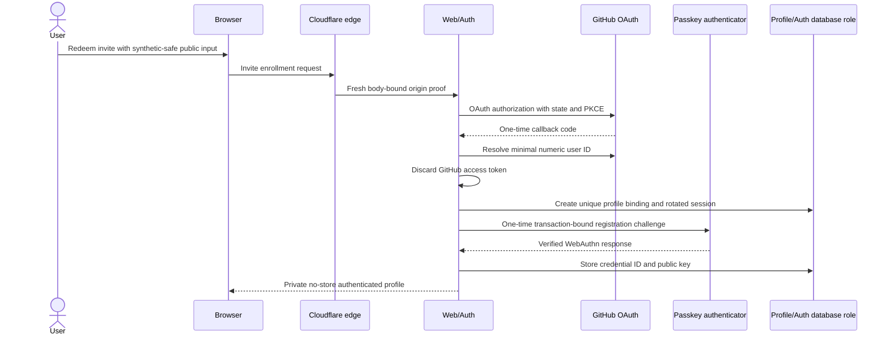
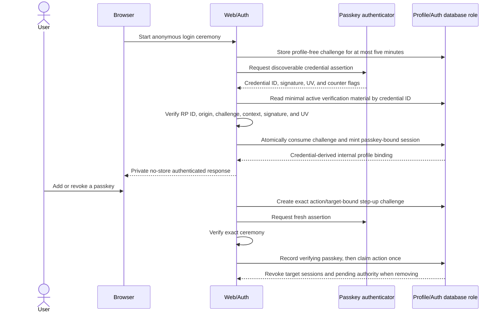
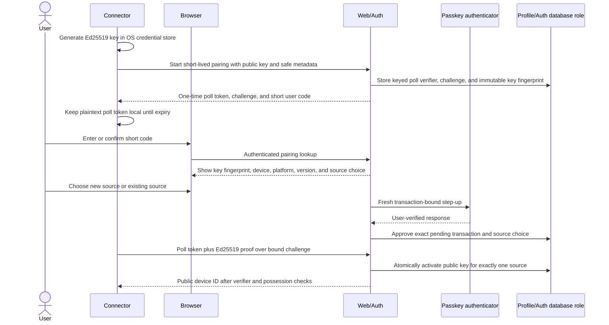
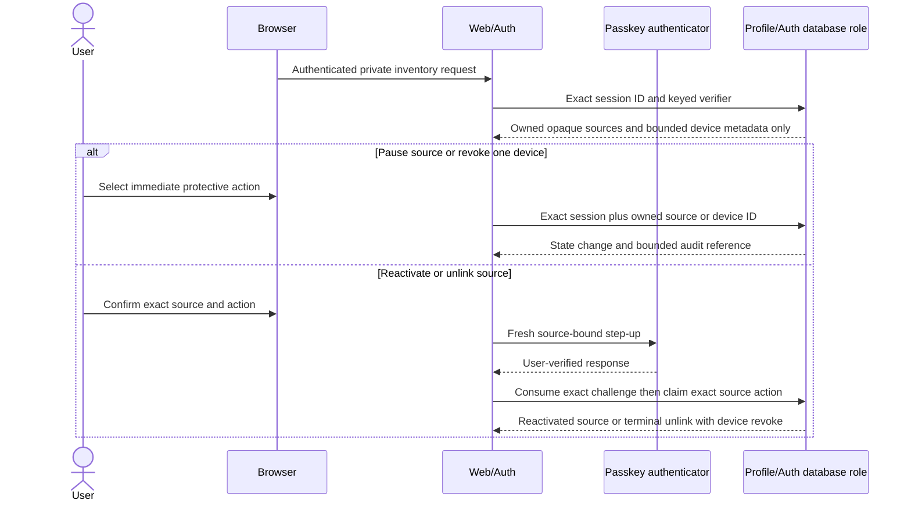
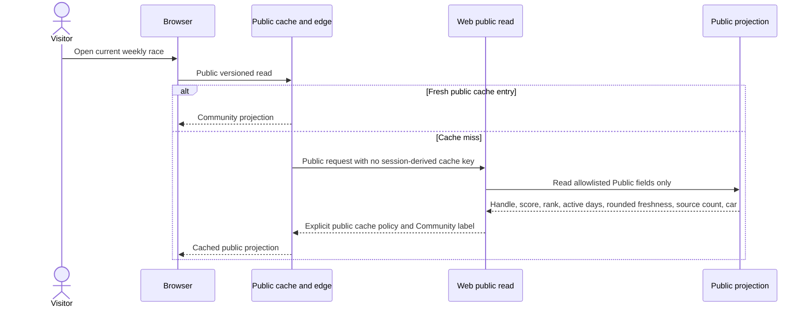
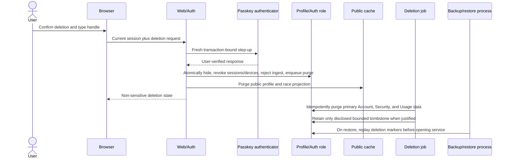
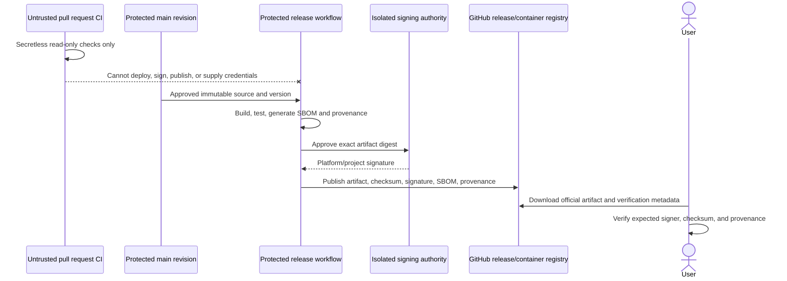

# Data flow

## Status and notation

These sequences remain planned application contracts. Revisions 0001 through 0011 provide private
identity/source/device/pairing/audit/deletion/usage tables, deny-by-default roles, and a narrow
database slice for invite issuance, enrollment, exact-session challenges, initial-passkey
activation, passkey login and management, restricted recovery, session rotation/revocation,
immediate deletion lock-down, source-bound pairing, source/device lifecycle controls, and Community
ingest, bounded ingest-retention cleanup, open-season scoring refresh, late-ingest closure, terminal
season finalization, and a Web-only public score projection. No endpoint, OAuth callback,
Argon2id/WebAuthn/Ed25519 application verifier, connector, purge/maintenance/scoring service or
scheduler, HTTP public-score delivery, audited correction, or deployed service executes the complete
sequences. Data labels refer to the classifications in the
[privacy data map](../security/PRIVACY_DATA_MAP.md): Public, Account, Security, Usage, Operational,
and Prohibited.

## Enrollment and passkey bootstrap



Only the numeric GitHub user ID crosses into persistent Account data. GitHub access tokens are
callback-memory data and are discarded. The public handle and optional GitHub link require a later
explicit preview/choice; neither is inferred from local or OAuth-private data.

Revisions 0002 and 0005 enforce the database steps shown here only after Web/Auth supplies a
resolved numeric GitHub ID and, for the passkey step, a cryptographically verified WebAuthn result.
They create a fresh session during enrollment, bind each stored challenge to that exact
session/profile pair, make initial activation one-time, and bind the activated session to the new
credential. They do not implement the browser, edge, OAuth, cookie, CSRF, RP ID, origin, signature,
or user-verification checks.

## Passkey login and credential management



The database exposes no profile identifier during credential lookup, stores no attestation
fingerprint, preserves a monotonic maximum sign counter, and makes revoke terminal. It cannot check
WebAuthn cryptography or protect an Internet endpoint from anonymous challenge floods; edge/service
limits and bounded expiry cleanup are mandatory before this flow is reachable. Recovery is a
separate restricted-authority flow, not a normal login shortcut.

## Recovery-code rotation and passkey replacement

```mermaid
sequenceDiagram
  actor User
  participant Browser
  participant Web as Web/Auth
  participant Authenticator as Passkey authenticator
  participant DB as Profile/Auth database role

  alt User still has a passkey
    User->>Browser: Regenerate recovery-code batch
    Web->>Authenticator: Fresh recovery-change step-up
    Authenticator-->>Web: Exact user-verified assertion
    Web->>DB: Record exact passkey and atomically replace 8-16 PHCs
    DB->>DB: Revoke authority derived from every old code
    Web-->>Browser: Show plaintext batch once; never log or persist it
  else User has no available passkey
    User->>Browser: Present opaque code selector and secret
    Web->>DB: Read only selected unused PHC verification material
    Web->>Web: Apply body/rate limits and verify Argon2id plus protected pepper
    Web->>DB: Consume and scrub code; create <=10-minute restricted authority
    Web->>Authenticator: Exact replacement-passkey registration ceremony
    Authenticator-->>Web: Registration response
    Web->>Web: Verify RP ID, origin, challenge, context, signature, and UV
    Web->>DB: Atomically register replacement and revoke old browser authority
    DB-->>Web: Create normal session only after replacement passkey exists
    Web-->>Browser: Show retained activated connectors for explicit review
  end
```

Revision 0006 implements only this database boundary. Lookup returns an opaque selector and PHC,
never a profile identifier. Starting recovery consumes one code, immediately removes its verifier,
and creates no session. Completion requires the exact authority verifier, challenge, and context; it
registers one replacement passkey, revokes previous passkeys and browser sessions, cancels
approved-but-not-activated pairings, removes remaining recovery codes and profile challenges, and
then creates the replacement-key session in the same transaction. Activated source-bound connector
keys remain separately visible and revocable because they have no profile-administration scope.

Code rotation and completion serialize on the profile row and take terminal timestamps after lock
acquisition. Observed cross-connection tests prove rotation dominates a concurrent start with an old
code and completion dominates a concurrent login with an old passkey. Completion fails closed at the
32-lifetime-passkey provenance ceiling until bounded cleanup exists. The repository still lacks
application Argon2id and pepper handling, WebAuthn verification, cookies/CSRF, generic HTTP timing
and response shaping, rate limits, cleanup, notifications, inventory UI, and deployment evidence;
therefore no recovery endpoint is launch-ready.

## Device pairing and source choice



The short user code and poll token cannot approve or activate a device by themselves. The browser
needs a current GitHub session and fresh passkey, the connector must prove private-key possession,
and the pending public key is immutable. The server returns the plaintext poll token once, stores
only a keyed verifier, and never logs it. Device authority begins only after atomic source binding
and never includes profile administration.

Revision 0003 implements only the database steps in this sequence. It supports an explicit new or
existing opaque source, binds approval to the exact session/pairing/source-choice challenge, exposes
minimal public-key material for an external Ed25519 verifier, and activates the exact key only after
that verifier succeeds. PostgreSQL scenarios cover competing profiles, wrong poll possession,
replay, immutable binding, 32 lifetime sources, and 64 active/unexpired-approved device authorities
per profile. The browser, HTTP, WebAuthn, Ed25519, edge-rate-limit, and cleanup layers remain
planned. The ceiling and first-winner assertions use separate PostgreSQL connections held behind a
real row lock before simultaneous release.

## Source and device lifecycle



Revision 0004 implements only this database boundary. Inventory derives the profile from the
possessed session and omits internal key IDs, public keys, profile IDs, exact usage, and account
email. Pause and device revoke are immediate session-authenticated protective actions. Reactivation
works only from `paused`; a normal user cannot lift `quarantined`. Unlink accepts an exact fresh
source-bound challenge, moves the source to terminal `unlinked`, revokes every active device,
cancels approved pairings, and invalidates unused source challenges atomically.

The PostgreSQL runner releases pause against pairing approval and unlink against device activation
on separate connections. Either ordering ends without approved authority on a paused source or an
active device on an unlinked source. HTTP authorization, CSRF protection, WebAuthn verification,
private no-store response handling, and user notifications remain application work. Revision 0007
adds the database-side submission enforcement described below.

## Local collection and signed synchronization

```mermaid
sequenceDiagram
  participant Scheduler as User-scoped scheduler
  participant Connector
  participant AppServer as Local Codex App Server
  participant KeyStore as OS credential store
  participant Edge as Cloudflare edge
  participant Ingest as Ingest API
  participant DB as Usage procedure
  participant Jobs

  Scheduler->>Connector: Fixed executable and argument array
  Connector->>AppServer: Launch pinned compatible version over stdio
  Connector->>AppServer: initialize then initialized
  Connector->>AppServer: Planned stable allowlisted account-mode and usage reads
  AppServer-->>Connector: Version-specific response
  Connector->>Connector: Reject unknown schema; select only date and token buckets
  Connector->>KeyStore: Use source-bound device private key
  Connector->>Connector: Sign method, path, body hash, device, nonce, time, idempotency
  Connector->>Edge: Bounded ConnectorSyncV1 Community payload
  Edge->>Ingest: Fresh body-bound origin proof plus original signed request
  Ingest->>Ingest: Validate proof, signature, source, schema, replay, and bounds
  Ingest->>DB: Execute narrow idempotent submission procedure
  DB-->>Ingest: Accepted, quarantined, duplicate, or rejected outcome
  Jobs->>DB: Delete a bounded expired nonce/raw-snapshot batch
  Jobs->>DB: Aggregate sources then apply one profile daily cap
```

Prompts, conversations, repositories, account email, Codex credentials, API keys, and process logs
are Prohibited and have no field in the connector egress schema. `observedAt` supports replay
checks; server `receivedAt` controls deadlines and season finalization. A valid signature proves
only which registered device sent the self-reported payload.

Revision 0007 implements only the PostgreSQL portion of this flow. Ingest can look up the minimal
active device/source/public-key tuple, then call one procedure after application verification. The
procedure independently enforces the exact activated binding, identifier/version/date/token and
31-entry bounds, millisecond timestamp precision, a server-time freshness window, per-device nonce
replay, per-device/sync idempotency, and one monotonic current value per source/date. It retains a
whole decrease or quarantined-source snapshot as `quarantined`; paused/unlinked sources, revoked
devices, and deletion-pending profiles fail closed. Observed races cover exact retry, same-source
devices, pause, and revoke.

The connector, edge, Ingest HTTP service, raw-body canonicalization, Ed25519 verification, origin
proof, and rate controls are still absent. Revision 0008 gives Jobs only a server-time, 1-to-1000
batch procedure for expired nonces and raw snapshots. It serializes callers, cascades raw entries,
preserves current source/day values, and clears only their deleted raw reference. The expiry columns
still do not delete rows by themselves: no Jobs service, scheduler, monitor, or deployment invokes
the procedure.

Revision 0009 adds only the private PostgreSQL scoring part of the planned Jobs step. One serialized
transaction refreshes an open ISO-week season from current eligible source/day values, sums distinct
sources before one profile daily cap, applies the immutable Community v1 formula, and writes derived
daily/weekly scores, active days, source count, shared rank, and deterministic display order. It
excludes hidden/deleting profiles and quarantined sources and copies no raw token total or source ID
into score tables. Revision 0010 closes the grace window at Wednesday 00:00 UTC after the ISO week
using server `receivedAt`; any submission touching a closed week is retained as a quarantined whole
snapshot and cannot update accepted source/day state. Jobs may atomically finalize at or after that
deadline, and terminal triggers reject silent metadata or score rewrites while allowing profile
purge to remove personal rows. Ingest and Jobs share the canonical
`season → profile → source → device` lock order. Revision 0011 gives only Web a bounded score-only
read that filters current profile visibility before re-ranking and omits private identifiers, raw
values, daily detail, and exact timestamps. No Jobs process invokes the maintenance procedures, and
no audited correction, freshness/streak/car projection, HTTP route, or public cache exists.

## Public race read



Exact token values, exact sync time, GitHub binding, passkeys, devices, source details, and audit
data are absent. Authenticated responses use private `no-store` policy and never populate this
cache. This complete read flow remains planned. Revision 0011 implements only the database score
subset: season metadata, handle, weekly score, active days, source count, shared rank, and display
position. It grants no HTTP route, cache, car, streak, freshness, daily detail, or profile read.

## Hide and deletion



Hide and authority revocation are synchronous security actions; bulk purge is retryable. Failure of
the asynchronous job does not make the profile public or the device valid again.

Revision 0002 implements the database transaction behind the immediate hide/revoke/enqueue step and
proves its rollback behavior with synthetic PostgreSQL scenarios. Revision 0006 also revokes active
restricted recovery authority as the profile enters deletion, and revision 0007 rejects every
deletion-pending profile at the usage procedure. Cache purge, job execution, tombstone policy,
backup replay, and the authenticated application endpoint are still planned.

## Trusted release



Release and deployment workflows do not run a pull-request revision with privileged credentials.
Promotion reuses the verified artifact rather than rebuilding from mutable source.

## Flow-change checklist

A change to any sequence updates:

1. versioned public contracts and generated artifacts;
2. [security invariants](SECURITY_INVARIANTS.md), threat model, and abuse cases;
3. privacy classification, retention, access, and deletion behavior;
4. service/database capability matrices and negative tests;
5. compatibility, migration, rollback, logs, alerts, and user-facing EN/RU documentation.
