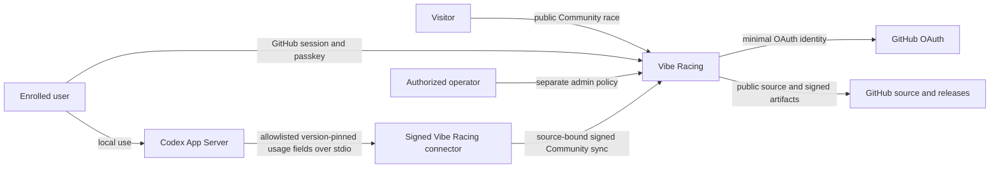
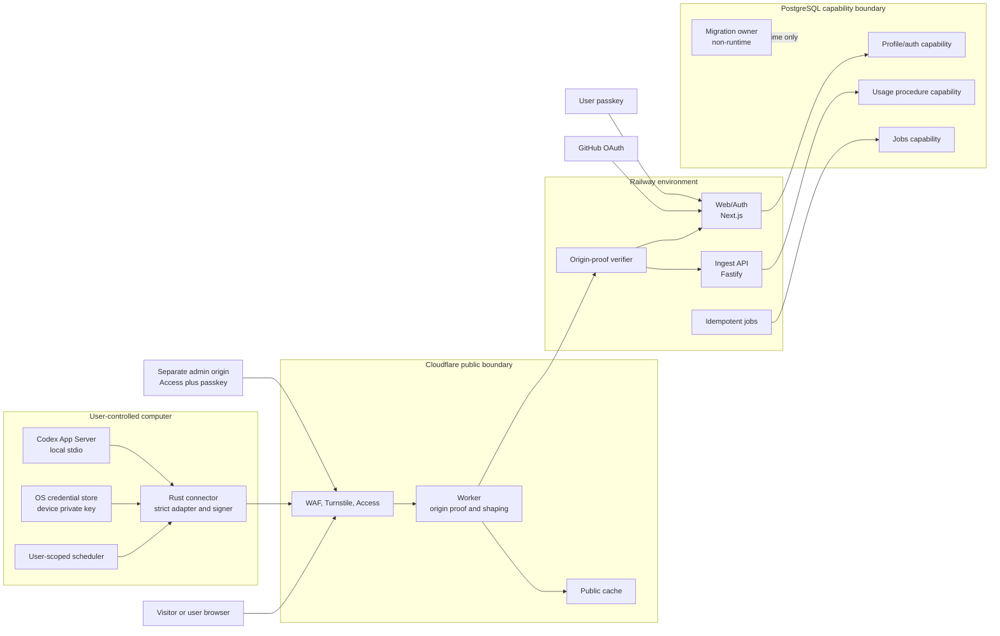

# System context and containers

## Status

This is the planned runtime architecture. The current repository contains a tested SQL persistence
foundation but no application service, connector, Cloudflare/Railway deployment, or production
database. Component status is tracked in [implementation status](../IMPLEMENTATION_STATUS.md);
diagrams describe required runtime boundaries, not deployed evidence.

## System context

Vibe Racing is not an OpenAI service and does not rank all Codex users. The connector is installed
and controlled by the participant. GitHub establishes one upstream profile identity; it does not
prove one human, one Codex account, or honest local usage.

## Container view

The four database boxes represent separate PostgreSQL roles/capabilities, not necessarily separate
database servers. Runtime roles never own schema objects. The ingest role executes a narrow
submission procedure and cannot edit profile, passkey, invite, admin, migration, or finalized-season
state.

Revision 0007 implements that database-only Usage procedure capability and its role/concurrency
evidence. The Ingest service, edge/origin proof, request signature verification, Jobs capabilities,
and finalized-season state shown in the design remain planned.

## Component responsibilities

| Component        | Owns                                                                                                       | Must not own                                                                                      | Primary trust boundary |
| ---------------- | ---------------------------------------------------------------------------------------------------------- | ------------------------------------------------------------------------------------------------- | ---------------------- |
| Browser UI       | Race rendering, authenticated profile controls, passkey ceremony UI                                        | Raw device key, connector execution, admin authority, private cache mixing                        | TB-01 and TB-02        |
| Cloudflare edge  | Public ingress, WAF integration, request shaping, public cache, body-bound origin proof                    | Profile authorization, score derivation, database credentials                                     | TB-01 and TB-06        |
| Web/Auth         | OAuth, sessions, passkeys, profile/preferences, user-approved device/source lifecycle, deletion initiation | Device private key, direct usage submission, schema ownership                                     | TB-02, TB-07, TB-08    |
| Ingest           | Edge proof, device signature, replay/idempotency, strict sync contract, submission procedure               | OAuth, admin, invites, passkey/recovery, migrations, final score authority                        | TB-05, TB-06, TB-07    |
| Jobs             | Scoring, season finalization, retention, deletion, cleanup, cache projection                               | Interactive auth, public request handling, schema ownership                                       | TB-07 and TB-11        |
| PostgreSQL       | Constraints, role separation, transactional state, immutable season/deletion enforcement                   | Public routing, connector trust, release credentials                                              | TB-07                  |
| Rust connector   | Local App Server lifecycle, compatibility adapter, local key, canonical signing, safe scheduling           | Website commands, experimental App Server API, arbitrary telemetry/upload, profile administration | TB-03, TB-04, TB-05    |
| Admin surface    | Reasoned exceptional actions, quarantine/correction, security operations                                   | Normal user session reuse, shared identities, routine exact-usage access                          | TB-08                  |
| CI               | Evaluate untrusted source without secrets; produce read-only evidence                                      | Deployment, signing, package publication from pull requests                                       | TB-09                  |
| Release pipeline | Build protected revision, SBOM, provenance, checksum, sign and publish                                     | Unreviewed pull-request execution, long-lived broad credentials                                   | TB-10                  |

Trust-boundary IDs are defined in the [threat model](../security/THREAT_MODEL.md).

## Deployment boundaries

- Cloudflare is the only intended public ingress. Railway rejects traffic without a fresh proof
  bound to method, path, body hash, and time.
- Web/Auth, Ingest, and Jobs run as separately deployable principals with different environment and
  database capabilities. A shared monorepo is not shared runtime authority.
- Staging and production use different projects, databases, OAuth registrations, WebAuthn origins,
  edge keys, deployment credentials, and caches.
- Pull-request previews contain only synthetic data and cannot reach production secrets or networks.
- Health endpoints expose only bounded readiness state and no dependency inventory, build secret,
  user data, or internal hostname.
- Admin uses a separate origin and policy. Ordinary GitHub membership or a user session never
  implies admin.

## Data ownership and derived state

The browser and connector can propose only fields declared in versioned contracts. Trust tier,
profile identity, accepted source binding, server receipt time, season, score, rank, streak,
freshness projection, moderation state, and deletion state are server-derived.

The [privacy data map](../security/PRIVACY_DATA_MAP.md) defines field classification and retention.
The [data-flow document](DATA_FLOW.md) defines enrollment, pairing, synchronization, public read,
deletion, and release sequences. The [security invariants](SECURITY_INVARIANTS.md) are normative
when a diagram and prose appear to conflict.

## Failure containment

- Each public capability has a separate kill switch: enrollment, pairing, source creation, ingest,
  car proposals, and public ranking.
- Load shedding disables expensive or write paths without weakening auth, signature, or origin
  verification.
- An Ingest compromise is contained by procedure-only database rights and no profile or admin
  credentials.
- A connector compromise is contained to its bound Community source; device authority cannot manage
  the profile.
- A Web/Auth compromise does not automatically receive signing or migration ownership.
- A failed Jobs run is idempotently repeatable; it cannot reopen a finalized season through client
  time.
- A restore remains unavailable until deletion markers and required migrations are replayed.
