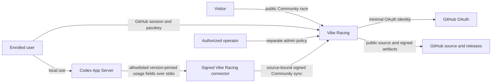
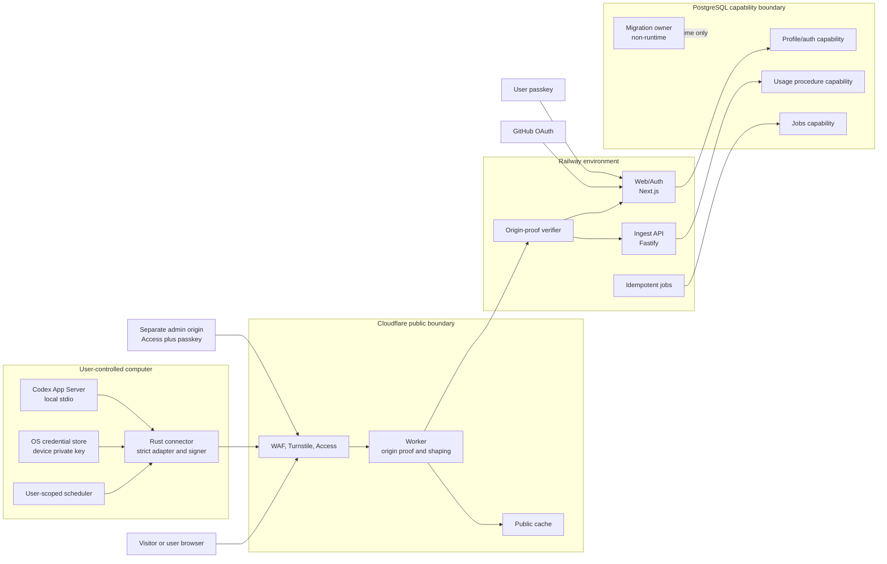

# System context and containers

## Status

This is the planned runtime architecture. The current repository contains a tested SQL persistence
foundation, one local public-score route, one local one-shot Jobs runner, and local Ingest
request-verification, PostgreSQL-adapter, application-composition, and bounded HTTP-server
boundaries, plus a library-only connector initialization boundary, but no deployed application
service, operational connector, Cloudflare/Railway deployment, or production database. Component
status is tracked in [implementation status](../IMPLEMENTATION_STATUS.md); diagrams describe
required runtime boundaries, not deployed evidence.

## System context

Vibe Racing is not an OpenAI service and does not rank all Codex users. The connector is installed
and controlled by the participant. GitHub establishes one upstream profile identity; it does not
prove one human, one Codex account, or honest local usage.

## Container view

The four database boxes represent separate PostgreSQL roles/capabilities, not necessarily separate
database servers. Runtime roles never own schema objects. The ingest role executes a narrow
submission procedure and cannot edit profile, passkey, invite, admin, migration, or finalized-season
state.

Revision 0007 implements the database-only Usage submission capability; revision 0008 gives Jobs
bounded expired ingest-state cleanup; revision 0009 gives Jobs an isolated open-season scoring
refresh; and revision 0010 adds server-time late-ingest quarantine plus immutable Jobs-only
finalization. Revision 0011 gives Web only a bounded, active-profile score projection, and ADR 0010
adds its response-only top-32 contract. A server-only Web mapper now enforces the exact projection
shape and its cross-row invariants before returning a validated frozen contract. ADR 0011 adds a
bounded server-only PostgreSQL pool/config/store boundary around that read, including strict
production TLS, fixed deadlines/query, and per-checkout effective-role and least-privileged-login
verification. ADR 0013 adds a locally implemented request/admission/response route around it. These
capabilities have role, contract, route, adapter, mapping, and concurrency evidence. ADR 0014 adds a
local one-shot Jobs adapter/CLI for only cleanup, refresh, and finalization, with its own role/login
probe, one-client pool, and fixed deadlines. ADR 0015 adds a pure local Ingest kernel that bounds
the raw envelope and JSON parser, verifies a replay-consumed body-bound origin proof before parsing,
validates the sync contract, and verifies the exact source-bound device request under strict Ed25519
semantics. ADR 0016 adds a fixed-query four-client PostgreSQL adapter with strict TLS/config,
per-checkout Ingest role/login/search-path verification, closed device/submission mappers, copied
parameters, and destructive failure release. ADR 0017 adds an exact primary/secondary origin-key
reader and config-backed verifier factory without exposing a reusable key container. ADR 0018 adds
persistent atomic origin replay, and ADR 0019 composes the same replay/device/submission adapter
behind one transport-free validated application decision. ADR 0020 adds one confined Fastify server
factory with exact raw-body/header preservation, closed POST/error serialization, local
connection/deadline bounds, four-call no-queue admission, and no proxy/request-ID trust. The
library-only ADR 0021 Rust foundation adds one bounded stable App Server JSONL initialization state
machine and discards all server values. It does not implement the connector container's process,
account/usage, key, signing, scheduling, upload, CLI, or release responsibilities. The host/port/TLS
deployment entry point, live secret-manager/edge key injection, working deployment
login/certificate, composed live end-to-end flow, distributed rate/backpressure and capacity
evidence, Cloudflare/Railway path, operational connector, Jobs scheduler/monitoring, public cache,
and audited correction authority shown in the design remain planned.

## Component responsibilities

| Component        | Owns                                                                                                                          | Must not own                                                                                      | Primary trust boundary |
| ---------------- | ----------------------------------------------------------------------------------------------------------------------------- | ------------------------------------------------------------------------------------------------- | ---------------------- |
| Browser UI       | Race rendering, authenticated profile controls, passkey ceremony UI                                                           | Raw device key, connector execution, admin authority, private cache mixing                        | TB-01 and TB-02        |
| Cloudflare edge  | Public ingress, WAF integration, request shaping, public cache, body-bound origin proof                                       | Profile authorization, score derivation, database credentials                                     | TB-01 and TB-06        |
| Web/Auth         | Public score read, OAuth, sessions, passkeys, profile/preferences, user-approved device/source lifecycle, deletion initiation | Device private key, direct usage submission, schema ownership                                     | TB-02, TB-07, TB-08    |
| Ingest           | Edge proof, device signature, replay/idempotency, strict sync contract, submission procedure, generic sync decision           | OAuth, admin, invites, passkey/recovery, migrations, final score authority                        | TB-05, TB-06, TB-07    |
| Jobs             | Scoring, season finalization, retention, deletion, cleanup, cache projection                                                  | Interactive auth, public request handling, schema ownership                                       | TB-07 and TB-11        |
| PostgreSQL       | Constraints, role separation, transactional state, immutable season/deletion enforcement                                      | Public routing, connector trust, release credentials                                              | TB-07                  |
| Rust connector   | Local App Server lifecycle, compatibility adapter, local key, canonical signing, safe scheduling                              | Website commands, experimental App Server API, arbitrary telemetry/upload, profile administration | TB-03, TB-04, TB-05    |
| Admin surface    | Reasoned exceptional actions, quarantine/correction, security operations                                                      | Normal user session reuse, shared identities, routine exact-usage access                          | TB-08                  |
| CI               | Evaluate untrusted source without secrets; produce read-only evidence                                                         | Deployment, signing, package publication from pull requests                                       | TB-09                  |
| Release pipeline | Build protected revision, SBOM, provenance, checksum, sign and publish                                                        | Unreviewed pull-request execution, long-lived broad credentials                                   | TB-10                  |

Trust-boundary IDs are defined in the [threat model](../security/THREAT_MODEL.md).

## Deployment boundaries

- Cloudflare is the only intended public ingress. Railway rejects traffic without a fresh proof
  bound to method, path, body hash, and time.
- Web/Auth, Ingest, and Jobs run as separately deployable principals with different environment and
  database capabilities. A shared monorepo is not shared runtime authority.
- Staging and production use different projects, databases, OAuth registrations, WebAuthn origins,
  edge keys, deployment credentials, and caches.
- Pull-request previews contain only synthetic data and cannot reach production secrets or networks.
- Health endpoints expose only bounded readiness state and no dependency inventory, build secret,
  user data, or internal hostname.
- Admin uses a separate origin and policy. Ordinary GitHub membership or a user session never
  implies admin.

## Data ownership and derived state

The browser and connector can propose only fields declared in versioned contracts. Trust tier,
profile identity, accepted source binding, server receipt time, season, score, rank, streak,
freshness projection, moderation state, and deletion state are server-derived.

The [privacy data map](../security/PRIVACY_DATA_MAP.md) defines field classification and retention.
The [data-flow document](DATA_FLOW.md) defines enrollment, pairing, synchronization, public read,
deletion, and release sequences. The [security invariants](SECURITY_INVARIANTS.md) are normative
when a diagram and prose appear to conflict.

## Failure containment

- Each public capability has a separate kill switch: enrollment, pairing, source creation, ingest,
  car proposals, and public ranking.
- Load shedding disables expensive or write paths without weakening auth, signature, or origin
  verification.
- An Ingest compromise is contained by procedure-only database rights and no profile or admin
  credentials.
- A connector compromise is contained to its bound Community source; device authority cannot manage
  the profile.
- A Web/Auth compromise does not automatically receive signing or migration ownership.
- A failed Jobs run is idempotently repeatable; it cannot reopen a finalized season through client
  time.
- A restore remains unavailable until deletion markers and required migrations are replayed.
