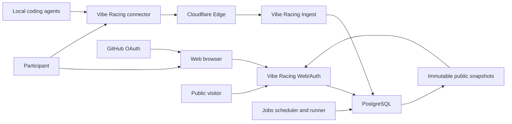
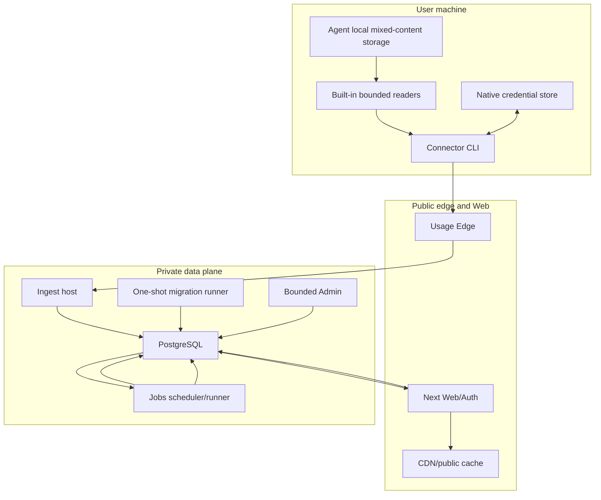

# System context

## Status

ADR 0076 defines the accepted clean AgentAccount target. Implementation and deployment evidence are
tracked separately; no production service or official connector is claimed.

## External actors and systems

The browser owns identity, passkey, batch approval, private dashboard, visibility, and deletion UX.
The connector owns bounded local discovery and account-scoped signing. Edge owns the public write
framing/rate/origin proof. Ingest owns cryptographic verification and the atomic usage application.
PostgreSQL owns identity/account authority, exact UTC/date/value constraints, observations,
account/day totals, seasons, and snapshot state. Jobs owns derived snapshot publication and fixed
maintenance. Public Web reads only snapshots.

## Container view

Every data-plane process uses a distinct probed least-privileged login and fixed adapter/function
catalog. Runtime roles do not own schema objects. Edge and every externally material capability stay
independently default-off until protected deployment enablement exists.

## Component responsibilities

| Component              | Owns                                                                                          | Must not own                                                                     |
| ---------------------- | --------------------------------------------------------------------------------------------- | -------------------------------------------------------------------------------- |
| Built-in reader        | Exact safe roots, schema/version admission, privacy projection, UTC/account/day derivation    | Network, server authority, prompt/code/path/email output, guessed accounting     |
| Connector installation | Discovery orchestration, native keys, signed manifest/usage, bounded CLI output               | Profile/passkey authority, plaintext keys, generic shell/launcher/proxy/redirect |
| Web/Auth               | GitHub identity, passkeys, sessions, batch decisions, dashboard, visibility, deletion request | Raw agent data, device signing keys, live public ranking calculation             |
| Edge                   | Exact public usage route, framing, rate policy, body-bound origin HMAC                        | Device/profile authority, body mutation, retry, caller-supplied origin proof     |
| Ingest                 | In-memory verification ordering, non-mutating lookup, exact atomic submission                 | Public rank reads, arbitrary SQL, pre-signature persistent state                 |
| PostgreSQL             | Immutable identity/account attribution, exact decimal/UTC rules, roles/RLS, atomic state      | Provider schema guessing, external secret storage, public HTTP serialization     |
| Jobs                   | Dirty-season refresh, finalization, retention, deletion, fixed no-overlap catalog             | Arbitrary SQL/selector/cutoff/retry, public listener                             |
| Public Web             | Snapshot-only leaderboard/profile serialization, ETag/304/cache, semantic SSR and lazy race   | Raw account/day/provider/device reads, live ranking aggregation                  |
| Admin                  | Separately authorized, passkey-stepped, reasoned, audited bounded actions                     | Normal-session elevation or generic database access                              |
| Migration runner       | Exact digest-verified bootstrap/revision catalog under advisory lock                          | Runtime startup migration, interactive SQL, down migration                       |
| Release workflow       | Protected platform artifacts, signature/checksum/SBOM/provenance and support declaration      | Pull-request secrets, arbitrary tag/source, false hosted success                 |
