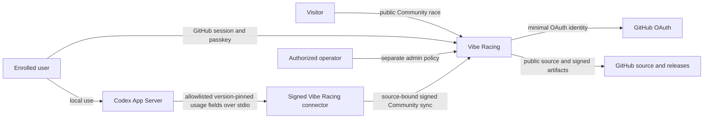
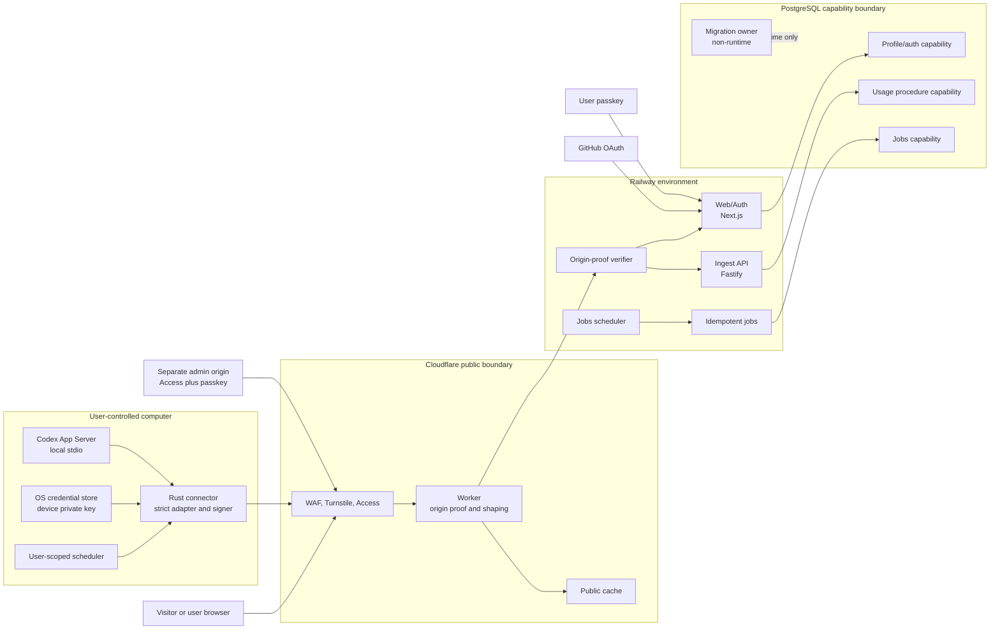

# System context and containers

## Status

This is the planned runtime architecture. The current repository contains a tested SQL persistence
foundation, default-off local public score/race/status routes with a visible validated status
consumer and synthetic fallback, four default-off local pairing routes plus an independent
default-off new-source control and an independent default-off CarRecipe proposal mutation control,
default-off local invite/OAuth/initial-passkey enrollment, returning-passkey login, exact-session
public-profile visibility, and private passkey-inventory/add/revocation slices with encrypted
cookies, local recovery-code replacement-passkey sign-in, and logout, one local one-shot Jobs runner
including bounded primary profile deletion, a separate default-off local UTC scheduler around only
that runner, and local Ingest request-verification, PostgreSQL-adapter, application-composition, and
bounded HTTP-server boundaries, plus library-only connector initialization and candidate `0.144.5`
account/usage parser boundaries, a synthetic one-shot supervisor, an exact-body sync composer,
isolated pairing/sync/proposal signers, pure Web pairing and proposal verifiers, one local connector
command with native OS key custody and exact start/poll routes, one credential-free Windows
candidate diagnostic that performs only exact artifact admission, one Windows sync command with
bounded fixed-name discovery plus an explicit path fallback that admits, collects, signs, and
uploads once, and one fixed proposal-only command that starts no Codex process. It also has one
opt-in synthetic loopback integration through the emitted Ingest host and a disposable
least-privileged PostgreSQL login, plus a separate synthetic integration through all seventeen
emitted Jobs commands and a disposable narrow login with a widened-login negative control. A second
Jobs mode composes the production scheduler core under fixed injected UTC time with the real runner
and disposable database. It still has no emitted scheduler-process timing, deployed application
service, durable Jobs cadence, operational sync connector, supported Codex version, distributed
recovery perimeter, Cloudflare/Railway deployment, live OAuth or production database login, or
production database. Component status is tracked in
[implementation status](../IMPLEMENTATION_STATUS.md); diagrams describe required runtime boundaries,
not deployed evidence.

## System context

Vibe Racing is not an OpenAI service and does not rank all Codex users. The connector is installed
and controlled by the participant. GitHub establishes one upstream profile identity; it does not
prove one human, one Codex account, or honest local usage.

## Container view

The four database boxes represent separate PostgreSQL roles/capabilities, not necessarily separate
database servers. Runtime roles never own schema objects. The ingest role executes a narrow
submission procedure and cannot edit profile, passkey, invite, admin, migration, or finalized-season
state.

Revision 0007 implements the database-only Usage submission capability; revision 0008 gives Jobs
bounded expired ingest-state cleanup; revision 0013 separately gives Jobs bounded expired
non-activated pairing/key cleanup; revision 0023 adds bounded authentication cleanup; revision 0024
adds bounded primary profile deletion; revision 0026 adds CarRecipe-proposal cleanup; revision 0030
adds eligible expired-session cleanup; revision 0031 adds expired-unredeemed-invite cleanup;
revision 0032 adds 30-day terminal deletion-job cleanup; revision 0033 adds 180-day database
audit-event cleanup; revision 0034 adds 180-day pairing approval-provenance redaction; revision 0035
adds 180-day unreferenced revoked-passkey cleanup; revision 0036 adds 180-day minimized
revoked-device/pairing cleanup; revision 0037 adds maximum-one-hour fixed pairing-rate-window reset;
revision 0038 adds bounded abandoned-enrollment cleanup after all retained authority expires;
revision 0009 gives Jobs an isolated open-season scoring refresh; and revision 0010 adds server-time
late-ingest quarantine plus immutable Jobs-only finalization. Revision 0011 gives Web only a
bounded, active-profile score projection, and ADR 0010 adds its response-only top-32 contract. A
server-only Web mapper now enforces the exact projection shape and its cross-row invariants before
returning a validated frozen contract. ADR 0011 adds a bounded server-only PostgreSQL
pool/config/store boundary around that read, including strict production TLS, fixed deadlines/query,
and per-checkout effective-role and least-privileged-login verification. ADR 0013 adds a locally
implemented request/admission/response route around it. ADR 0037 and revision 0027 add a separate
compatible response, route, and query that preserve the score contract and optionally project only
the current active recipe. ADR 0040 adds the separate compatible rounded status route, and ADR 0056
places all three GET compositions behind one exact default-off module-load decision before
query/header parsing, admission acquisition, or store work. These capabilities have role, contract,
route, adapter, mapping, and concurrency evidence. ADR 0014 adds a local one-shot Jobs adapter/CLI;
ADRs 0029, 0032, 0034, 0036, 0042, 0043, 0045, 0046, 0047, 0048, 0049, 0050, 0061, and 0062 extend
it to exactly twelve cleanup commands, one pairing approval-provenance redaction, one fixed
pairing-rate-window reset, one primary purge, one refresh, and one finalization command with the
same role/login probe, one-client pool, and fixed deadlines. A separate opt-in synthetic integration
now runs all seventeen emitted commands against disposable PostgreSQL, proves the narrow login and
extra-membership denial, and checks exact stored state. ADR 0063 separately adds one
exact-default-off local scheduler that derives only fixed UTC process slots, invokes the closed
runner sequentially, keeps slot state in memory, prevents overlap and same-slot retry, and bounds
signal shutdown. A second opt-in synthetic integration composes its production core under a fixed
injected UTC clock/timer with the real Jobs runner and disposable PostgreSQL, proving exact catalog
order, full private-table widened-login non-mutation, and exact narrow-login state. It is not an
emitted-process clock or deployed-cadence result. ADR 0015 adds a pure local Ingest kernel that
bounds the raw envelope and JSON parser, verifies a replay-consumed body-bound origin proof before
parsing, validates the sync contract, and verifies the exact source-bound device request under
strict Ed25519 semantics. ADR 0016 adds a fixed-query four-client PostgreSQL adapter with strict
TLS/config, per-checkout Ingest role/login/search-path verification, closed device/submission
mappers, copied parameters, and destructive failure release. ADR 0017 adds an exact
primary/secondary origin-key reader and config-backed verifier factory without exposing a reusable
key container. ADR 0018 adds persistent atomic origin replay, and ADR 0019 composes the same
replay/device/submission adapter behind one transport-free validated application decision. ADR 0020
adds one confined Fastify server factory with exact raw-body/header preservation, closed POST/error
serialization, local connection/deadline bounds, four-call no-queue admission, and no
proxy/request-ID trust. ADR 0033 adds a separate local host with exact loopback/Railway listener
declarations, one bind, complete partial-startup cleanup, and bounded signal-driven shutdown. ADR
0055 requires exact default-off enable admission before every other host/protected-application field
or resource; neither that startup latch nor the external-TLS declaration is deployment evidence. The
opt-in full-path gate composes those Ingest boundaries with a synthetic dedicated login in
disposable PostgreSQL and verifies signed accepted/duplicate/replay/revoke HTTP behavior plus exact
stored state. It remains local synthetic evidence, not external TLS, edge, secret-delivery,
production-credential, capacity, or real-user evidence. The library-only ADR 0021 Rust foundation
adds one bounded stable App Server JSONL initialization state machine and discards all server
values. ADR 0022 adds the exact-version candidate account/usage adapter, and ADR 0023 composes both
through a fixed, deadline/output-bounded, reap-before-success synthetic child supervisor. ADR 0024
adds a second inaccessible reviewed context and exact sync-body/digest/device-message composition
shared with the Ingest verifier. ADR 0025 adds an isolated one-use signer behind a third
inaccessible device-bound key capability and returns only the same body plus five signed header
values. ADR 0026 adds an inaccessible pending-key/challenge signer and pure strict Web verifier for
one exact pairing-possession message. ADR 0027 composes protected poll lookup, that proof, and fixed
atomic activation behind local admission/timing. ADR 0028 composes fresh server-owned pairing start
material and one fixed database call; ADR 0029 supplies bounded Jobs-only physical cleanup after
pairing expiry, while ADR 0032 separately cleans expired authentication challenges and restricted
recovery authority under the recovery profile-lock order. ADR 0043 deletes only expired unredeemed
invite verifier rows under the shared authentication mutex. ADR 0034 adds all-maintenance-serialized
maximum-10 primary profile purge without inventing a tombstone policy. A separate local `/connect`
flow supplies session-rate-limited pending-code review and fresh-passkey approval for an explicitly
selected new or active existing opaque source, without exposing raw source IDs. ADR 0030 now exposes
only the pairing journey through one Rust `connect` command, exact local start/poll routes,
fixed-storage database admission, and native OS credential custody. ADR 0057 places those two
connector routes and both signed-in approval routes behind exact default-off module-load decisions
before parsing, runtime/service construction, admission acquisition, protected configuration, or
database work. ADR 0058 separately requires exact default-off enablement for a new source in the
page and both approval modules while preserving active existing-source pairing. Both service steps
repeat the decision, and exact source choice enters the sealed challenge plus v2 context digest so
an in-flight new-source approval closes after a restarted verification module resolves disabled. ADR
0059 separately closes browser proposal creation/approval and device proposal ingress while
preserving private read and exact session-bound rejection. ADR 0060 separately closes both
enrollment pages, all four enrollment route modules, and all four service methods before private
work while preserving active-session redirects, returning login, restricted recovery, logout, and
account security actions. ADR 0041 separately adds exact, idempotent deletion of one local
origin/label record with no credential read or server call; the registered device remains until
authenticated revoke. App Server launch and sync capabilities still have no public constructor, so
ADR 0031 lets only the private Windows x86_64 command construct them after exact artifact admission
and active-record review. ADR 0051 permits selection only through a resource-bounded fixed-name
`PATH` policy or the original explicit path; both retain the same exact size/SHA-256 and
no-write-sharing handle. ADR 0052 separately permits an explicitly invoked `check-codex` to reuse
only that selector without a credential, process, account read, persistence, or network; its result
is not reusable authority. ADR 0053 adds only a secretless no-upload Windows release-profile
copy/removal smoke for the repository-built connector and creates no runtime authority, package, or
release path. ADR 0054 permits only one opt-in redacted stdout preview of fixed
version/admission/support state and adds no stored or network data flow. The sync command still
creates fresh context only after active-record validation and repeated admission, then performs one
fixed signed upload. A hosted Windows result, macOS/Linux admission, real package lifecycle,
scheduling, and release remain absent. Trusted external TLS/edge routing, live secret-manager/edge
key injection, working deployment login/certificate, composed live end-to-end flow, edge/capacity
evidence, a verified Cloudflare/Railway path, released sync connector, deployed Jobs
scheduler/monitoring, public cache, backup/tombstone/restore replay, and audited correction
authority shown in the design remain planned.

## Component responsibilities

| Component        | Owns                                                                                                                                                               | Must not own                                                                                                     | Primary trust boundary |
| ---------------- | ------------------------------------------------------------------------------------------------------------------------------------------------------------------ | ---------------------------------------------------------------------------------------------------------------- | ---------------------- |
| Browser UI       | Race rendering, authenticated profile controls, passkey ceremony UI                                                                                                | Raw device key, connector execution, admin authority, private cache mixing                                       | TB-01 and TB-02        |
| Cloudflare edge  | Public ingress, WAF integration, request shaping, public cache, body-bound origin proof                                                                            | Profile authorization, score derivation, database credentials                                                    | TB-01 and TB-06        |
| Web/Auth         | Default-off public ranking, enrollment, pairing, new-source, and CarRecipe proposal mutations; OAuth, sessions, passkeys, profile/preferences, lifecycle, deletion | Device private key, direct usage submission, schema ownership                                                    | TB-02, TB-07, TB-08    |
| Ingest           | Edge proof, device signature, replay/idempotency, strict sync contract, submission procedure, generic sync decision                                                | OAuth, admin, invites, passkey/recovery, migrations, final score authority                                       | TB-05, TB-06, TB-07    |
| Ingest host      | Default-off enable admission, closed listener configuration, reviewed Ingest composition, one bind, bounded process shutdown                                       | Request parsing, proof/database policy, proxy trust, logs, monitoring, deployment credentials                    | TB-06 and TB-07        |
| Jobs             | Scoring, season finalization, retention, deletion, cleanup, cache projection                                                                                       | Interactive auth, public request handling, schema ownership                                                      | TB-07 and TB-11        |
| Jobs scheduler   | Default-off fixed UTC cadence, sequential Jobs invocation, in-memory slots, bounded process shutdown                                                               | Database queries, caller-selected work, durable queue/history, network, monitoring, deployment credentials       | TB-07 and TB-11        |
| PostgreSQL       | Constraints, role separation, transactional state, immutable season/deletion enforcement                                                                           | Public routing, connector trust, release credentials                                                             | TB-07                  |
| Rust connector   | Local App Server lifecycle, compatibility adapter, local key custody/removal, canonical signing, safe scheduling                                                   | Website commands, server revoke, experimental App Server API, arbitrary telemetry/upload, profile administration | TB-03, TB-04, TB-05    |
| Admin surface    | Reasoned exceptional actions, quarantine/correction, security operations                                                                                           | Normal user session reuse, shared identities, routine exact-usage access                                         | TB-08                  |
| CI               | Evaluate untrusted source without secrets; produce read-only and ephemeral no-upload Windows smoke evidence                                                        | Deployment, signing, package publication from pull requests                                                      | TB-09                  |
| Release pipeline | Build protected revision, SBOM, provenance, checksum, sign and publish                                                                                             | Unreviewed pull-request execution, long-lived broad credentials                                                  | TB-10                  |

The repository-verification Agent Skill is a local read-only TB-09 control. It may select checked-in
gates for the real Git scope and report exact evidence, but it cannot edit, stage, commit, install,
access network/live services, publish, push, deploy, or make production claims.

Trust-boundary IDs are defined in the [threat model](../security/THREAT_MODEL.md).

## Deployment boundaries

- Cloudflare is the only intended public ingress. Railway rejects traffic without a fresh proof
  bound to method, path, body hash, and time.
- Web/Auth, Ingest, and Jobs run as separately deployable principals with different environment and
  database capabilities. The scheduler can construct only the Jobs runner and adds no database
  capability. A shared monorepo is not shared runtime authority.
- Staging and production use different projects, databases, OAuth registrations, WebAuthn origins,
  edge keys, deployment credentials, and caches.
- Pull-request previews contain only synthetic data and cannot reach production secrets or networks.
- Health endpoints expose only bounded readiness state and no dependency inventory, build secret,
  user data, or internal hostname.
- Admin uses a separate origin and policy. Ordinary GitHub membership or a user session never
  implies admin.

## Data ownership and derived state

The browser and connector can propose only fields declared in versioned contracts. Trust tier,
profile identity, accepted source binding, server receipt time, season, score, rank, streak,
freshness projection, moderation state, and deletion state are server-derived.

The current `CarRecipeV1` proposal has two bounded service origins. Web derives browser authority
from an exact possessed session, while the dedicated signed route derives proposal-only authority
from an active source-bound device. A local repository Agent Skill may reduce an existing style
request to the exact recipe and invoke that fixed connector command once; it creates no third route,
does not forward conversation text, and receives no decision authority. Web owns proposal
identity/expiry and exposes an encrypted session-bound decision control only to the browser.
PostgreSQL owns the atomic pending-to-active transition. A device can replace only the private
pending recipe and cannot inspect, approve, reject, activate, publish, or administer it. The
separate public race projection can expose only the exact current approved recipe for an `active`
profile. A third compatible projection may additionally expose complete-UTC-day freshness and the
preference-gated consecutive positive-score streak; exact receipt timestamps, daily score rows, the
preference itself, proposal identity, state, and timestamps remain private. Both older response
components remain unchanged.

The [privacy data map](../security/PRIVACY_DATA_MAP.md) defines field classification and retention.
The [data-flow document](DATA_FLOW.md) defines enrollment, pairing, synchronization, public read,
deletion, and release sequences. The [security invariants](SECURITY_INVARIANTS.md) are normative
when a diagram and prose appear to conflict.

## Failure containment

- Each public capability has a separate kill switch: enrollment, pairing, source creation, ingest,
  car proposals, and public ranking. Local default-off gates now cover Ingest startup, all three
  public-ranking route modules, all four pairing route modules, and new-source creation in the page
  and both approval service steps, CarRecipe proposal creation/approval across browser and device
  ingress, and both enrollment pages plus all four route/service steps; deployed operation remains
  planned for every local control.
- Load shedding disables expensive or write paths without weakening auth, signature, or origin
  verification.
- An Ingest compromise is contained by procedure-only database rights and no profile or admin
  credentials.
- A connector compromise is contained to its bound Community source; it may submit Community usage
  and replace the bound profile's pending enum-only car proposal, but cannot activate it or manage
  the profile.
- A Web/Auth compromise does not automatically receive signing or migration ownership.
- A failed Jobs run is idempotently repeatable; it cannot reopen a finalized season through client
  time.
- A restore remains unavailable until deletion markers and required migrations are replayed.
